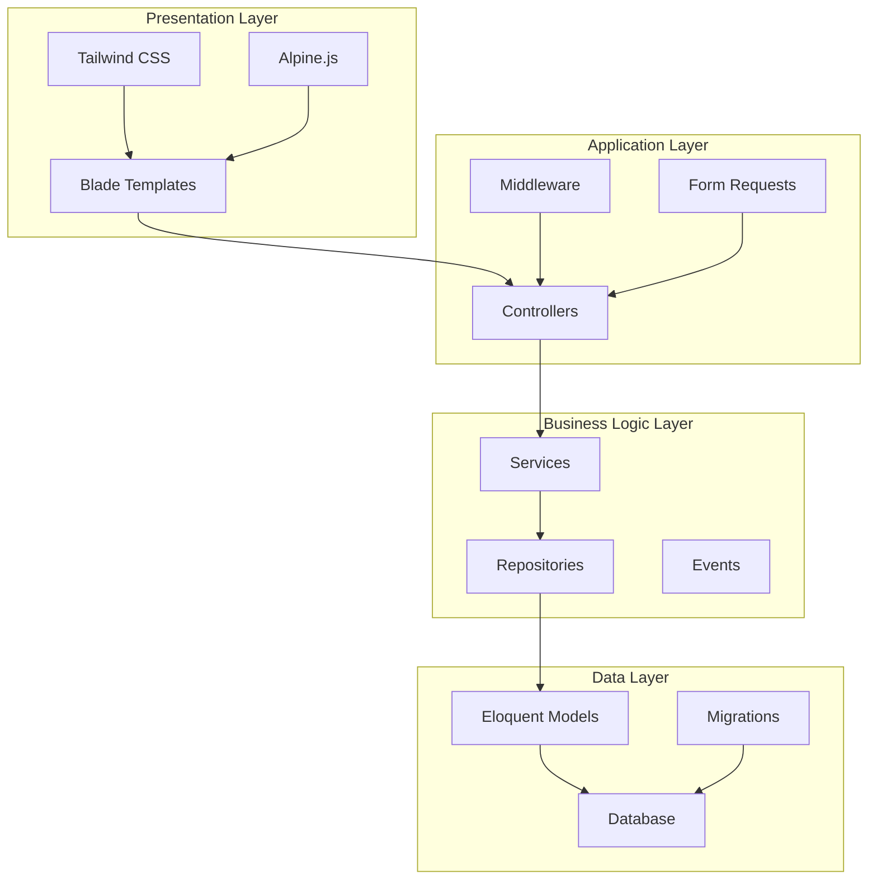
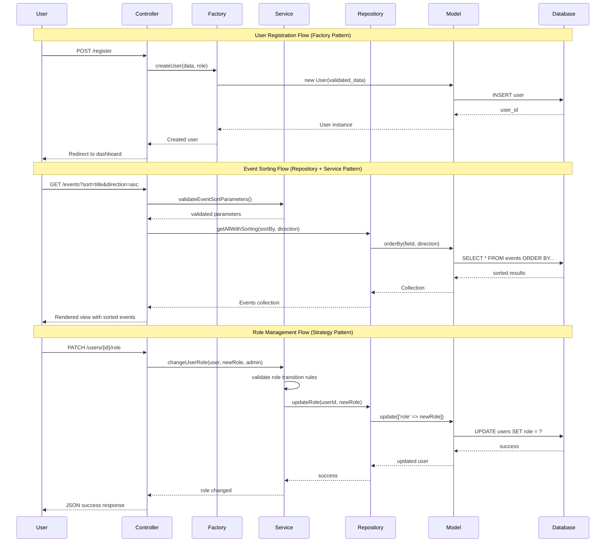
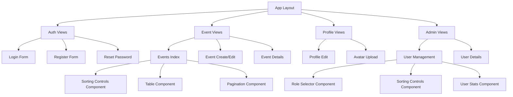
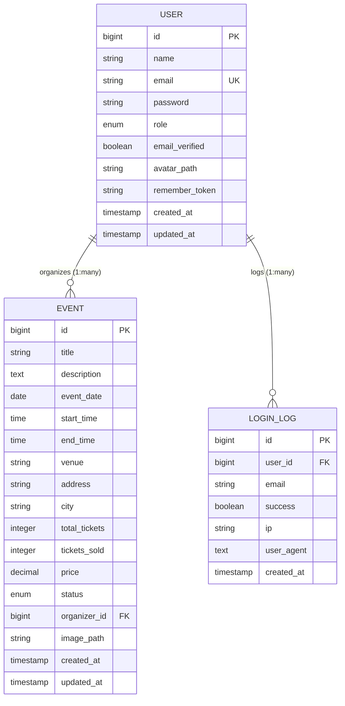
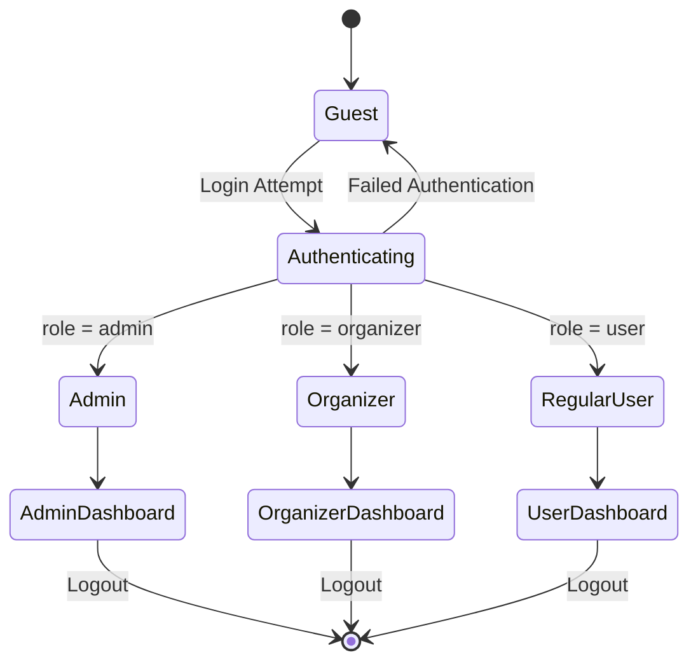
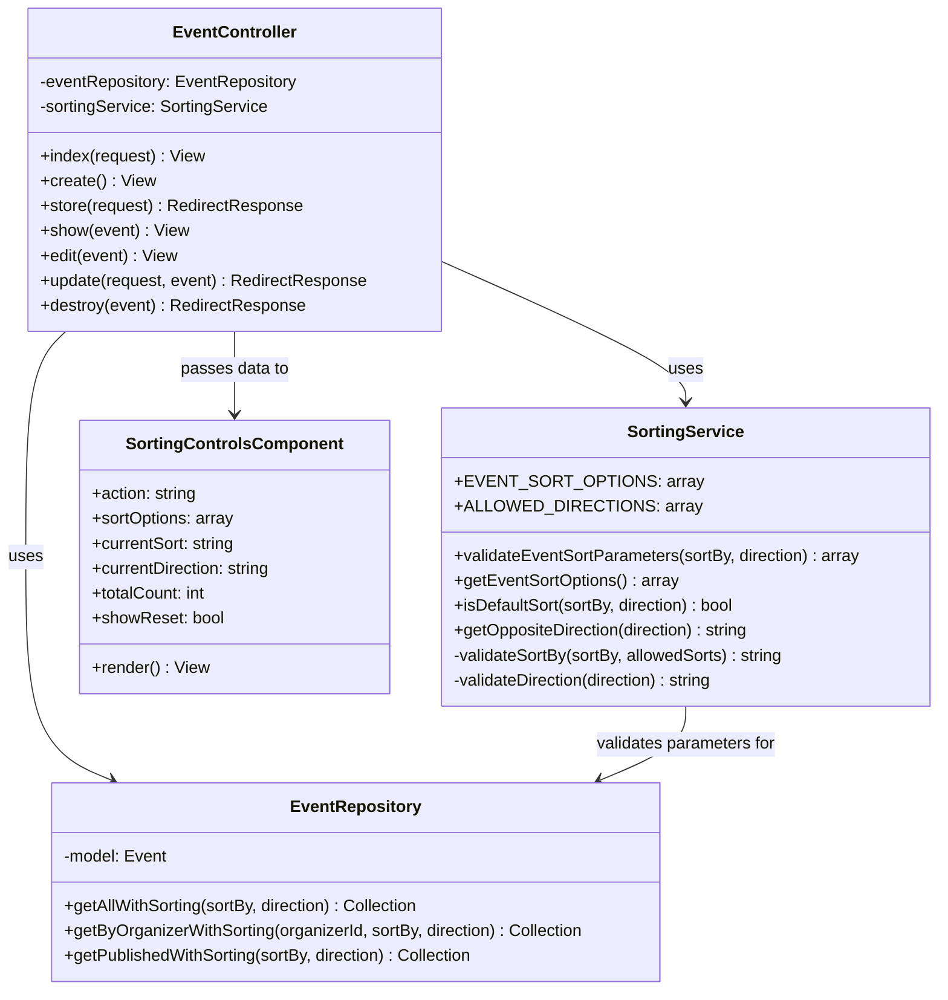
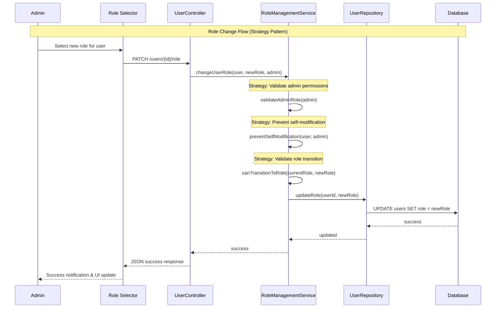
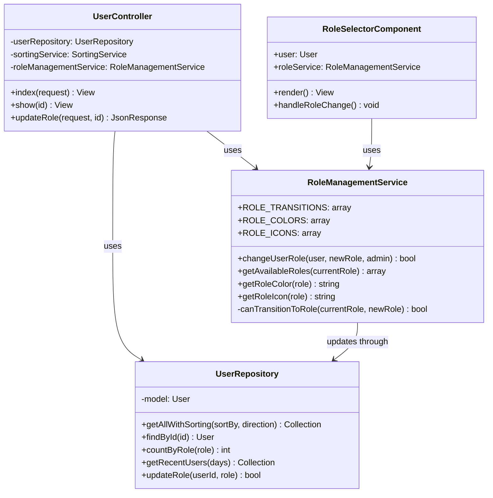
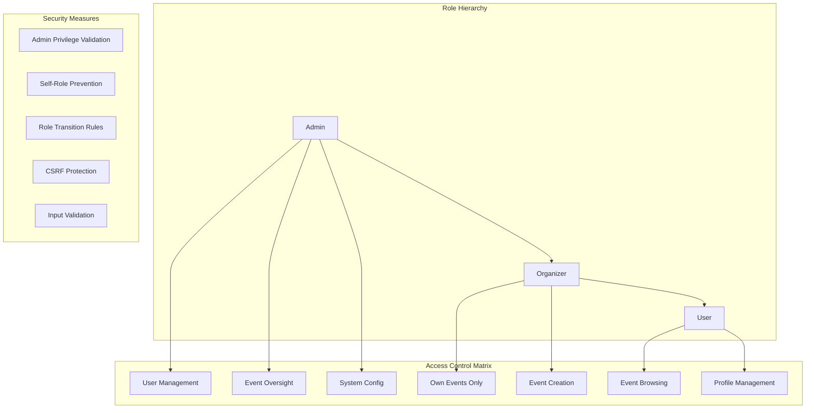

# EMTS - System Architecture Diagrams

## Overall System Architecture

## Design Patterns Flow

## Component Hierarchy

## Database Relationships

## Authentication Flow

## Sorting System Architecture

## Role Management System Architecture

## Security & Access Control

