# EMTS - System Architecture Documentation

## 🏗️ Overall System Architecture

### Clean, Simple Architecture with Observer Pattern

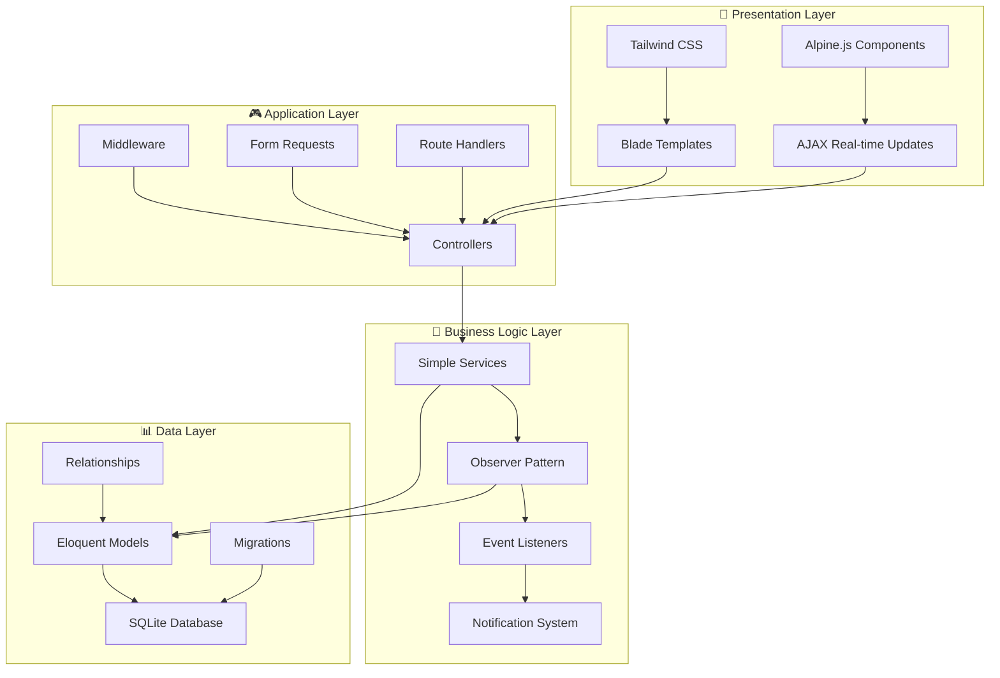

## 🔄 Observer Pattern Architecture

### Core Observer Implementation

The system uses Laravel's Observer Pattern for real-time ticket tracking and notifications:

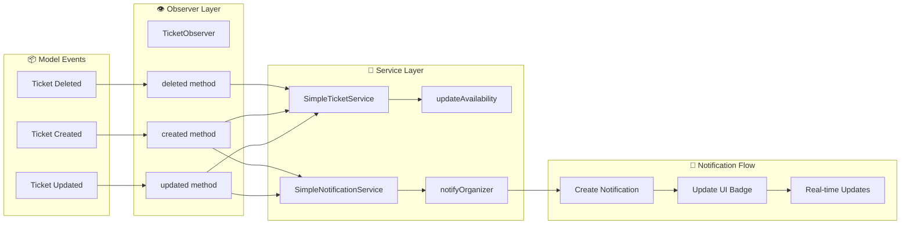

### Notification System Flow

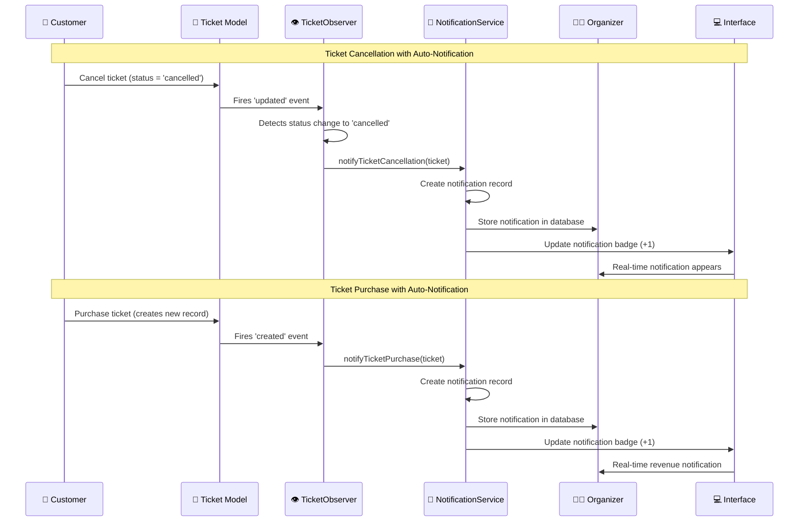

```mermaid
sequenceDiagram
    participant U as User
    participant C as Controller
    participant F as Factory
    participant S as Service
    participant R as Repository
    participant M as Model
    participant DB as Database

    Note over U,DB: User Registration Flow (Factory Pattern)
    U->>C: POST /register
    C->>F: createUser(data, role)
## 🎯 Simple Service Layer Architecture

### Beginner-Friendly Design Patterns

Our system focuses on **simplicity and learning** rather than over-engineering:

```mermaid
graph TD
    subgraph "🎫 Ticket Management"
        A[SimpleTicketService]
        B[getAvailability]
        C[purchaseTickets]
        D[Cache Results]
    end
    
    subgraph "🔔 Notification System"
        E[SimpleNotificationService]
        F[notifyTicketCancellation]
        G[notifyTicketPurchase]
        H[getUnreadNotifications]
    end
    
    subgraph "👁️ Observer Pattern"
        I[TicketObserver]
        J[updated method]
        K[created method]
        L[Auto-trigger notifications]
    end
    
    A --> B
    A --> C
    A --> D
    E --> F
    E --> G
    E --> H
    I --> J
    I --> K
    J --> A
    J --> E
    K --> A
    K --> E
    L --> E
```

## 🔄 Complete Data Flow Diagrams

### Ticket Purchase with Automatic Notifications

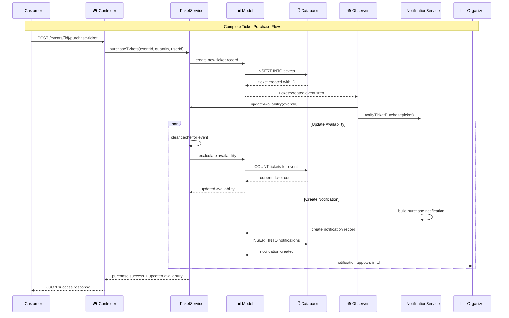

### Ticket Cancellation with Organizer Alerts

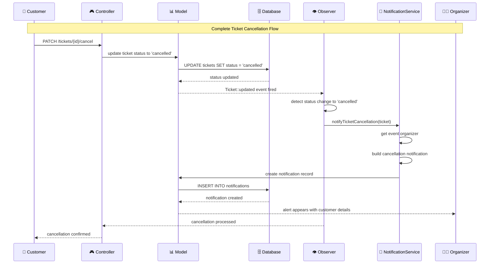
    M->>DB: INSERT INTO tickets
    DB-->>M: tickets created
    M-->>TO: Ticket::created event
    TO->>TS: updateAvailability(eventId)
    TS->>Cache: clear cache
    TS-->>C: purchase success
    C-->>U: JSON success response
```

## Component Hierarchy

```mermaid
graph TD
    A[App Layout] --> B[Auth Views]
    A --> C[Event Views]
    A --> D[Profile Views]
    
    B --> B1[Login Form]
    B --> B2[Register Form]
    B --> B3[Reset Password]
    
    C --> C1[Events Index]
    C --> C2[Event Create/Edit]
    C --> C3[Event Details]
    
    C1 --> SC[Sorting Controls Component]
    C1 --> TC[Table Component]
    C1 --> PC[Pagination Component]
    
    C3 --> TAC[Ticket Availability Component]
## 🎨 Component Hierarchy

### Modern Blade Component Structure

```mermaid
graph TD
    A[🏠 App Layout] --> B[🔐 Auth Views]
    A --> C[🎪 Event Views] 
    A --> D[👤 Profile Views]
    A --> E[🔔 Notification Views]
    
    B --> B1[Login Form]
    B --> B2[Register Form]
    B --> B3[Reset Password]
    
    C --> C1[📋 Events Index]
    C --> C2[✏️ Event Create/Edit]
    C --> C3[📄 Event Details]
    
    C1 --> SC[🔽 Sorting Controls]
    C1 --> TC[📊 Table Component]
    C1 --> PC[📑 Pagination]
    
    C3 --> TAC[🎫 Ticket Availability]
    TAC --> TPB[📊 Progress Bar]
    TAC --> TPF[💳 Purchase Form]
    TAC --> TRT[⚡ Real-time Updates]
    
    D --> D1[✏️ Profile Edit]
    D --> D2[🖼️ Avatar Upload]
    
    E --> E1[🔔 Notification Center]
    E --> E2[📬 Notification Cards]
    E --> E3[🔵 Notification Badges]
    
    E1 --> NFC[📋 Notification Filter]
    E1 --> NLC[📜 Notification List]
    E2 --> NRC[✅ Mark Read Button]
    E2 --> NDC[📊 Notification Data]
```

## 🗄️ Database Relationships & Schema

### Complete Entity Relationship Diagram

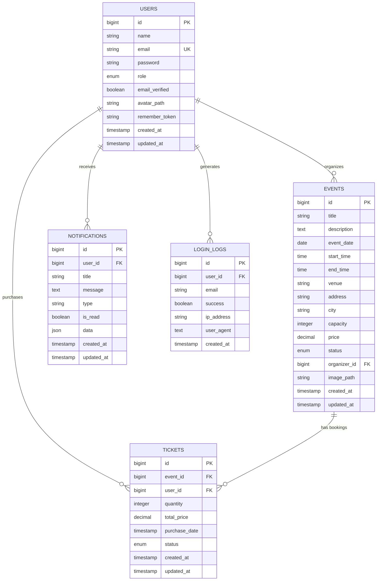
        bigint organizer_id FK
        string image_path
        timestamp created_at
        timestamp updated_at
    }
    
    LOGIN_LOG {
        bigint id PK
        bigint user_id FK
        string email
        boolean success
        string ip
        text user_agent
        timestamp created_at
    }
    
    USER ||--o{ EVENT : "organizes (1:many)"
    USER ||--o{ LOGIN_LOG : "logs (1:many)"
```

## Authentication Flow

```mermaid
stateDiagram-v2
    [*] --> Guest
    Guest --> Authenticating : Login Attempt
    Authenticating --> Admin : role = admin
    Authenticating --> Organizer : role = organizer
    Authenticating --> RegularUser : role = user
    Authenticating --> Guest : Failed Authentication
## ⚙️ Observer Pattern Deep Dive

### Why Observer Pattern for Beginners?

The Observer Pattern is perfect for learning because it's **simple** and **automatic**:

```mermaid
graph LR
    subgraph "🎯 Problem"
        A[Manual Updates]
        B[Forgotten Notifications]  
        C[Tight Coupling]
        D[Code Duplication]
    end
    
    subgraph "✅ Observer Solution"
        E[Automatic Updates]
        F[Never Miss Events]
        G[Loose Coupling]
        H[Single Responsibility]
    end
    
    A --> E
    B --> F
    C --> G
    D --> H
```

### Observer Pattern Benefits

- ✅ **Easy to understand** - One service, one observer, one controller

- ✅ **Automatic notifications** - No manual trigger needed
- ✅ **Single responsibility** - Each class has one job
- ✅ **Extensible** - Easy to add new notification types
- ✅ **Testable** - Simple to mock and test
- ✅ **Laravel native** - Uses framework's built-in observer system

### Code Structure Benefits

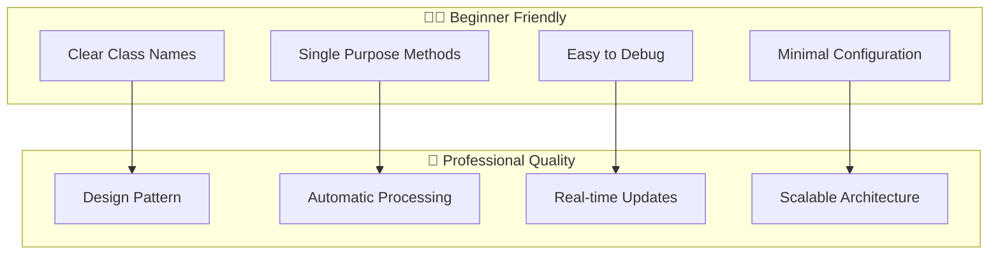

## 🔄 Real-time Update Architecture

### AJAX Polling System

Our real-time updates use simple AJAX polling for maximum compatibility:

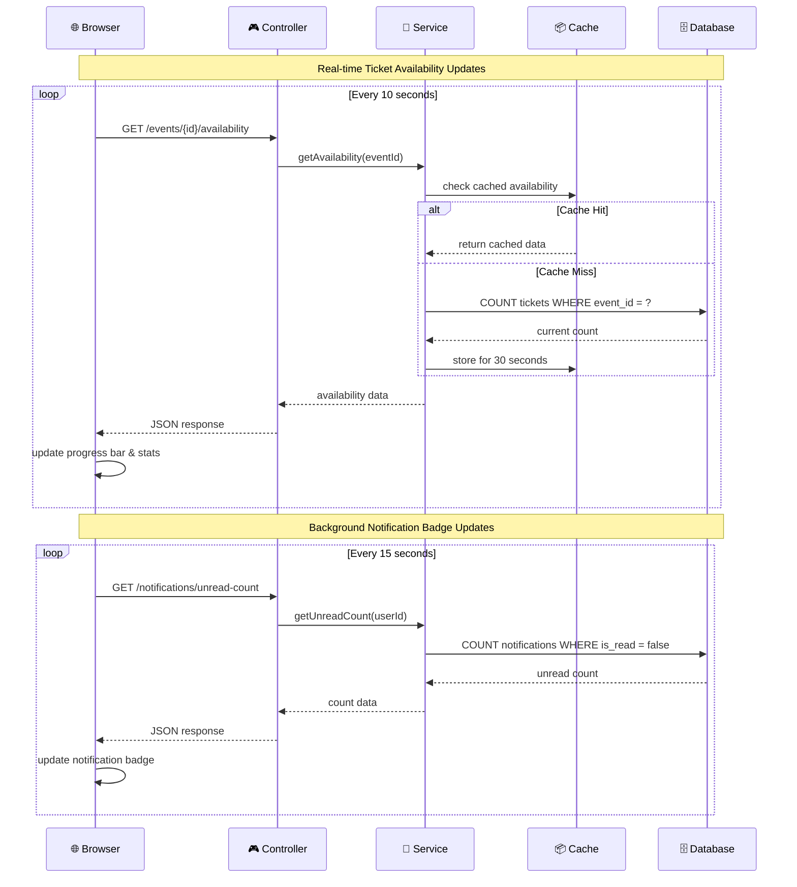
        +render() View
    }
    
    EventController --> SortingService : uses
    EventController --> EventRepository : uses
    EventController --> SortingControlsComponent : passes data to
    SortingService --> EventRepository : validates parameters for
```

## Simplified Ticket Availability System Architecture ⭐ **BEGINNER FRIENDLY**

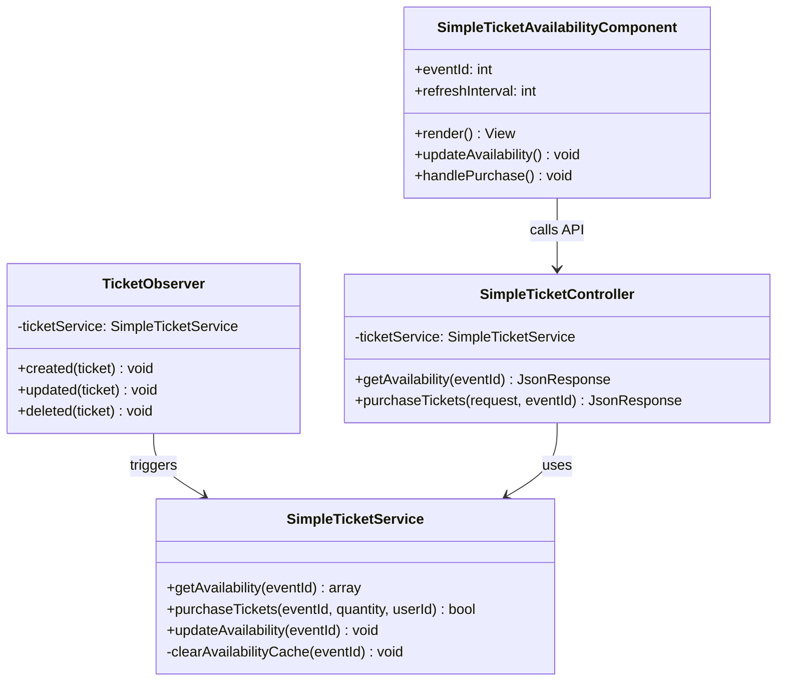

**Key Benefits of Simplified Design:**
- ✅ **Easy to understand** - One service, one observer, one controller
- ✅ **Observer Pattern** - Automatic updates when tickets change
- ✅ **Caching** - Fast performance with simple cache strategy
- ✅ **Real-time UI** - Updates every 10 seconds automatically
- ✅ **No complexity** - No strategy interfaces or multiple implementations

## Role Management System Architecture

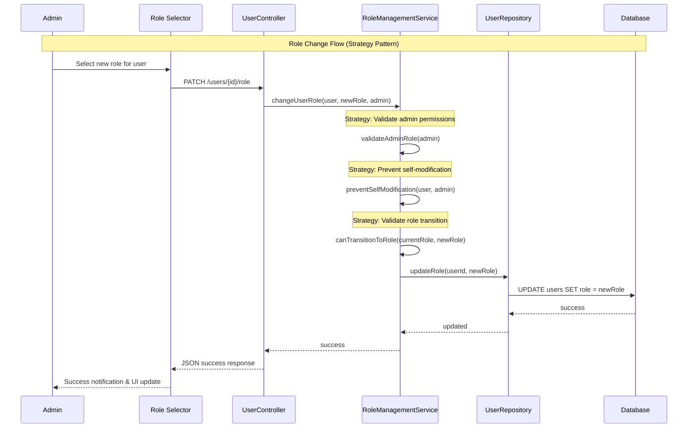

```mermaid
classDiagram
    class RoleManagementService {
        +ROLE_TRANSITIONS: array
        +ROLE_COLORS: array
## 🚀 Implementation Benefits

### Why This Architecture Works for Learners

```mermaid
graph TD
    subgraph "📚 Learning Benefits"
        A[Clear Separation of Concerns]
        B[Single Design Pattern Focus]
        C[Real-world Applicability]
        D[Easy to Extend]
    end
    
    subgraph "💼 Professional Quality"
        E[Industry Standard Patterns]
        F[Scalable Architecture]
        G[Maintainable Code]
        H[Testable Components]
    end
    
    A --> E
    B --> F
    C --> G
    D --> H
```

### Technology Stack Integration

- **Laravel Framework**: Robust foundation with built-in Observer support
- **SQLite Database**: Lightweight, perfect for learning and development
- **Tailwind CSS**: Utility-first styling for rapid UI development
- **Alpine.js**: Minimal JavaScript framework for reactive components
- **AJAX Polling**: Simple real-time updates without WebSocket complexity

## 🔮 Future Extensions

### Easy Enhancement Opportunities

The current architecture makes it simple to add:

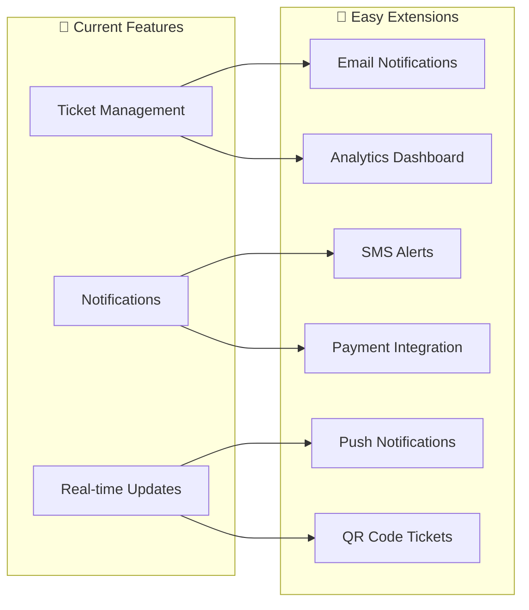

### Adding New Notification Types

Simply extend the Observer and add new methods:

```php
// In TicketObserver.php
public function updated(Ticket $ticket)
{
    // Existing cancellation logic...
    
    // New: Refund processed notification
    if ($ticket->wasChanged('refund_status') && $ticket->refund_status === 'processed') {
        $this->notificationService->notifyRefundProcessed($ticket);
    }
    
    // New: Event reminder notification  
    if ($ticket->event->event_date->isToday()) {
        $this->notificationService->notifyEventReminder($ticket);
    }
}
```

This architecture grows with your learning journey! 🌱 
        A --> A3[System Config]
        
        O --> O1[Own Events Only]
        O --> O2[Event Creation]
        
        U --> U1[Event Browsing]
        U --> U2[Profile Management]
    end
    
    subgraph "Security Measures"
        S1[Admin Privilege Validation]
        S2[Self-Role Prevention]
This architecture grows with your learning journey! 🌱

---

## 📖 Documentation Summary

This **Event Management & Ticketing System** demonstrates how to build professional-quality applications using simple, beginner-friendly design patterns. The **Observer Pattern** serves as the foundation for both real-time ticket availability and organizer notifications, proving that one well-implemented pattern can power multiple features effectively.

**Key Learning Outcomes:**
- ✅ Observer Pattern for automatic event handling
- ✅ Service Layer Pattern for clean business logic  
- ✅ Real-time updates with AJAX polling
- ✅ Database relationships and migrations
- ✅ Component-based UI architecture
- ✅ Professional documentation practices

Perfect for students learning Laravel, design patterns, and modern web development! 🚀