# EMTS - Complete System Architecture Documentation

## 🏗️ Overall System Architecture

### Modern Event Management & Ticketing System with Advanced Design Patterns


## 🔐 Event Approval System Architecture

### Admin-Controlled Event Workflow

The Event Approval System implements a three-state workflow with admin oversight:

```mermaid
graph TD
    subgraph "📝 Event Creation (Organizer)"
        A[Organizer Creates Event]
        B[Event Status: Draft]
        C[Approval Status: Pending]
    end
    
    subgraph "👨‍💼 Admin Review Process"
        D[Admin Dashboard Alert]
        E[Pending Events Counter]
        F[Review Event Details]
        G{Admin Decision}
        H[Approve + Comments]
        I[Reject + Required Reason]
    end
    
    subgraph "📊 Event State Management"
        J[Approved Status]
        K[Rejected Status]
        L[Audit Trail Created]
        M[Organizer Notification]
    end
    
    A --> B
    B --> C
    C --> D
    D --> E
    E --> F
    F --> G
    G -->|Approve| H
    G -->|Reject| I
    H --> J
    I --> K
    J --> L
    K --> L
    L --> M
```



### Service Layer Implementation

**SimpleEventApprovalService** encapsulates all approval business logic:


### Database Schema Extension

**Enhanced Events Table** with approval tracking:


### Approval Workflow Sequence

**Complete Admin Approval Process**:


### Security & Access Control

**Multi-Layer Security Implementation**:

```mermaid
graph TB
    subgraph "🛡️ Access Control Layers"
        A[Route Access]
        B[Controller Validation]
        C[Service Layer Security]
        D[Database Constraints]
    end
    
    subgraph "🔐 Admin Validation"
        E[User Authentication]
        F[Role Verification]
        G[Admin Role Check]
        H[Action Authorization]
    end
    
    A --> E
    B --> F
    C --> G
    D --> H
    
    E -->|Authenticated| F
    F -->|role = admin| G
    G -->|Authorized| H
    H -->|Permitted| I[Approval Action Executed]
```



**Access Validation Code Pattern**:
```php
private function checkAdminAccess()
{
    if (!Auth::check() || Auth::user()->role !== 'admin') {
        abort(403, 'Admin access required');
    }
}
```

### Performance & Caching Strategy

**Approval System Optimization**:

```mermaid
graph LR
    subgraph "📊 Stats Caching"
        A[Approval Stats]
        B[Cache Key: approval_stats]
        C[TTL: 300 seconds]
    end
    
    subgraph "📋 Event Caching"
        D[Pending Events]
        E[Cache Key: pending_events]
        F[TTL: 60 seconds]
    end
    
    subgraph "🔄 Cache Invalidation"
        G[Event Approved/Rejected]
        H[Clear All Approval Caches]
        I[Refresh Dashboard Counters]
    end
    
    A --> B --> C
    D --> E --> F
    G --> H --> I
```



### Key Benefits

- ✅ **Quality Control**: Admin oversight ensures event standards
- ✅ **Audit Trail**: Complete tracking of approval decisions
- ✅ **Security Focused**: Multi-layer admin access validation
- ✅ **User Feedback**: Required comments provide organizer guidance
- ✅ **Scalable Design**: Supports multiple admin reviewers
- ✅ **Performance Optimized**: Intelligent caching strategies

---

## 🔄 Complete Data Flow Diagramsitecture

### Clean, Simple Architecture with Advanced Design Patterns


## 🔄 Observer Pattern Architecture

### Core Observer Implementation

The system uses Laravel's Observer Pattern for real-time ticket tracking and notifications:

```mermaid
graph LR
    subgraph "📦 Model Events"
        A[Ticket Created]
        B[Ticket Updated] 
        C[Ticket Deleted]
    end
    
    subgraph "👁️ Observer Layer"
        D[TicketObserver]
        E[updated method]
        F[created method]
        G[deleted method]
    end
    
    subgraph "🔧 Service Layer"
        H[SimpleTicketService]
        I[SimpleNotificationService]
        J[updateAvailability]
        K[notifyOrganizer]
    end
    
    subgraph "📱 Notification Flow"
        L[Create Notification]
        M[Update UI Badge]
        N[Real-time Updates]
    end
    
    A --> F
    B --> E  
    C --> G
    E --> H
    E --> I
    F --> H
    F --> I
    G --> H
    H --> J
    I --> K
    K --> L
    L --> M
    M --> N
```



### Notification System Flow


```mermaid
sequenceDiagram
    participant U as User
    participant C as Controller
    participant F as Factory
    participant S as Service
    participant R as Repository
    participant M as Model
    participant DB as Database

    Note over U,DB: User Registration Flow (Factory Pattern)
    U->>C: POST /register
    C->>F: createUser(data, role)
## 🎯 Enhanced Service Layer Architecture

### Modern Design Patterns for Scalable Development

Our system combines **simplicity with advanced patterns** for educational and production readiness:

```mermaid
graph TD
    subgraph "🎫 Ticket Management"
        A[SimpleTicketService]
        B[getAvailability]
        C[purchaseTickets]
        D[Cache Results]
    end
    
    subgraph "📊 Booking Management"
        E[SimpleBookingService]
        F[getAllBookings]
        G[getBookingStats]
        H[exportBookings]
        I[Cache Statistics]
    end
    
    subgraph "🔔 Notification System"
        J[SimpleNotificationService]
        K[notifyTicketCancellation]
        L[notifyTicketPurchase]
        M[getUnreadNotifications]
    end
    
    subgraph "👁️ Enhanced Observer Pattern"
        N[TicketObserver]
        O[updated method]
        P[created method]
        Q[deleted method]
        R[clearBookingCache]
        S[Auto-trigger notifications]
    end
    
    A --> B
    A --> C
    A --> D
    E --> F
    E --> G
    E --> H
    E --> I
    J --> K
    J --> L
    J --> M
    N --> O
    N --> P
    N --> Q
    N --> R
    O --> S
    P --> S
    Q --> S
    R --> E
    E --> H
    I --> J
    I --> K
    J --> A
    J --> E
    K --> A
    K --> E
    L --> E
```

## 🔄 Complete Data Flow Diagrams

### Ticket Purchase with Automatic Notifications

```mermaid
sequenceDiagram
    participant U as 👤 Customer
    participant C as 🎮 Controller
    participant TS as 🎫 TicketService
    participant M as 📊 Model
    participant DB as 🗄️ Database
    participant TO as 👁️ Observer
    participant NS as 🔔 NotificationService
    participant O as 👨‍💼 Organizer

    Note over U,O: Complete Ticket Purchase Flow
    
    U->>C: POST /events/{id}/purchase-ticket
    C->>TS: purchaseTickets(eventId, quantity, userId)
    TS->>M: create new ticket record
    M->>DB: INSERT INTO tickets
    DB-->>M: ticket created with ID
    M-->>TO: Ticket::created event fired
    TO->>TS: updateAvailability(eventId)
    TO->>NS: notifyTicketPurchase(ticket)
    
    par Update Availability
        TS->>TS: clear cache for event
        TS->>M: recalculate availability
        M->>DB: COUNT tickets for event
        DB-->>M: current ticket count
        M-->>TS: updated availability
    and Create Notification
        NS->>NS: build purchase notification
        NS->>M: create notification record
        M->>DB: INSERT INTO notifications
        DB-->>M: notification created
        M-->>O: notification appears in UI
    end
    
    TS-->>C: purchase success + updated availability
    C-->>U: JSON success response
```



### Ticket Cancellation with Organizer Alerts

```mermaid
sequenceDiagram
    participant U as 👤 Customer
    participant C as 🎮 Controller
    participant M as 📊 Model
    participant DB as 🗄️ Database
    participant TO as 👁️ Observer
    participant NS as 🔔 NotificationService
    participant O as 👨‍💼 Organizer

    Note over U,O: Complete Ticket Cancellation Flow
    
    U->>C: PATCH /tickets/{id}/cancel
    C->>M: update ticket status to 'cancelled'
    M->>DB: UPDATE tickets SET status = 'cancelled'
    DB-->>M: status updated
    M-->>TO: Ticket::updated event fired
    TO->>TO: detect status change to 'cancelled'
    TO->>NS: notifyTicketCancellation(ticket)
    
    NS->>NS: get event organizer
    NS->>NS: build cancellation notification
    NS->>M: create notification record
    M->>DB: INSERT INTO notifications
    DB-->>M: notification created
    M-->>O: alert appears with customer details
    
    TO-->>C: cancellation processed
    C-->>U: cancellation confirmed
```


    M->>DB: INSERT INTO tickets
    DB-->>M: tickets created
    M-->>TO: Ticket::created event
    TO->>TS: updateAvailability(eventId)
    TS->>Cache: clear cache
    TS-->>C: purchase success
    C-->>U: JSON success response
```

## Component Hierarchy

```mermaid
graph TD
    A[App Layout] --> B[Auth Views]
    A --> C[Event Views]
    A --> D[Profile Views]
    
    B --> B1[Login Form]
    B --> B2[Register Form]
    B --> B3[Reset Password]
    
    C --> C1[Events Index]
    C --> C2[Event Create/Edit]
    C --> C3[Event Details]
    
    C1 --> SC[Sorting Controls Component]
    C1 --> TC[Table Component]
    C1 --> PC[Pagination Component]
    
    C3 --> TAC[Ticket Availability Component]
## 🎨 Component Hierarchy

### Modern Blade Component Structure

```mermaid
graph TD
    A[🏠 App Layout] --> B[🔐 Auth Views]
    A --> C[🎪 Event Views] 
    A --> D[👤 Profile Views]
    A --> E[🔔 Notification Views]
    
    B --> B1[Login Form]
    B --> B2[Register Form]
    B --> B3[Reset Password]
    
    C --> C1[📋 Events Index]
    C --> C2[✏️ Event Create/Edit]
    C --> C3[📄 Event Details]
    
    C1 --> SC[🔽 Sorting Controls]
    C1 --> TC[📊 Table Component]
    C1 --> PC[📑 Pagination]
    
    C3 --> TAC[🎫 Ticket Availability]
    TAC --> TPB[📊 Progress Bar]
    TAC --> TPF[💳 Purchase Form]
    TAC --> TRT[⚡ Real-time Updates]
    
    D --> D1[✏️ Profile Edit]
    D --> D2[🖼️ Avatar Upload]
    
    E --> E1[🔔 Notification Center]
    E --> E2[📬 Notification Cards]
    E --> E3[🔵 Notification Badges]
    
    E1 --> NFC[📋 Notification Filter]
    E1 --> NLC[📜 Notification List]
    E2 --> NRC[✅ Mark Read Button]
    E2 --> NDC[📊 Notification Data]
```

## 🗄️ Database Relationships & Schema

### Complete Entity Relationship Diagram


        bigint organizer_id FK
        string image_path
        timestamp created_at
        timestamp updated_at
    }
    
    LOGIN_LOG {
        bigint id PK
        bigint user_id FK
        string email
        boolean success
        string ip
        text user_agent
        timestamp created_at
    }
    
    USER ||--o{ EVENT : "organizes (1:many)"
    USER ||--o{ LOGIN_LOG : "logs (1:many)"
```

## Authentication Flow

```mermaid
stateDiagram-v2
    [*] --> Guest
    Guest --> Authenticating : Login Attempt
    Authenticating --> Admin : role = admin
    Authenticating --> Organizer : role = organizer
    Authenticating --> RegularUser : role = user
    Authenticating --> Guest : Failed Authentication
## ⚙️ Observer Pattern Deep Dive

### Why Observer Pattern for Beginners?

The Observer Pattern is perfect for learning because it's **simple** and **automatic**:

```mermaid
graph LR
    subgraph "🎯 Problem"
        A[Manual Updates]
        B[Forgotten Notifications]  
        C[Tight Coupling]
        D[Code Duplication]
    end
    
    subgraph "✅ Observer Solution"
        E[Automatic Updates]
        F[Never Miss Events]
        G[Loose Coupling]
        H[Single Responsibility]
    end
    
    A --> E
    B --> F
    C --> G
    D --> H
```

### Observer Pattern Benefits

- ✅ **Easy to understand** - One service, one observer, one controller

- ✅ **Automatic notifications** - No manual trigger needed
- ✅ **Single responsibility** - Each class has one job
- ✅ **Extensible** - Easy to add new notification types
- ✅ **Testable** - Simple to mock and test
- ✅ **Laravel native** - Uses framework's built-in observer system

### Code Structure Benefits

```mermaid
graph TD
    subgraph "👨‍🎓 Beginner Friendly"
        A[Clear Class Names]
        B[Single Purpose Methods]
        C[Easy to Debug]
        D[Minimal Configuration]
    end
    
    subgraph "🚀 Professional Quality"
        E[Design Pattern]
        F[Automatic Processing]
        G[Real-time Updates]
        H[Scalable Architecture]
    end
    
    A --> E
    B --> F
    C --> G
    D --> H
```



## 🔄 Real-time Update Architecture

### AJAX Polling System

Our real-time updates use simple AJAX polling for maximum compatibility:

```mermaid
sequenceDiagram
    participant Browser as 🌐 Browser
    participant Controller as 🎮 Controller
    participant Service as 🔧 Service
    participant Cache as 📦 Cache
    participant DB as 🗄️ Database
    
    Note over Browser,DB: Real-time Ticket Availability Updates
    
    loop Every 10 seconds
        Browser->>Controller: GET /events/{id}/availability
        Controller->>Service: getAvailability(eventId)
        Service->>Cache: check cached availability
        
        alt Cache Hit
            Cache-->>Service: return cached data
        else Cache Miss
            Service->>DB: COUNT tickets WHERE event_id = ?
            DB-->>Service: current count
            Service->>Cache: store for 30 seconds
        end
        
        Service-->>Controller: availability data
        Controller-->>Browser: JSON response
        Browser->>Browser: update progress bar & stats
    end
    
    Note over Browser,DB: Background Notification Badge Updates
    
    loop Every 15 seconds  
        Browser->>Controller: GET /notifications/unread-count
        Controller->>Service: getUnreadCount(userId)
        Service->>DB: COUNT notifications WHERE is_read = false
        DB-->>Service: unread count
        Service-->>Controller: count data
        Controller-->>Browser: JSON response
        Browser->>Browser: update notification badge
    end
```


        +render() View
    }
    
    EventController --> SortingService : uses
    EventController --> EventRepository : uses
    EventController --> SortingControlsComponent : passes data to
    SortingService --> EventRepository : validates parameters for
```

## 🔑 Command Pattern - Password Reset System Architecture ⭐ **BEGINNER FRIENDLY**

The password reset system uses Command Pattern to encapsulate reset operations as individual command objects, enhancing maintainability and separation of concerns.

### Password Reset Workflow

```mermaid
sequenceDiagram
    participant User as 👤 User
    participant Controller as 🎮 Controller
    participant Service as 🔧 Service
    participant DB as 🗄️ Database
    participant Mail as ✉️ Mail System
    
    User->>Controller: Request password reset
    Controller->>Service: sendResetToken(email)
    Service->>DB: Check if user exists
    DB-->>Service: User info
    
    alt User exists
        Service->>DB: Store token & expiry
        Service->>Mail: Send reset email
        Mail-->>User: Reset link email
        Service-->>Controller: Success response
        Controller-->>User: "Check your email"
    else User not found
        Service-->>Controller: Error response
        Controller-->>User: "Email not found"
    end
    
    Note over User,Mail: Later: User clicks reset link
    
    User->>Controller: Open reset form
    Controller->>Service: verifyResetToken(email, token)
    Service->>DB: Check token validity
    DB-->>Service: Token info
    
    alt Valid token
        Service-->>Controller: Token verified
        Controller-->>User: Show reset form
        
        User->>Controller: Submit new password
        Controller->>Service: resetPassword(email, token, newPassword)
        Service->>DB: Update password
        Service->>DB: Remove used token
        Service-->>Controller: Success response
        Controller-->>User: "Password reset successful"
    else Invalid/expired token
        Service-->>Controller: Error response
        Controller-->>User: "Invalid or expired token"
    end
```



### Command Pattern Implementation


### Key Benefits of Command Pattern in Password Reset:

- ✅ **Encapsulation**: Each password reset operation encapsulated in its own command
- ✅ **Separation of Concerns**: Each command handles one specific task
- ✅ **Auditability**: Commands can be logged, tracked, and monitored
- ✅ **Testability**: Easy to test each command in isolation
- ✅ **Flexibility**: New password-related commands can be added easily
- ✅ **Security**: Clean separation between validation and execution

## 💰 State Pattern - Payment Processing Architecture ⭐ **BEGINNER FRIENDLY**

The payment system uses the State Pattern to manage payment status transitions in a clean, safe way, ensuring that tickets can only move through valid payment states.

### Payment State Machine

```mermaid
stateDiagram-v2
    [*] --> Pending: Create Ticket
    
    Pending --> Paid: markAsPaid()
    Pending --> Failed: markAsFailed()
    
    Paid --> Refunded: refundTicket()
    Failed --> Pending: retryPayment()
    
    note right of Pending: Initial state
    note right of Paid: Can only reach from Pending
    note right of Failed: Can retry payment
    note right of Refunded: Terminal state
```

### State Pattern Implementation

```mermaid
classDiagram
    class SimplePaymentService {
        +markAsPaid(ticket, amount, reference) boolean
        +markAsFailed(ticket, reason) boolean
        +refundTicket(ticket, reference) boolean
        +retryPayment(ticket) boolean
        +getPaymentStats() array
        +getPendingPayments() Collection
        +getFailedPayments() Collection
    }
    
    class Ticket {
        +payment_status: string
        +payment_amount: decimal
        +payment_reference: string
        +paid_at: timestamp
        +isPending() boolean
        +isPaid() boolean
        +isFailed() boolean
        +isRefunded() boolean
    }
    
    class SimplePaymentController {
        -paymentService: SimplePaymentService
        +processPendingPayment(ticketId, amount, reference) JsonResponse
        +markPaymentFailed(ticketId, reason) JsonResponse
        +processRefund(ticketId) JsonResponse
        +retryFailedPayment(ticketId) JsonResponse
        +showPaymentDashboard() View
    }
    
    SimplePaymentService --> Ticket : manages state
    SimplePaymentController --> SimplePaymentService : uses
```

### Key Benefits of State Pattern in Payment Processing:

- ✅ **Clear State Transitions**: Only valid payment state changes are allowed
- ✅ **Business Rules Enforcement**: System prevents invalid operations (e.g., refunding an unpaid ticket)
- ✅ **Code Organization**: Payment states and transitions are clearly defined
- ✅ **Reduced Bugs**: Prevents accidental invalid state changes
- ✅ **Maintainability**: Easy to understand the payment lifecycle
- ✅ **Extensibility**: New payment states can be added easily

## Simplified Ticket Availability System Architecture ⭐ **BEGINNER FRIENDLY**

```mermaid
classDiagram
    class SimpleTicketService {
        +getAvailability(eventId) array
        +purchaseTickets(eventId, quantity, userId) bool
        +updateAvailability(eventId) void
        -clearAvailabilityCache(eventId) void
    }
    
    class TicketObserver {
        -ticketService: SimpleTicketService
        +created(ticket) void
        +updated(ticket) void
        +deleted(ticket) void
    }
    
    class SimpleTicketController {
        -ticketService: SimpleTicketService
        +getAvailability(eventId) JsonResponse
        +purchaseTickets(request, eventId) JsonResponse
    }
    
    class SimpleTicketAvailabilityComponent {
        +eventId: int
        +refreshInterval: int
        +render() View
        +updateAvailability() void
        +handlePurchase() void
    }
    
    TicketObserver --> SimpleTicketService : triggers
    SimpleTicketController --> SimpleTicketService : uses
    SimpleTicketAvailabilityComponent --> SimpleTicketController : calls API
```

**Key Benefits of Simplified Design:**
- ✅ **Easy to understand** - One service, one observer, one controller
- ✅ **Observer Pattern** - Automatic updates when tickets change
- ✅ **Caching** - Fast performance with simple cache strategy
- ✅ **Real-time UI** - Updates every 10 seconds automatically
- ✅ **No complexity** - No strategy interfaces or multiple implementations

## Role Management System Architecture

```mermaid
sequenceDiagram
    participant A as Admin
    participant UI as Role Selector
    participant UC as UserController
    participant RMS as RoleManagementService
    participant UR as UserRepository
    participant DB as Database

    Note over A,DB: Role Change Flow (Strategy Pattern)
    A->>UI: Select new role for user
    UI->>UC: PATCH /users/{id}/role
    UC->>RMS: changeUserRole(user, newRole, admin)
    
    Note over RMS: Strategy: Validate admin permissions
    RMS->>RMS: validateAdminRole(admin)
    
    Note over RMS: Strategy: Prevent self-modification
    RMS->>RMS: preventSelfModification(user, admin)
    
    Note over RMS: Strategy: Validate role transition
    RMS->>RMS: canTransitionToRole(currentRole, newRole)
    
    RMS->>UR: updateRole(userId, newRole)
    UR->>DB: UPDATE users SET role = newRole
    DB-->>UR: success
    UR-->>RMS: updated
    RMS-->>UC: success
    UC-->>UI: JSON success response
    UI-->>A: Success notification & UI update
```

```mermaid
classDiagram
    class RoleManagementService {
        +ROLE_TRANSITIONS: array
        +ROLE_COLORS: array
## 🚀 Implementation Benefits

### Why This Architecture Works for Learners

```mermaid
graph TD
    subgraph "📚 Learning Benefits"
        A[Clear Separation of Concerns]
        B[Single Design Pattern Focus]
        C[Real-world Applicability]
        D[Easy to Extend]
    end
    
    subgraph "💼 Professional Quality"
        E[Industry Standard Patterns]
        F[Scalable Architecture]
        G[Maintainable Code]
        H[Testable Components]
    end
    
    A --> E
    B --> F
    C --> G
    D --> H
```

### Technology Stack Integration

- **Laravel Framework**: Robust foundation with built-in Observer support
- **SQLite Database**: Lightweight, perfect for learning and development
- **Tailwind CSS**: Utility-first styling for rapid UI development
- **Alpine.js**: Minimal JavaScript framework for reactive components
- **AJAX Polling**: Simple real-time updates without WebSocket complexity

## 🔮 Future Extensions

### Easy Enhancement Opportunities

The current architecture makes it simple to add:

```mermaid
graph LR
    subgraph "🎯 Current Features"
        A[Ticket Management]
        B[Notifications]
        C[Real-time Updates]
    end
    
    subgraph "🚀 Easy Extensions"
        D[Email Notifications]
        E[SMS Alerts]
        F[Push Notifications]
        G[Analytics Dashboard]
        H[Payment Integration]
        I[QR Code Tickets]
    end
    
    A --> D
    B --> E
    C --> F
    A --> G
    B --> H
    C --> I
```

### Adding New Notification Types

Simply extend the Observer and add new methods:

```php
// In TicketObserver.php
public function updated(Ticket $ticket)
{
    // Existing cancellation logic...
    
    // New: Refund processed notification
    if ($ticket->wasChanged('refund_status') && $ticket->refund_status === 'processed') {
        $this->notificationService->notifyRefundProcessed($ticket);
    }
    
    // New: Event reminder notification  
    if ($ticket->event->event_date->isToday()) {
        $this->notificationService->notifyEventReminder($ticket);
    }
}
```

## 🎫 User-Admin Support Communication System ⭐ **LATEST FEATURE**

### Comprehensive Support System Architecture

The Support System enables **direct communication between users and organizers/admins** for event-related questions, issues, and feedback. This system follows **MVC + Service Layer patterns** for clean architecture.

```mermaid
graph TB
    subgraph "👤 User Layer"
        A[User/Customer]
        B[Support Question/Issue]
        C[Event Selection]
        D[Priority Selection]
    end
    
    subgraph "📝 Support Form System"
        E[Support Creation Form]
        F[Event Dropdown]
        G[Priority Selector]
        H[Message Validation]
    end
    
    subgraph "🎮 Controller Layer"
        I[SupportController]
        J[create Method]
        K[store Method]
        L[index Method - Admin]
        M[show Method]
        N[respond Method - Admin]
    end
    
    subgraph "📊 Business Logic"
        O[Form Validation]
        P[Status Management]
        Q[Priority Handling]
        R[Admin Access Control]
    end
    
    subgraph "🗄️ Database Layer"
        S[SupportMessage Model]
        T[User Relationship]
        U[Event Relationship]
        V[Admin Relationship]
    end
    
    subgraph "👨‍💼 Admin Management"
        W[Admin Dashboard]
        X[Message List]
        Y[Response Interface]
        Z[Status Updates]
    end
    
    A --> B
    B --> C
    C --> D
    D --> E
    E --> F
    F --> G
    G --> H
    H --> I
    I --> J
    J --> K
    K --> O
    O --> P
    P --> Q
    Q --> S
    S --> T
    T --> U
    U --> V
    L --> W
    W --> X
    X --> Y
    Y --> Z
    M --> N
    N --> R
    R --> S
```

### Support System Data Flow

```mermaid
sequenceDiagram
    participant U as 👤 User
    participant SF as 📝 Support Form
    participant SC as 🎮 SupportController
    participant SM as 📊 SupportMessage
    participant DB as 🗄️ Database
    participant A as 👨‍💼 Admin
    participant AI as 💻 Admin Interface

    Note over U,AI: Complete Support Communication Workflow
    
    U->>SF: Fill support form
    SF->>SF: Select event (optional)
    SF->>SF: Choose priority (low/medium/high)
    SF->>SF: Write detailed message
    SF->>SC: Submit support request
    
    SC->>SC: Validate form data
    SC->>SM: Create new support message
    SM->>DB: Store message with status 'open'
    DB-->>SM: Message created with ID
    SM-->>SC: Success confirmation
    SC-->>U: "Message sent! Admin will respond soon"
    
    Note over A,AI: Admin Management Process
    
    A->>AI: Access admin support dashboard
    AI->>SC: Get all support messages
    SC->>DB: Query messages with relationships
    DB-->>SC: Messages with user/event/admin data
    SC-->>AI: Display organized message list
    
    A->>AI: Click on specific message
    AI->>SC: Show message details
    SC->>DB: Get complete message data
    DB-->>SC: Full message with relationships
    SC-->>AI: Display detailed view
    
    A->>AI: Write response + update status
    AI->>SC: Submit admin response
    SC->>SC: Validate admin permissions
    SC->>SM: Update message with response
    SM->>DB: Store admin response + timestamp
    DB-->>SM: Response saved
    SM-->>SC: Update confirmed
    SC-->>A: "Response sent successfully!"
```

### Support Message Database Schema

```mermaid
erDiagram
    SUPPORT_MESSAGES {
        bigint id PK
        bigint user_id FK "User who sent message"
        bigint event_id FK "Related event (optional)"
        bigint admin_id FK "Admin who responded"
        string subject "Message subject line"
        text message "User's detailed message"
        text admin_response "Admin's response"
        enum status "open, in_progress, resolved"
        enum priority "low, medium, high"
        timestamp admin_responded_at "When admin responded"
        timestamp created_at "When message was created"
        timestamp updated_at "Last modification time"
    }
    
    USERS {
        bigint id PK
        string name
        string email
        enum role "user, organizer, admin"
    }
    
    EVENTS {
        bigint id PK
        string title
        text description
        bigint organizer_id FK
        enum approval_status
    }
    
    USERS ||--o{ SUPPORT_MESSAGES : "sends messages"
    USERS ||--o{ SUPPORT_MESSAGES : "responds as admin"
    EVENTS ||--o{ SUPPORT_MESSAGES : "relates to event"
```

### Support System Features

**🔍 User Features:**
- **Event-Specific Questions**: Link support messages to specific events
- **Priority Selection**: Choose urgency level (low, medium, high)
- **Subject & Message**: Detailed communication with character limits
- **Intuitive Form**: Clean, user-friendly interface
- **Success Feedback**: Clear confirmation when message is sent

**👨‍💼 Admin Features:**
- **Centralized Dashboard**: View all support messages in one place
- **Status Management**: Track message status (open → in_progress → resolved)
- **Detailed View**: See complete user information and event context
- **Response System**: Reply directly to users with admin responses
- **Priority Filtering**: Focus on high-priority messages first
- **Admin Tracking**: Track which admin responded and when

**🔐 Security Features:**
- **Role-Based Access**: Only admins can view and respond to messages
- **User Authentication**: All messages tied to authenticated users
- **Input Validation**: Prevent XSS and ensure data integrity
- **Admin Response Tracking**: Full audit trail of admin responses

### Support Controller Implementation

```php
// app/Http/Controllers/SupportController.php
class SupportController extends Controller
{
    /**
     * Show support form (Users) - with approved events
     */
    public function create()
    {
        $events = Event::where('status', 'published')
            ->where('approval_status', 'approved')
            ->orderBy('event_date', 'asc')
            ->get();

        return view('support.create', compact('events'));
    }

    /**
     * Store support message with validation
     */
    public function store(Request $request)
    {
        $request->validate([
            'subject' => 'required|string|max:255',
            'message' => 'required|string|max:1000',
            'event_id' => 'nullable|exists:events,id',
            'priority' => 'required|in:low,medium,high'
        ]);

        SupportMessage::create([
            'user_id' => Auth::id(),
            'event_id' => $request->event_id,
            'subject' => $request->subject,
            'message' => $request->message,
            'priority' => $request->priority,
            'status' => 'open'
        ]);

        return redirect()->route('support.create')
            ->with('success', 'Your message has been sent! An admin will respond soon.');
    }

    /**
     * Admin dashboard - view all messages
     */
    public function index()
    {
        $messages = SupportMessage::with(['user', 'event', 'admin'])
            ->orderBy('created_at', 'desc')
            ->get();

        return view('support.index', compact('messages'));
    }

    /**
     * Admin response system
     */
    public function respond(Request $request, $id)
    {
        $request->validate([
            'admin_response' => 'required|string|max:1000',
            'status' => 'required|in:open,in_progress,resolved'
        ]);

        $message = SupportMessage::findOrFail($id);

        $message->update([
            'admin_response' => $request->admin_response,
            'admin_responded_at' => now(),
            'admin_id' => Auth::id(),
            'status' => $request->status
        ]);

        return redirect()->route('support.show', $id)
            ->with('success', 'Response sent successfully!');
    }
}
```

### Support Message Model Relationships

```php
// app/Models/SupportMessage.php
class SupportMessage extends Model
{
    // Status and Priority Constants
    public const STATUS_OPEN = 'open';
    public const STATUS_IN_PROGRESS = 'in_progress';
    public const STATUS_RESOLVED = 'resolved';

    public const PRIORITY_LOW = 'low';
    public const PRIORITY_MEDIUM = 'medium';
    public const PRIORITY_HIGH = 'high';

    protected $fillable = [
        'user_id', 'event_id', 'subject', 'message', 
        'status', 'priority', 'admin_response', 
        'admin_responded_at', 'admin_id'
    ];

    /**
     * Relationships for complete data access
     */
    public function user(): BelongsTo
    {
        return $this->belongsTo(User::class, 'user_id');
    }

    public function event(): BelongsTo
    {
        return $this->belongsTo(Event::class, 'event_id');
    }

    public function admin(): BelongsTo
    {
        return $this->belongsTo(User::class, 'admin_id');
    }

    /**
     * Helper methods for status checking
     */
    public function isOpen(): bool
    {
        return $this->status === self::STATUS_OPEN;
    }

    public function isResolved(): bool
    {
        return $this->status === self::STATUS_RESOLVED;
    }

    public function hasAdminResponse(): bool
    {
        return !empty($this->admin_response);
    }
}
```

### Support System UI Components

**📝 User Support Form (`support/create.blade.php`):**
- Clean, responsive form with Tailwind CSS styling
- Event selection dropdown (optional)
- Priority selection with visual indicators
- Character counter for message field
- Success/error message handling

**📋 Admin Support Dashboard (`support/index.blade.php`):**
- Table view of all support messages
- Priority badges with color coding
- Status indicators with icons
- User and event information display
- Quick access to detailed view

**📄 Support Message Detail View (`support/show.blade.php`):**
- Complete message information
- User profile and event details
- Admin response form
- Status update functionality
- Timestamp tracking

### Support System Benefits

**✅ For Users:**
- **Direct Communication**: Ask specific questions about events
- **Event Context**: Link questions to specific events
- **Priority System**: Mark urgent issues appropriately
- **Easy Access**: Support button available in user dashboard
- **Quick Feedback**: Immediate confirmation of message submission

**✅ For Admins:**
- **Centralized Management**: All support messages in one dashboard
- **Complete Context**: See user, event, and message details
- **Response Tracking**: Track all admin responses with timestamps
- **Status Management**: Organize workflow with status updates
- **Efficient Communication**: Respond directly without external tools

**✅ For System:**
- **Clean Architecture**: Follows Laravel MVC + Service patterns
- **Database Efficiency**: Proper relationships and indexing
- **Security**: Role-based access and input validation
- **Scalability**: Easy to extend with new features
- **Maintainability**: Clear code structure and documentation

### Integration with Existing Features

The Support System seamlessly integrates with:

**🔗 Event System:**
- Support messages can be linked to specific events
- Only approved events appear in support form dropdown
- Event organizers can see support messages related to their events

**🔗 User Management:**
- All support messages tied to authenticated users
- Admin responses tracked with admin user relationships
- Role-based access control for admin features

**🔗 Dashboard Integration:**
- Support button added to user dashboard
- Admin support management accessible from admin dashboard
- Consistent UI/UX with existing design system

**🔗 Notification System:**
- Could be extended to notify users when admins respond
- Could notify admins when new support messages arrive
- Integration ready for email/SMS notifications

### Future Enhancement Opportunities

The Support System is designed for easy extension:

**📧 Email Notifications:**
- Notify users when admins respond
- Notify admins when new messages arrive
- Email templates for professional communication

**📊 Analytics & Reporting:**
- Support message volume analysis
- Response time tracking
- Common issue identification
- Customer satisfaction metrics

**�️ Category System:**
- Categorize support messages by type
- Auto-routing to appropriate admin teams
- Template responses for common issues

**💬 Real-time Chat:**
- WebSocket integration for live chat
- Typing indicators and read receipts
- File attachment support

---

## 📖 Documentation Summary

This **Event Management & Ticketing System** demonstrates how to build professional-quality applications using simple, beginner-friendly design patterns. The **Observer Pattern** serves as the foundation for both real-time ticket availability and organizer notifications, proving that one well-implemented pattern can power multiple features effectively.

**Key Learning Outcomes:**
- ✅ Observer Pattern for automatic event handling
- ✅ Service Layer Pattern for clean business logic  
- ✅ Real-time updates with AJAX polling
- ✅ Database relationships and migrations
- ✅ Component-based UI architecture
- ✅ Professional documentation practices

Perfect for students learning Laravel, design patterns, and modern web development! 🚀