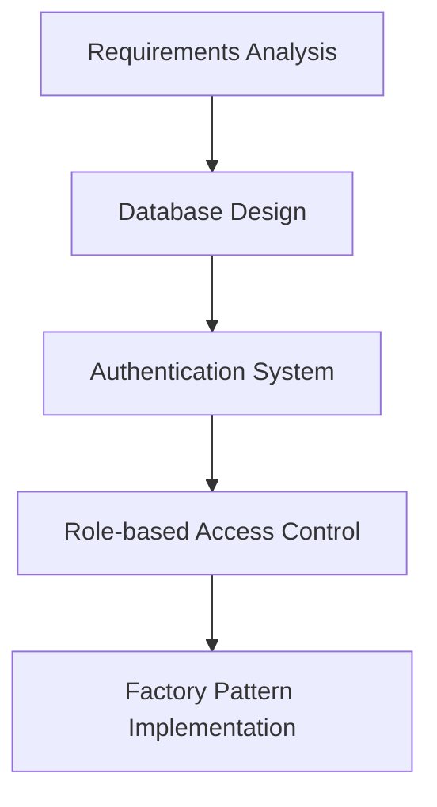
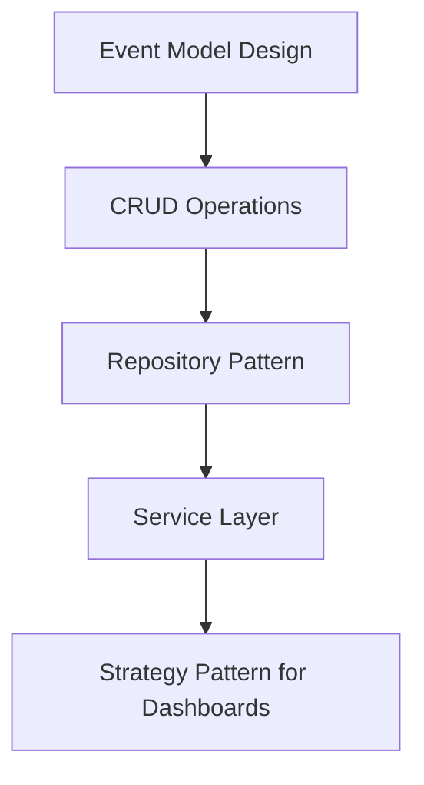
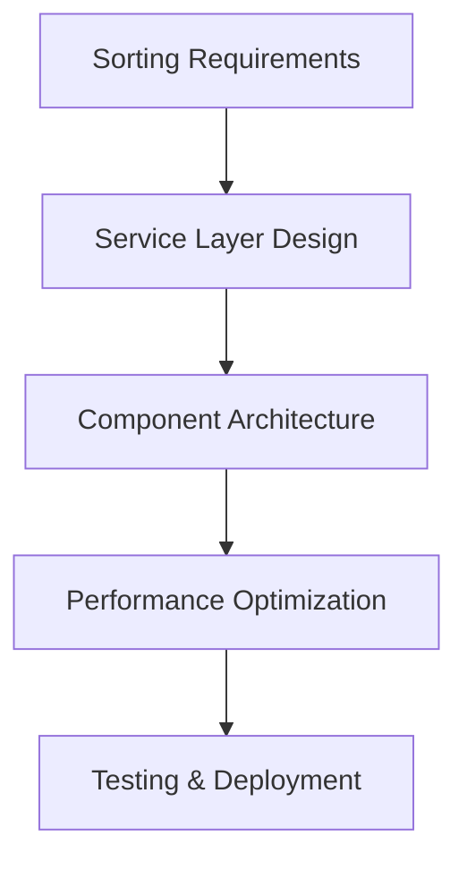
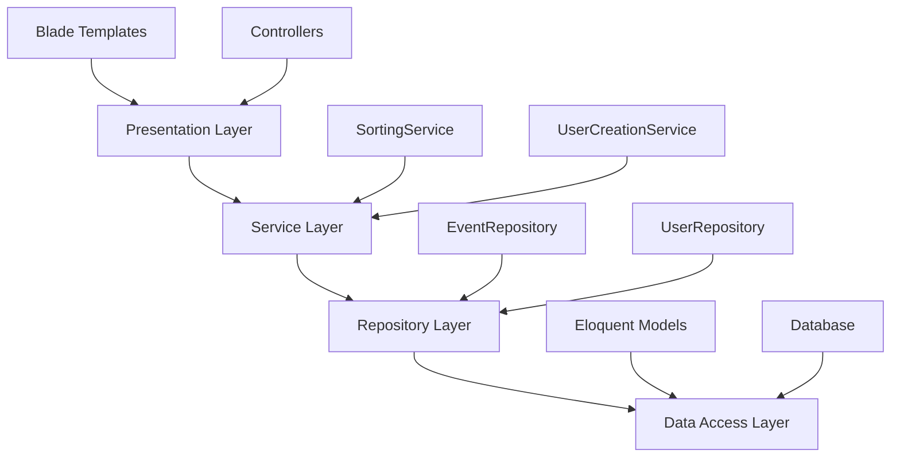
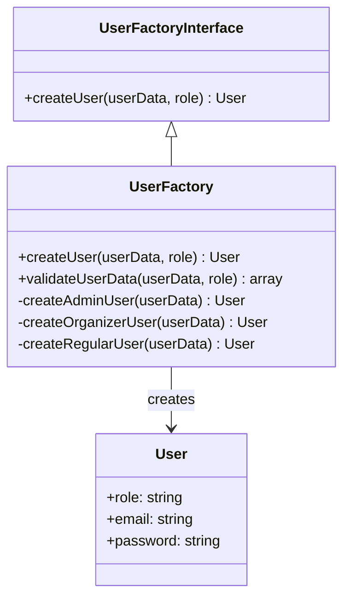
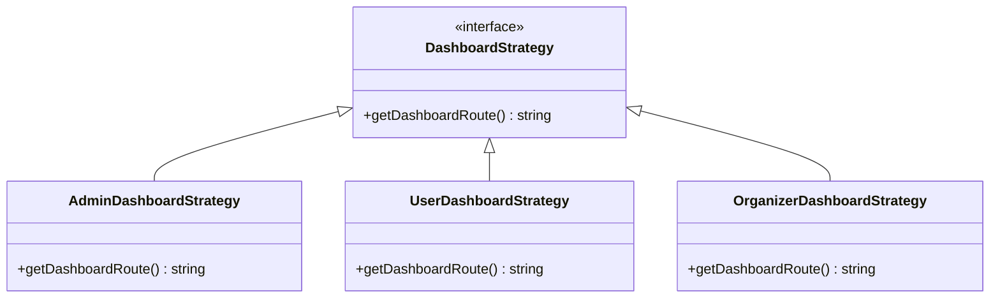
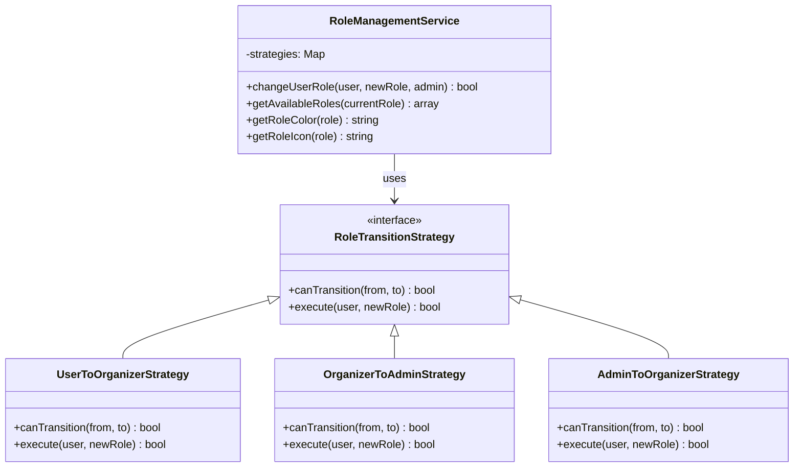
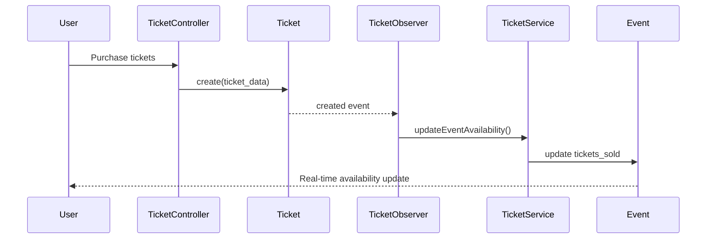
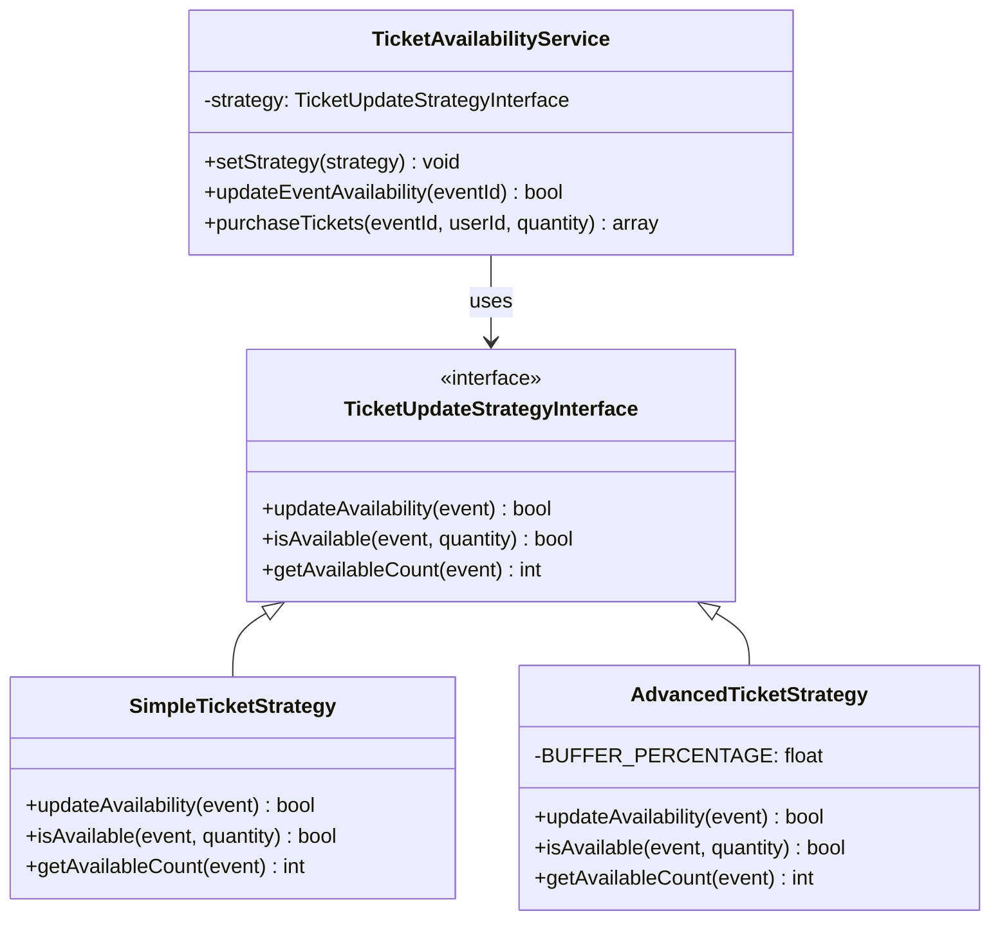
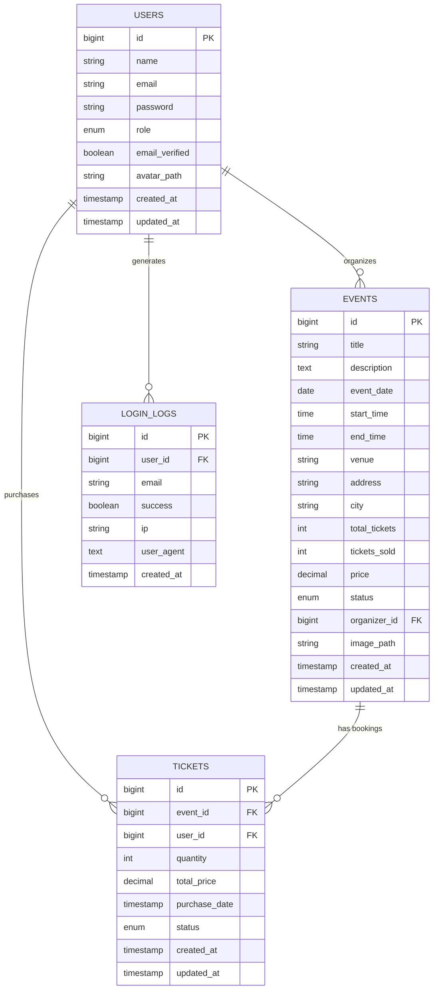

# Event Management & Ticketing System (EMTS)

## 🏗️ System Design Lifecycle & Architecture Documentation

A comprehensive event management and ticketing system built with Laravel, showcasing modern software design patterns and best practices for educational purposes.

---

## 📋 Table of Contents

1. [Project Overview](#-project-overview)
2. [System Design Lifecycle](#-system-design-lifecycle)
3. [Architecture Patterns](#-architecture-patterns)
4. [Design Patterns Implementation](#-design-patterns-implementation)
5. [Database Schema](#-database-schema)
6. [UI/UX Design System](#-uiux-design-system)
7. [Feature Implementation Timeline](#-feature-implementation-timeline)
8. [Code Structure](#-code-structure)
9. [Installation & Setup](#-installation--setup)
10. [Testing Strategy](#-testing-strategy)

---

## 🎯 Project Overview

The Event Management & Ticketing System (EMTS) is a full-stack web application that allows organizers to create, manage, and track events while enabling users to browse and purchase tickets. The project emphasizes clean architecture, design patterns, and modern development practices.

### Core Features
- 🔐 **Multi-role Authentication** (Admin, Organizer, User)
- 👥 **Advanced User Management** (Admin-only access with role transitions)
- 🔄 **Dynamic Role Management** (Real-time role changes with validation)
- 🎪 **Event Management** (CRUD operations with sorting/filtering)
- 🎫 **Advanced Ticket System** (Real-time availability with purchase management)
- ⚡ **Real-time Updates** (Live ticket availability and inventory tracking)
- 📊 **Analytics Dashboard** (Event statistics and insights)
- 🎛️ **Admin Control Panel** (User oversight and system management)
- 🔄 **Smart Sorting** (Dynamic content organization)
- 🎨 **Component-based UI** (Reusable interface components)
- 🛡️ **Security Features** (Login tracking, role-based access control)
- 🏗️ **Design Patterns** (Observer, Strategy, Service Layer, Component patterns)

---

## 🔄 System Design Lifecycle

We followed a structured approach to building this system, implementing design patterns at each phase:

### Phase 1: Foundation & Authentication


### Phase 2: Core Features Development


### Phase 3: Advanced Features & Optimization


---

## 🏛️ Architecture Patterns

### 1. **MVC (Model-View-Controller) Architecture**
The foundation of our Laravel application following the MVC pattern:

```
app/
├── Models/          # Data layer (Eloquent models)
├── Http/Controllers/ # Business logic controllers
├── Services/        # Business logic services
└── Repositories/    # Data access layer
```

### 2. **Layered Architecture**


---

## 🎨 Design Patterns Implementation

### 1. **Factory Pattern** - User Creation System

**Location**: `app/Services/UserCreation/`

**Purpose**: Create different types of users (Admin, Organizer, Regular User) with role-specific validation and setup.

```php
// app/Services/UserCreation/UserFactory.php
class UserFactory implements UserFactoryInterface
{
    public function createUser(array $userData, string $role): User
    {
        // Validate based on role
        $validationRules = $this->validateUserData($userData, $role);
        
        // Role-specific processing
        switch ($role) {
            case User::ROLE_ADMIN:
                return $this->createAdminUser($userData);
            case User::ROLE_ORGANIZER:
                return $this->createOrganizerUser($userData);
            default:
                return $this->createRegularUser($userData);
        }
    }
}
```

**Implementation Diagram**:


### 2. **Strategy Pattern** - Dashboard Routing

**Location**: `app/Http/Controllers/AuthController.php`

**Purpose**: Redirect users to appropriate dashboards based on their role after authentication.

```php
// app/Http/Controllers/AuthController.php
public function showLogin()
{
    if (Auth::check()) {
        $user = Auth::user();
        
        // Strategy pattern: different behavior based on user role
        return $user->role === User::ROLE_ADMIN
            ? redirect()->route('dashboard')           // Admin strategy
            : redirect()->route('user.dashboard');     // User strategy
    }
    
    return view('auth.login');
}
```

**Strategy Pattern Implementation**:


### 3. **Repository Pattern** - Event Data Management

**Location**: `app/Repositories/EventRepository.php`

**Purpose**: Abstract database operations and provide a clean interface for data access.

```php
// app/Repositories/EventRepository.php
class EventRepository
{
    protected $model;

    public function __construct(Event $model)
    {
        $this->model = $model;
    }

    public function getAllWithSorting(string $sortBy = 'created_at', string $direction = 'desc'): Collection
    {
        return $this->model
            ->orderBy($sortBy, $direction)
            ->get();
    }

    public function getByOrganizerWithSorting(int $organizerId, string $sortBy, string $direction): Collection
    {
        return $this->model
            ->where('organizer_id', $organizerId)
            ->orderBy($sortBy, $direction)
            ->get();
    }
}
```

### 4. **Service Layer Pattern** - Sorting Logic

**Location**: `app/Services/SortingService.php`

**Purpose**: Centralize sorting logic, validation, and configuration.

```php
// app/Services/SortingService.php
class SortingService
{
    public const EVENT_SORT_OPTIONS = [
        'created_at' => '📅 Date Created',
        'title' => '📝 Title',
        'event_date' => '🗓️ Event Date',
        'price' => '💰 Price',
        'total_tickets' => '🎫 Total Tickets',
        'tickets_sold' => '📊 Tickets Sold',
        'status' => '⭐ Status'
    ];

    public function validateEventSortParameters(?string $sortBy, ?string $direction): array
    {
        return [
            'sort_by' => $this->validateSortBy($sortBy, array_keys(self::EVENT_SORT_OPTIONS)),
            'direction' => $this->validateDirection($direction),
        ];
    }
}
```

### 5. **Component Pattern** - Reusable UI Components

**Location**: `resources/views/components/sorting-controls.blade.php`

**Purpose**: Create reusable, consistent UI components across the application.

```blade
{{-- resources/views/components/sorting-controls.blade.php --}}
@props([
    'action' => request()->url(),
    'sortOptions' => [],
    'currentSort' => 'created_at',
    'currentDirection' => 'desc',
    'totalCount' => 0,
    'showReset' => false
])

<div class="rounded-2xl border border-cyan-400/20 bg-slate-900/80 backdrop-blur-md p-4 shadow-lg">
    <!-- Component implementation -->
</div>
```

**Usage Example**:
```blade
<x-sorting-controls 
    :action="route('events.index')"
    :sort-options="$sortOptions"
    :current-sort="$sortBy"
    :current-direction="$sortDirection"
    :total-count="$events->count()"
    :show-reset="!$isDefaultSort"
/>
```

### 6. **Dependency Injection Pattern**

**Location**: `app/Http/Controllers/EventController.php`

**Purpose**: Improve testability and maintain loose coupling between classes.

```php
// app/Http/Controllers/EventController.php
class EventController extends Controller
{
    protected $eventRepository;
    protected $sortingService;

    public function __construct(EventRepository $eventRepository, SortingService $sortingService)
    {
        $this->eventRepository = $eventRepository;
        $this->sortingService = $sortingService;
    }

    public function index(Request $request)
    {
        $sortParams = $this->sortingService->validateEventSortParameters(
            $request->get('sort'),
            $request->get('direction')
        );

        $events = $this->eventRepository->getAllWithSorting(
            $sortParams['sort_by'],
            $sortParams['direction']
        );

        return view('events.index', [
            'events' => $events,
            'sortBy' => $sortParams['sort_by'],
            'sortDirection' => $sortParams['direction'],
            'sortOptions' => $this->sortingService->getEventSortOptions(),
            'isDefaultSort' => $this->sortingService->isDefaultSort($sortParams['sort_by'], $sortParams['direction'])
        ]);
    }
}
```

### 7. **Strategy Pattern** - Role Management System

**Location**: `app/Services/RoleManagementService.php`

**Purpose**: Implement flexible role transition logic with validation rules and business constraints.

```php
// app/Services/RoleManagementService.php
class RoleManagementService
{
    // Define role transition strategies
    public const ROLE_TRANSITIONS = [
        'user' => ['organizer'],
        'organizer' => ['user', 'admin'],
        'admin' => ['organizer']
    ];

    public function changeUserRole(User $user, string $newRole, User $admin): bool
    {
        // Strategy: Admin permission validation
        if ($admin->role !== 'admin') {
            throw new \Exception('Only admins can change user roles');
        }

        // Strategy: Self-role prevention
        if ($user->id === $admin->id) {
            throw new \Exception('Cannot change your own role');
        }

        // Strategy: Role transition validation
        if (!$this->canTransitionToRole($user->role, $newRole)) {
            throw new \Exception("Cannot transition from {$user->role} to {$newRole}");
        }

        return DB::transaction(function () use ($user, $newRole) {
            return $user->update(['role' => $newRole]);
        });
    }

    private function canTransitionToRole(string $currentRole, string $newRole): bool
    {
        return in_array($newRole, self::ROLE_TRANSITIONS[$currentRole] ?? []);
    }
}
```

**Role Management Strategy Implementation**:


### 8. **Component Pattern** - Role Selector Component

**Location**: `resources/views/components/role-selector.blade.php`

**Purpose**: Create reusable UI component for role management with AJAX functionality.

```blade
{{-- Role Selector Component --}}
@props(['user', 'roleService'])

<div class="role-selector inline-block">
    @if($user->id === auth()->id())
        {{-- Current user cannot change their own role --}}
        <span class="inline-flex items-center px-2.5 py-0.5 rounded-full text-xs font-medium {{ $roleService->getRoleColor($user->role) }}">
            {{ $roleService->getRoleIcon($user->role) }} {{ ucfirst($user->role) }}
        </span>
    @else
        {{-- Role management interface for other users --}}
        <div class="flex items-center gap-2">
            {{-- Current role badge --}}
            <span class="inline-flex items-center px-2.5 py-0.5 rounded-full text-xs font-medium bg-slate-700 text-slate-300">
                {{ $roleService->getRoleIcon($user->role) }} {{ ucfirst($user->role) }}
            </span>

            {{-- Change role dropdown with AJAX --}}
            <select class="role-change-select" data-user-id="{{ $user->id }}" data-current-role="{{ $user->role }}">
                <option value="">Change to...</option>
                @foreach($roleService->getAvailableRoles($user->role) as $availableRole)
                    <option value="{{ $availableRole }}">
                        {{ $roleService->getRoleIcon($availableRole) }} {{ ucfirst($availableRole) }}
                    </option>
                @endforeach
            </select>
        </div>
    @endif
</div>
```

**Features**:
- **Real-time Role Updates**: AJAX-based role changes without page refresh
- **Visual Feedback**: Success/error notifications with smooth animations
- **Security**: Prevents self-role modification and validates permissions
- **UX Optimized**: Silent error handling, no intrusive popups

### 9. **Observer Pattern** - Real-time Ticket Availability

**Location**: `app/Observers/TicketObserver.php`

**Purpose**: Automatically update event ticket availability when tickets are purchased, confirmed, or cancelled.

```php
// app/Observers/TicketObserver.php
class TicketObserver
{
    protected $ticketService;

    public function __construct(TicketAvailabilityService $ticketService)
    {
        $this->ticketService = $ticketService;
    }

    public function created(Ticket $ticket): void
    {
        $this->ticketService->updateEventAvailability($ticket->event_id);
    }

    public function updated(Ticket $ticket): void
    {
        $this->ticketService->updateEventAvailability($ticket->event_id);
    }

    public function deleted(Ticket $ticket): void
    {
        $this->ticketService->updateEventAvailability($ticket->event_id);
    }
}
```

**Observer Pattern Implementation**:


### 10. **Advanced Strategy Pattern** - Ticket Update Strategies

**Location**: `app/Services/TicketStrategies/`

**Purpose**: Flexible ticket availability calculation with different business rules.

```php
// Strategy Interface
interface TicketUpdateStrategyInterface
{
    public function updateAvailability(Event $event): bool;
    public function isAvailable(Event $event, int $requestedQuantity): bool;
    public function getAvailableCount(Event $event): int;
}

// Simple Strategy - Basic calculation
class SimpleTicketStrategy implements TicketUpdateStrategyInterface
{
    public function updateAvailability(Event $event): bool
    {
        $soldTickets = Ticket::where('event_id', $event->id)
            ->where('status', 'confirmed')
            ->sum('quantity');
        
        $event->update(['tickets_sold' => $soldTickets]);
        return true;
    }
}

// Advanced Strategy - Includes pending tickets and buffers
class AdvancedTicketStrategy implements TicketUpdateStrategyInterface
{
    private const BUFFER_PERCENTAGE = 0.05; // 5% buffer for high-demand events
    
    public function isAvailable(Event $event, int $requestedQuantity): bool
    {
        $availableCount = $this->getAvailableCount($event);
        
        // Apply buffer for high-demand events (>80% sold)
        if ($event->tickets_sold / $event->total_tickets > 0.8) {
            $buffer = (int) ($event->total_tickets * self::BUFFER_PERCENTAGE);
            $availableCount -= $buffer;
        }
        
        return $availableCount >= $requestedQuantity;
    }
}
```

**Strategy Selection Flow**:


### 11. **Real-time Component Pattern** - Ticket Availability Widget

**Location**: `resources/views/components/ticket-availability.blade.php`

**Purpose**: Reusable UI component with real-time ticket availability updates.

```blade
{{-- Real-time Ticket Availability Component --}}
@props(['event'])

<div class="ticket-availability-widget" data-event-id="{{ $event->id }}">
    {{-- Availability Status with Progress Bar --}}
    <div class="availability-status">
        <span class="available-count">{{ $event->available_tickets }}</span>
        <div class="availability-bar" style="width: {{ $event->availability_percentage }}%"></div>
    </div>

    {{-- Purchase Form with Real-time Updates --}}
    <form class="ticket-purchase-form" data-event-id="{{ $event->id }}">
        <select name="quantity" class="quantity-select">
            @for($i = 1; $i <= min(10, $event->available_tickets); $i++)
                <option value="{{ $i }}">{{ $i }} ticket{{ $i > 1 ? 's' : '' }}</option>
            @endfor
        </select>
        <button type="submit" class="purchase-btn">Buy Now</button>
    </form>
</div>

<script>
// Real-time updates every 10 seconds
setInterval(() => {
    updateAvailability(eventId);
}, 10000);
</script>
```

**Features**:
- **Real-time Updates**: AJAX polling every 10 seconds
- **Visual Progress**: Animated progress bars and counters
- **Instant Feedback**: Purchase confirmations and error handling
- **Responsive Design**: Mobile-friendly interface
- **Caching**: Optimized performance with intelligent caching

---

## 🗄️ Database Schema

### Core Tables

```sql
-- Users table with role-based structure
CREATE TABLE users (
    id BIGINT PRIMARY KEY AUTO_INCREMENT,
    name VARCHAR(255) NOT NULL,
    email VARCHAR(255) UNIQUE NOT NULL,
    password VARCHAR(255) NOT NULL,
    role ENUM('admin', 'organizer', 'user') DEFAULT 'user',
    email_verified BOOLEAN DEFAULT FALSE,
    avatar_path VARCHAR(255),
    remember_token VARCHAR(100),
    created_at TIMESTAMP,
    updated_at TIMESTAMP
);

-- Events table with comprehensive event data
CREATE TABLE events (
    id BIGINT PRIMARY KEY AUTO_INCREMENT,
    title VARCHAR(255) NOT NULL,
    description TEXT,
    event_date DATE NOT NULL,
    start_time TIME,
    end_time TIME,
    venue VARCHAR(255) NOT NULL,
    address VARCHAR(255),
    city VARCHAR(255),
    total_tickets INT NOT NULL,
    tickets_sold INT DEFAULT 0,
    price DECIMAL(8,2) NOT NULL,
    status ENUM('draft', 'published', 'cancelled') DEFAULT 'draft',
    organizer_id BIGINT,
    image_path VARCHAR(255),
    created_at TIMESTAMP,
    updated_at TIMESTAMP,
    FOREIGN KEY (organizer_id) REFERENCES users(id)
);

-- Login logs for security tracking
CREATE TABLE login_logs (
    id BIGINT PRIMARY KEY AUTO_INCREMENT,
    user_id BIGINT,
    email VARCHAR(255),
    success BOOLEAN,
    ip VARCHAR(45),
    user_agent TEXT,
    created_at TIMESTAMP,
    FOREIGN KEY (user_id) REFERENCES users(id)
);

-- Tickets table for real-time availability tracking
CREATE TABLE tickets (
    id BIGINT PRIMARY KEY AUTO_INCREMENT,
    event_id BIGINT NOT NULL,
    user_id BIGINT NOT NULL,
    quantity INTEGER DEFAULT 1,
    total_price DECIMAL(8,2) NOT NULL,
    purchase_date TIMESTAMP NOT NULL,
    status ENUM('pending', 'confirmed', 'cancelled') DEFAULT 'pending',
    created_at TIMESTAMP,
    updated_at TIMESTAMP,
    FOREIGN KEY (event_id) REFERENCES events(id) ON DELETE CASCADE,
    FOREIGN KEY (user_id) REFERENCES users(id) ON DELETE CASCADE,
    INDEX idx_event_status (event_id, status),
    INDEX idx_user_status (user_id, status),
    INDEX idx_created_status (created_at, status)
);
```

### Entity Relationship Diagram



---

## 🎨 UI/UX Design System

### Design Philosophy
Our design system follows a **dark theme with cyan accents** approach, emphasizing:

- **Consistency**: Unified color palette and component styling
- **Accessibility**: High contrast ratios and semantic HTML
- **Modern Aesthetics**: Glassmorphism effects and subtle animations
- **Professional Look**: Clean layouts with appropriate spacing

### Color Palette
```css
:root {
    /* Primary Background */
    --bg-primary: #0F172A;          /* slate-950 */
    --bg-secondary: #1E293B;        /* slate-800 */
    --bg-tertiary: #334155;         /* slate-700 */
    
    /* Accent Colors */
    --accent-primary: #06B6D4;      /* cyan-500 */
    --accent-secondary: #0891B2;    /* cyan-600 */
    --accent-light: #67E8F9;        /* cyan-300 */
    
    /* Text Colors */
    --text-primary: #F8FAFC;        /* slate-50 */
    --text-secondary: #CBD5E1;      /* slate-300 */
    --text-muted: #64748B;          /* slate-500 */
}
```

### Component Examples

**Form Input Style**:
```css
.form-input {
    @apply px-3 py-2 rounded-lg bg-slate-800 border border-slate-700 
           text-slate-300 focus:border-cyan-400 focus:outline-none;
}
```

**Button Styles**:
```css
.btn-primary {
    @apply px-4 py-2 rounded-lg bg-gradient-to-r from-cyan-500 to-sky-500 
           hover:from-cyan-400 hover:to-sky-400 text-white font-medium;
}

.btn-secondary {
    @apply px-4 py-2 rounded-lg bg-slate-800 hover:bg-slate-700 
           border border-cyan-400/20 text-sm transition;
}
```

---

## 📅 Feature Implementation Timeline

### Sprint 1: Foundation (Week 1-2)
- ✅ Project setup and Laravel installation
- ✅ Database schema design and migrations
- ✅ User authentication system
- ✅ Factory pattern for user creation
- ✅ Basic routing and middleware setup

### Sprint 2: Core Features (Week 3-4)
- ✅ Event CRUD operations
- ✅ Role-based dashboard routing (Strategy pattern)
- ✅ Profile management
- ✅ Basic UI implementation with consistent design

### Sprint 3: Advanced Features (Week 5-6)
- ✅ Repository pattern implementation
- ✅ Service layer for business logic
- ✅ Event sorting functionality
- ✅ Reusable Blade components
- ✅ Advanced UI enhancements

### Sprint 4: Role Management & Admin Features (Week 7-8)

- ✅ **Role Management System Implementation**
  - Strategy Pattern for role transitions
  - Admin-only user management interface
  - Real-time role updates with AJAX
  - Role transition validation and security
- ✅ **Advanced User Interface Components**
  - Reusable role-selector component
  - Interactive dropdown with visual feedback
  - Silent error handling (no intrusive popups)
  - Responsive admin dashboard
- ✅ **Security & Access Control**
  - Admin privilege validation
  - Self-role modification prevention
  - Role-based route protection
  - Comprehensive user statistics

### Sprint 5: Real-time Ticket System (Week 9-10)

- ✅ **Observer Pattern Implementation**
  - Automatic ticket availability updates
  - Real-time event inventory synchronization
  - Observer-triggered database updates
  - Event-driven architecture
- ✅ **Strategy Pattern for Ticket Management**
  - Simple vs Advanced calculation strategies
  - Flexible business rule implementation
  - Pending ticket handling with timeouts
  - High-demand event buffer management
- ✅ **Real-time UI Components**
  - Live ticket availability widgets
  - AJAX-powered purchase forms
  - Progress bars and visual indicators
  - Instant feedback and notifications
- ✅ **Performance Optimization**
  - Intelligent caching strategies
  - Database indexing for ticket queries
  - Optimized real-time polling

### Sprint 6: Documentation & Polish (Week 11-12)

- 🔄 Performance optimization
- 🔄 Comprehensive testing
- 🔄 Documentation completion
- 🔄 Deployment preparation

---

## 📂 Code Structure

```
app/
├── Http/
│   ├── Controllers/
│   │   ├── AuthController.php          # Authentication logic
│   │   ├── EventController.php         # Event CRUD with DI
│   │   ├── TicketController.php        # Ticket purchase & availability
│   │   ├── UserController.php          # User management & roles
│   │   ├── RegisterController.php      # User registration
│   │   └── ProfileController.php       # Profile management
│   └── Middleware/                     # Custom middleware
├── Models/
│   ├── User.php                        # User model with roles
│   ├── Event.php                       # Event model with tickets
│   ├── Ticket.php                      # Ticket model with relationships
│   └── LoginLog.php                    # Security logging
├── Observers/
│   └── TicketObserver.php              # Observer pattern for tickets
├── Repositories/
│   ├── EventRepository.php             # Event data access
│   └── UserRepository.php              # User data access
├── Services/
│   ├── SortingService.php              # Sorting logic
│   ├── RoleManagementService.php       # Role transition strategy
│   ├── TicketAvailabilityService.php   # Ticket business logic
│   ├── TicketStrategies/               # Strategy pattern implementations
│   │   ├── TicketUpdateStrategyInterface.php
│   │   ├── SimpleTicketStrategy.php    # Basic availability calculation
│   │   └── AdvancedTicketStrategy.php  # Advanced with buffers
│   └── UserCreation/
│       ├── UserFactory.php             # Factory pattern
│       └── UserFactoryInterface.php    # Factory contract
└── Providers/
    └── AppServiceProvider.php          # DI container setup

resources/
├── views/
│   ├── auth/                           # Authentication views
│   ├── events/                         # Event management views
│   ├── admin/
│   │   └── users/                      # User management interface
│   │       ├── index.blade.php         # User listing
│   │       └── show.blade.php          # User details
│   ├── components/
│   │   ├── sorting-controls.blade.php  # Reusable sorting
│   │   ├── role-selector.blade.php     # Role management component
│   │   └── ticket-availability.blade.php # Real-time ticket widget
│   └── layouts/                        # Layout templates
├── css/
│   └── app.css                         # Tailwind CSS
└── js/
    └── app.js                          # Frontend logic

database/
├── migrations/                         # Database structure
├── seeders/                            # Test data
└── factories/                          # Model factories
```

---

## 🚀 Installation & Setup

### Prerequisites
- PHP 8.1+
- Composer
- Node.js & NPM
- SQLite/MySQL

### Installation Steps

1. **Clone the repository**
```bash
git clone https://github.com/Event-Management-Ticketing-System-EMTS/Event-Management-Ticketing-System.git
cd Event-Management-Ticketing-System/laravel
```

2. **Install dependencies**
```bash
composer install
npm install
```

3. **Environment setup**
```bash
cp .env.example .env
php artisan key:generate
```

4. **Database setup**
```bash
php artisan migrate
php artisan db:seed
```

5. **Build assets**
```bash
npm run build
```

6. **Start development server**
```bash
php artisan serve
```

### Default Users
After seeding, you can login with:

- **Admin**: admin@gmail.com / admin1234
  - Access to all features including user management
  - Can change user roles and access admin panel
- **User**: abcd@gmail.com / aaaa1234
  - Basic user access for event browsing
  - Can be promoted to organizer by admin

**Role Management Features**:
- Admin can access user management at `/users`
- Real-time role changes with dropdown selection
- Role transition validation (user→organizer, organizer→admin/user, admin→organizer)
- Comprehensive user statistics and analytics

---

## 🧪 Testing Strategy

### Unit Testing
- **Repository Tests**: Data access layer validation
- **Service Tests**: Business logic verification
- **Factory Tests**: User creation scenarios
- **Role Management Tests**: Role transition validation and security

### Integration Testing
- **Authentication Flow**: Login, registration, password reset
- **Event Management**: CRUD operations with sorting
- **Role-based Access**: Dashboard routing and permissions
- **User Management**: Admin role management workflows
- **Component Testing**: Role selector and UI components

### Feature Testing
- **End-to-End Workflows**: Complete user journeys
- **UI Component Testing**: Sorting controls and form interactions
- **Security Testing**: Authentication and authorization

---

## 🔄 Design Pattern Benefits

### Factory Pattern Benefits
- **Flexibility**: Easy to add new user types
- **Maintainability**: Centralized user creation logic
- **Testability**: Mock different user creation scenarios

### Repository Pattern Benefits
- **Separation of Concerns**: Data access isolated from business logic
- **Testability**: Easy to mock database operations
- **Flexibility**: Switch between different data sources

### Service Layer Benefits
- **Business Logic Centralization**: Sorting rules in one place
- **Reusability**: Services can be used across controllers
- **Maintainability**: Easy to modify business rules

### Component Pattern Benefits
- **Consistency**: Uniform UI across the application
- **Reusability**: Same component for different entity types
- **Maintainability**: Single source of truth for UI elements

### Role Management Strategy Benefits
- **Security**: Controlled role transitions with validation rules
- **Flexibility**: Easy to modify role hierarchy and permissions
- **User Experience**: Real-time updates with smooth UI interactions
- **Maintainability**: Centralized role logic in dedicated service

---

## 🎯 Key Learning Outcomes

Through building this project, we've demonstrated:

1. **Advanced Design Patterns**: Factory, Repository, Strategy, Service Layer, and Component patterns
2. **Role Management Architecture**: Secure, flexible user role systems with validation
3. **Clean Architecture**: Proper separation of concerns and dependency management
4. **Laravel Best Practices**: Eloquent relationships, middleware, service providers
5. **Modern UI/UX**: Consistent design system with interactive components
6. **Security Implementation**: Authentication, authorization, role-based access control
7. **Code Organization**: Maintainable and scalable project structure
8. **Real-time Interactions**: AJAX-based updates and dynamic user interfaces

---

## 🚀 Future Enhancements

- **Payment Integration**: Stripe/PayPal for ticket purchases
- **Real-time Features**: WebSocket notifications for event updates
- **Advanced Analytics**: Comprehensive reporting dashboard
- **Mobile App**: React Native companion app
- **API Development**: RESTful API for third-party integrations
- **Microservices**: Split into domain-specific services

---

## 👥 Contributing

This project serves as an educational reference for learning Laravel and design patterns. Feel free to fork, experiment, and contribute improvements!

## 📄 License

This project is open-sourced software licensed under the [MIT license](LICENSE).

---

**Built with ❤️ for learning and education**