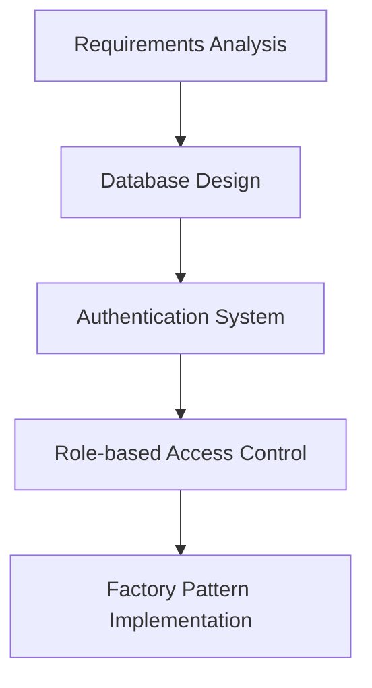
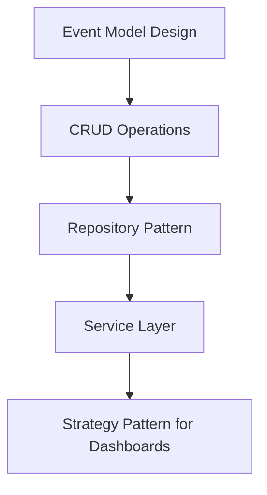
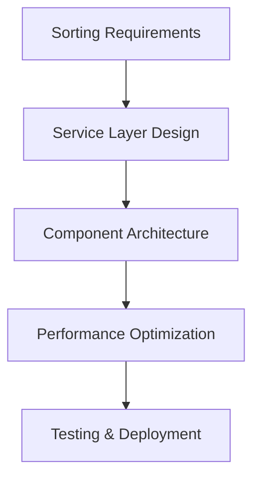
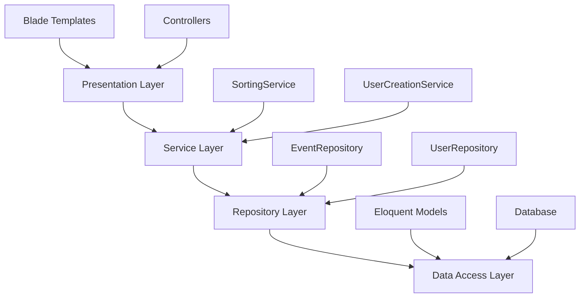
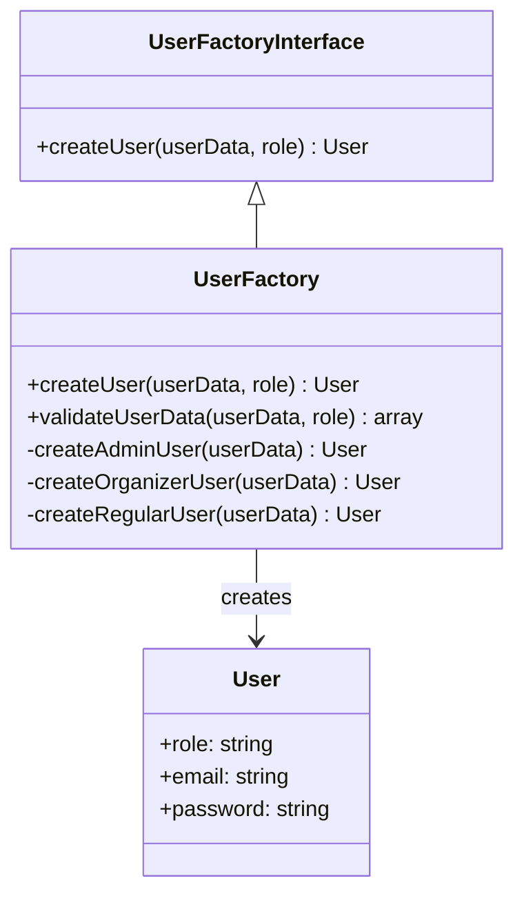
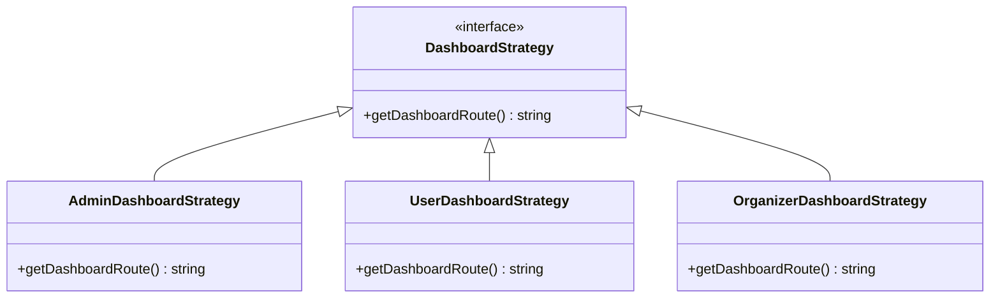
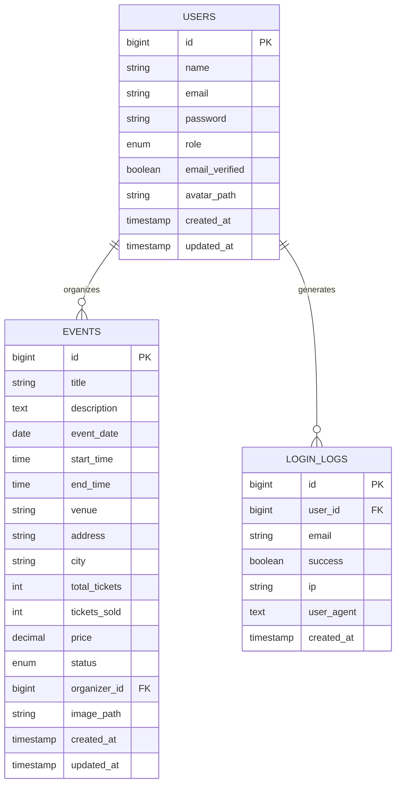

# Event Management & Ticket### Core Features
- 🔐 **Multi-role Authentication** (Admin, Organizer, User)
- 🎪 **Event Management** (CRUD operations with sorting/filtering)
- 🎫 **Ticket Management** (Sales tracking, inventory management)
- 📊 **Analytics Dashboard** (Event statistics and insights)
- 👥 **Admin User Management** (View all users, statistics, sorting & filtering)
- 👑 **Role Management** (Dynamic role assignment with security controls)
- 🔄 **Real-time Sorting** (Dynamic event organization)em (EMTS)

## 🏗️ System Design Lifecycle & Architecture Documentation

A comprehensive event management and ticketing system built with Laravel, showcasing modern software design patterns and best practices for educational purposes.

---

## 📋 Table of Contents

1. [Project Overview](#-project-overview)
2. [System Design Lifecycle](#-system-design-lifecycle)
3. [Architecture Patterns](#-architecture-patterns)
4. [Design Patterns Implementation](#-design-patterns-implementation)
5. [Database Schema](#-database-schema)
6. [UI/UX Design System](#-uiux-design-system)
7. [Feature Implementation Timeline](#-feature-implementation-timeline)
8. [Code Structure](#-code-structure)
9. [Installation & Setup](#-installation--setup)
10. [Testing Strategy](#-testing-strategy)

---

## 🎯 Project Overview

The Event Management & Ticketing System (EMTS) is a full-stack web application that allows organizers to create, manage, and track events while enabling users to browse and purchase tickets. The project emphasizes clean architecture, design patterns, and modern development practices.

### Core Features
- 🔐 **Multi-role Authentication** (Admin, Organizer, User)
- 🎪 **Event Management** (CRUD operations with sorting/filtering)
- 🎫 **Ticket Management** (Sales tracking, inventory management)
- 📊 **Analytics Dashboard** (Event statistics and insights)
- 👥 **User Management** (Profile management, role-based access)
- � **Role Management** (Dynamic role assignment with security controls)
- �🔄 **Real-time Sorting** (Dynamic event organization)

---

## 🔄 System Design Lifecycle

We followed a structured approach to building this system, implementing design patterns at each phase:

### Phase 1: Foundation & Authentication


### Phase 2: Core Features Development


### Phase 3: Advanced Features & Optimization


---

## 🏛️ Architecture Patterns

### 1. **MVC (Model-View-Controller) Architecture**
The foundation of our Laravel application following the MVC pattern:

```
app/
├── Models/          # Data layer (Eloquent models)
├── Http/Controllers/ # Business logic controllers
├── Services/        # Business logic services
└── Repositories/    # Data access layer
```

### 2. **Layered Architecture**


---

## 🎨 Design Patterns Implementation

### 1. **Factory Pattern** - User Creation System

**Location**: `app/Services/UserCreation/`

**Purpose**: Create different types of users (Admin, Organizer, Regular User) with role-specific validation and setup.

```php
// app/Services/UserCreation/UserFactory.php
class UserFactory implements UserFactoryInterface
{
    public function createUser(array $userData, string $role): User
    {
        // Validate based on role
        $validationRules = $this->validateUserData($userData, $role);
        
        // Role-specific processing
        switch ($role) {
            case User::ROLE_ADMIN:
                return $this->createAdminUser($userData);
            case User::ROLE_ORGANIZER:
                return $this->createOrganizerUser($userData);
            default:
                return $this->createRegularUser($userData);
        }
    }
}
```

**Implementation Diagram**:


### 2. **Strategy Pattern** - Dashboard Routing

**Location**: `app/Http/Controllers/AuthController.php`

**Purpose**: Redirect users to appropriate dashboards based on their role after authentication.

```php
// app/Http/Controllers/AuthController.php
public function showLogin()
{
    if (Auth::check()) {
        $user = Auth::user();
        
        // Strategy pattern: different behavior based on user role
        return $user->role === User::ROLE_ADMIN
            ? redirect()->route('dashboard')           // Admin strategy
            : redirect()->route('user.dashboard');     // User strategy
    }
    
    return view('auth.login');
}
```

**Strategy Pattern Implementation**:


### 3. **Repository Pattern** - Event Data Management

**Location**: `app/Repositories/EventRepository.php`

**Purpose**: Abstract database operations and provide a clean interface for data access.

```php
// app/Repositories/EventRepository.php
class EventRepository
{
    protected $model;

    public function __construct(Event $model)
    {
        $this->model = $model;
    }

    public function getAllWithSorting(string $sortBy = 'created_at', string $direction = 'desc'): Collection
    {
        return $this->model
            ->orderBy($sortBy, $direction)
            ->get();
    }

    public function getByOrganizerWithSorting(int $organizerId, string $sortBy, string $direction): Collection
    {
        return $this->model
            ->where('organizer_id', $organizerId)
            ->orderBy($sortBy, $direction)
            ->get();
    }
}
```

### 4. **Service Layer Pattern** - Sorting Logic

**Location**: `app/Services/SortingService.php`

**Purpose**: Centralize sorting logic, validation, and configuration.

```php
// app/Services/SortingService.php
class SortingService
{
    public const EVENT_SORT_OPTIONS = [
        'created_at' => '📅 Date Created',
        'title' => '📝 Title',
        'event_date' => '🗓️ Event Date',
        'price' => '💰 Price',
        'total_tickets' => '🎫 Total Tickets',
        'tickets_sold' => '📊 Tickets Sold',
        'status' => '⭐ Status'
    ];

    public function validateEventSortParameters(?string $sortBy, ?string $direction): array
    {
        return [
            'sort_by' => $this->validateSortBy($sortBy, array_keys(self::EVENT_SORT_OPTIONS)),
            'direction' => $this->validateDirection($direction),
        ];
    }
}
```

### 5. **Component Pattern** - Reusable UI Components

**Location**: `resources/views/components/sorting-controls.blade.php`

**Purpose**: Create reusable, consistent UI components across the application.

```blade
{{-- resources/views/components/sorting-controls.blade.php --}}
@props([
    'action' => request()->url(),
    'sortOptions' => [],
    'currentSort' => 'created_at',
    'currentDirection' => 'desc',
    'totalCount' => 0,
    'showReset' => false
])

<div class="rounded-2xl border border-cyan-400/20 bg-slate-900/80 backdrop-blur-md p-4 shadow-lg">
    <!-- Component implementation -->
</div>
```

**Usage Example**:
```blade
<x-sorting-controls 
    :action="route('events.index')"
    :sort-options="$sortOptions"
    :current-sort="$sortBy"
    :current-direction="$sortDirection"
    :total-count="$events->count()"
    :show-reset="!$isDefaultSort"
/>
```

### 6. **Dependency Injection Pattern**

**Location**: `app/Http/Controllers/EventController.php`

**Purpose**: Improve testability and maintain loose coupling between classes.

```php
// app/Http/Controllers/EventController.php
class EventController extends Controller
{
    protected $eventRepository;
    protected $sortingService;

    public function __construct(EventRepository $eventRepository, SortingService $sortingService)
    {
        $this->eventRepository = $eventRepository;
        $this->sortingService = $sortingService;
    }

    public function index(Request $request)
    {
        $sortParams = $this->sortingService->validateEventSortParameters(
            $request->get('sort'),
            $request->get('direction')
        );

        $events = $this->eventRepository->getAllWithSorting(
            $sortParams['sort_by'],
            $sortParams['direction']
        );

        return view('events.index', [
            'events' => $events,
            'sortBy' => $sortParams['sort_by'],
            'sortDirection' => $sortParams['direction'],
            'sortOptions' => $this->sortingService->getEventSortOptions(),
            'isDefaultSort' => $this->sortingService->isDefaultSort($sortParams['sort_by'], $sortParams['direction'])
        ]);
    }
}
```

### 5. **Strategy Pattern** - Role Management Service

**Location**: `app/Services/RoleManagementService.php`

**Purpose**: Centralized role transition logic and permission management using strategy pattern principles.

```php
// app/Services/RoleManagementService.php
class RoleManagementService
{
    // Strategy: Define valid role transitions
    public const ROLE_TRANSITIONS = [
        User::ROLE_USER => [User::ROLE_ADMIN],
        User::ROLE_ADMIN => [User::ROLE_USER],
    ];

    // Strategy implementation for role changes
    public function changeUserRole(User $user, string $newRole): array
    {
        // Permission strategy
        if (!$this->canManageRoles()) {
            return ['success' => false, 'message' => 'Access denied.'];
        }

        // Self-protection strategy
        if ($user->id === Auth::id()) {
            return ['success' => false, 'message' => 'Cannot change your own role.'];
        }

        // Transition validation strategy
        if (!$this->canChangeRole($user->role, $newRole)) {
            return ['success' => false, 'message' => 'Invalid role transition.'];
        }

        // Execute role change
        $user->role = $newRole;
        $user->save();

        return ['success' => true, 'message' => 'Role updated successfully.'];
    }

    // UI Strategy: Role-specific styling
    public function getRoleBadgeClass(string $role): string
    {
        return match($role) {
            User::ROLE_ADMIN => 'bg-red-100 text-red-800 dark:bg-red-900 dark:text-red-300',
            User::ROLE_USER => 'bg-blue-100 text-blue-800 dark:bg-blue-900 dark:text-blue-300',
            default => 'bg-gray-100 text-gray-800 dark:bg-gray-700 dark:text-gray-300'
        };
    }
}
```

**Strategy Pattern Benefits**:
- **Encapsulated Logic**: Role change rules are centralized and easily maintainable
- **Strategy Selection**: Different behaviors based on user roles and permissions
- **UI Consistency**: Role-specific styling strategies ensure consistent appearance
- **Security**: Built-in permission checks prevent unauthorized role changes

### 6. **Component Pattern** - Role Selector UI

**Location**: `resources/views/components/role-selector.blade.php`

**Purpose**: Reusable component for role management UI with consistent behavior.

```php
// resources/views/components/role-selector.blade.php
@props(['user', 'currentUserId' => null, 'availableRoles' => [], 'disabled' => false])

@php
    $isCurrentUser = $currentUserId && $user->id === $currentUserId;
    $roleService = app(\App\Services\RoleManagementService::class);
@endphp

@if($isCurrentUser)
    <!-- Strategy: Current user protection -->
    <span class="inline-flex items-center gap-1 rounded-full px-3 py-1 text-xs font-medium {{ $roleService->getRoleBadgeClass($user->role) }}">
        {{ $roleService->getRoleIcon($user->role) }} {{ ucfirst($user->role) }} (You)
    </span>
@else
    <!-- Strategy: Interactive role management -->
    <select onchange="changeUserRole({{ $user->id }}, this.value, this)" 
            data-original="{{ $user->role }}"
            class="bg-slate-800 border border-slate-600 text-white text-xs rounded px-3 py-1 focus:outline-none focus:ring-2 focus:ring-blue-500">
        @foreach($availableRoles as $roleKey => $roleName)
            <option value="{{ $roleKey }}" {{ $user->role === $roleKey ? 'selected' : '' }}>
                {{ $roleService->getRoleIcon($roleKey) }} {{ $roleName }}
            </option>
        @endforeach
    </select>
@endif
```

**Component Pattern Benefits**:
- **Reusability**: Can be used across different admin interfaces
- **Consistency**: Ensures uniform role management behavior
- **Maintainability**: Centralized component logic for easy updates
- **Security**: Built-in protection against self-role changes

### 7. **Repository + Service Pattern** - Admin User Management

**Location**: `app/Http/Controllers/UserController.php`, `app/Repositories/UserRepository.php`

**Purpose**: Allow administrators to view and manage all system users with sorting and filtering capabilities.

```php
// app/Http/Controllers/UserController.php
class UserController extends Controller
{
    protected $userRepository;
    protected $sortingService;
    protected $roleManagementService;

    public function index(Request $request)
    {
        // Admin access control
        if (!Auth::check() || Auth::user()->role !== 'admin') {
            abort(403, 'Access denied. Admin privileges required.');
        }

        // Apply Repository + Service patterns for data retrieval
        $sortParams = $this->sortingService->validateUserSortParameters(
            $request->get('sort'),
            $request->get('direction')
        );

        $users = $this->userRepository->getAllWithSorting(
            $sortParams['sort_by'],
            $sortParams['direction']
        );

        // Calculate user statistics
        $stats = [
            'total' => $users->count(),
            'admins' => $users->where('role', 'admin')->count(),
            'users' => $users->where('role', 'user')->count(),
            'verified' => $users->where('email_verified', true)->count(),
            'unverified' => $users->where('email_verified', false)->count(),
            'new_this_week' => $users->filter(function($user) {
                return $user->created_at >= now()->subWeek();
            })->count()
        ];

        return view('admin.users.index', compact(
            'users', 'stats', 'sortBy', 'sortDirection', 'sortOptions', 'availableRoles'
        ));
    }
}
```

```php
// app/Repositories/UserRepository.php
class UserRepository
{
    public function getAllWithSorting(string $sortBy = 'created_at', string $direction = 'desc'): Collection
    {
        return $this->model
            ->orderBy($sortBy, $direction)
            ->get();
    }

    public function getByRoleWithSorting(string $role, string $sortBy = 'created_at', string $direction = 'desc'): Collection
    {
        return $this->model
            ->where('role', $role)
            ->orderBy($sortBy, $direction)
            ->get();
    }

    public function countByRole(string $role): int
    {
        return $this->model->where('role', $role)->count();
    }
}
```

**Admin User Management Features**:
- **User Listing**: Display all system users with pagination support
- **Real-time Sorting**: Sort by name, email, role, join date, verification status
- **User Statistics**: Dashboard cards showing user counts by role and status
- **Role Management**: Dynamic role assignment with security controls
- **Access Control**: Admin-only access with proper permission checks
- **Responsive Design**: Consistent dark theme UI matching login page design

**Repository Pattern Benefits for User Management**:
- **Data Abstraction**: Clean separation between data access and business logic
- **Query Optimization**: Centralized and optimized database queries
- **Testability**: Easy to mock repository for unit testing
- **Consistency**: Uniform data access patterns across the application
- **Sorting Integration**: Seamless integration with SortingService for flexible data ordering

---

## 🗄️ Database Schema

### Core Tables

```sql
-- Users table with role-based structure
CREATE TABLE users (
    id BIGINT PRIMARY KEY AUTO_INCREMENT,
    name VARCHAR(255) NOT NULL,
    email VARCHAR(255) UNIQUE NOT NULL,
    password VARCHAR(255) NOT NULL,
    role ENUM('admin', 'organizer', 'user') DEFAULT 'user',
    email_verified BOOLEAN DEFAULT FALSE,
    avatar_path VARCHAR(255),
    remember_token VARCHAR(100),
    created_at TIMESTAMP,
    updated_at TIMESTAMP
);

-- Events table with comprehensive event data
CREATE TABLE events (
    id BIGINT PRIMARY KEY AUTO_INCREMENT,
    title VARCHAR(255) NOT NULL,
    description TEXT,
    event_date DATE NOT NULL,
    start_time TIME,
    end_time TIME,
    venue VARCHAR(255) NOT NULL,
    address VARCHAR(255),
    city VARCHAR(255),
    total_tickets INT NOT NULL,
    tickets_sold INT DEFAULT 0,
    price DECIMAL(8,2) NOT NULL,
    status ENUM('draft', 'published', 'cancelled') DEFAULT 'draft',
    organizer_id BIGINT,
    image_path VARCHAR(255),
    created_at TIMESTAMP,
    updated_at TIMESTAMP,
    FOREIGN KEY (organizer_id) REFERENCES users(id)
);

-- Login logs for security tracking
CREATE TABLE login_logs (
    id BIGINT PRIMARY KEY AUTO_INCREMENT,
    user_id BIGINT,
    email VARCHAR(255),
    success BOOLEAN,
    ip VARCHAR(45),
    user_agent TEXT,
    created_at TIMESTAMP,
    FOREIGN KEY (user_id) REFERENCES users(id)
);
```

### Entity Relationship Diagram



---

## 🎨 UI/UX Design System

### Design Philosophy
Our design system follows a **dark theme with cyan accents** approach, emphasizing:

- **Consistency**: Unified color palette and component styling
- **Accessibility**: High contrast ratios and semantic HTML
- **Modern Aesthetics**: Glassmorphism effects and subtle animations
- **Professional Look**: Clean layouts with appropriate spacing

### Color Palette
```css
:root {
    /* Primary Background */
    --bg-primary: #0F172A;          /* slate-950 */
    --bg-secondary: #1E293B;        /* slate-800 */
    --bg-tertiary: #334155;         /* slate-700 */
    
    /* Accent Colors */
    --accent-primary: #06B6D4;      /* cyan-500 */
    --accent-secondary: #0891B2;    /* cyan-600 */
    --accent-light: #67E8F9;        /* cyan-300 */
    
    /* Text Colors */
    --text-primary: #F8FAFC;        /* slate-50 */
    --text-secondary: #CBD5E1;      /* slate-300 */
    --text-muted: #64748B;          /* slate-500 */
}
```

### Component Examples

**Form Input Style**:
```css
.form-input {
    @apply px-3 py-2 rounded-lg bg-slate-800 border border-slate-700 
           text-slate-300 focus:border-cyan-400 focus:outline-none;
}
```

**Button Styles**:
```css
.btn-primary {
    @apply px-4 py-2 rounded-lg bg-gradient-to-r from-cyan-500 to-sky-500 
           hover:from-cyan-400 hover:to-sky-400 text-white font-medium;
}

.btn-secondary {
    @apply px-4 py-2 rounded-lg bg-slate-800 hover:bg-slate-700 
           border border-cyan-400/20 text-sm transition;
}
```

---

## 📅 Feature Implementation Timeline

### Sprint 1: Foundation (Week 1-2)
- ✅ Project setup and Laravel installation
- ✅ Database schema design and migrations
- ✅ User authentication system
- ✅ Factory pattern for user creation
- ✅ Basic routing and middleware setup

### Sprint 2: Core Features (Week 3-4)
- ✅ Event CRUD operations
- ✅ Role-based dashboard routing (Strategy pattern)
- ✅ Profile management
- ✅ Basic UI implementation with consistent design

### Sprint 3: Advanced Features (Week 5-6)
- ✅ Repository pattern implementation
- ✅ Service layer for business logic
- ✅ Event sorting functionality
- ✅ Reusable Blade components
- ✅ Advanced UI enhancements

### Sprint 4: Optimization & Polish (Week 7-8)
- 🔄 Performance optimization
- 🔄 Comprehensive testing
- 🔄 Documentation completion
- 🔄 Deployment preparation

---

## 📂 Code Structure

```
app/
├── Http/
│   ├── Controllers/
│   │   ├── AuthController.php          # Authentication logic
│   │   ├── EventController.php         # Event CRUD with DI
│   │   ├── RegisterController.php      # User registration
│   │   └── ProfileController.php       # Profile management
│   └── Middleware/                     # Custom middleware
├── Models/
│   ├── User.php                        # User model with roles
│   ├── Event.php                       # Event model
│   └── LoginLog.php                    # Security logging
├── Repositories/
│   └── EventRepository.php             # Data access layer
├── Services/
│   ├── SortingService.php              # Sorting logic
│   └── UserCreation/
│       ├── UserFactory.php             # Factory pattern
│       └── UserFactoryInterface.php    # Factory contract
└── Providers/
    └── AppServiceProvider.php          # DI container setup

resources/
├── views/
│   ├── auth/                           # Authentication views
│   ├── events/                         # Event management views
│   ├── components/
│   │   └── sorting-controls.blade.php  # Reusable component
│   └── layouts/                        # Layout templates
├── css/
│   └── app.css                         # Tailwind CSS
└── js/
    └── app.js                          # Frontend logic

database/
├── migrations/                         # Database structure
├── seeders/                            # Test data
└── factories/                          # Model factories
```

---

## 🚀 Installation & Setup

### Prerequisites
- PHP 8.1+
- Composer
- Node.js & NPM
- SQLite/MySQL

### Installation Steps

1. **Clone the repository**
```bash
git clone https://github.com/Event-Management-Ticketing-System-EMTS/Event-Management-Ticketing-System.git
cd Event-Management-Ticketing-System/laravel
```

2. **Install dependencies**
```bash
composer install
npm install
```

3. **Environment setup**
```bash
cp .env.example .env
php artisan key:generate
```

4. **Database setup**
```bash
php artisan migrate
php artisan db:seed
```

5. **Build assets**
```bash
npm run build
```

6. **Start development server**
```bash
php artisan serve
```

### Default Users
After seeding, you can login with:

- **Admin**: admin@example.com / password
- **Organizer**: organizer@example.com / password  
- **User**: user@example.com / password

---

## 🧪 Testing Strategy

### Unit Testing
- **Repository Tests**: Data access layer validation
- **Service Tests**: Business logic verification
- **Factory Tests**: User creation scenarios

### Integration Testing
- **Authentication Flow**: Login, registration, password reset
- **Event Management**: CRUD operations with sorting
- **Role-based Access**: Dashboard routing and permissions

### Feature Testing
- **End-to-End Workflows**: Complete user journeys
- **UI Component Testing**: Sorting controls and form interactions
- **Security Testing**: Authentication and authorization

---

## 🔄 Design Pattern Benefits

### Factory Pattern Benefits
- **Flexibility**: Easy to add new user types
- **Maintainability**: Centralized user creation logic
- **Testability**: Mock different user creation scenarios

### Repository Pattern Benefits
- **Separation of Concerns**: Data access isolated from business logic
- **Testability**: Easy to mock database operations
- **Flexibility**: Switch between different data sources

### Service Layer Benefits
- **Business Logic Centralization**: Sorting rules in one place
- **Reusability**: Services can be used across controllers
- **Maintainability**: Easy to modify business rules

### Component Pattern Benefits
- **Consistency**: Uniform UI across the application
- **Reusability**: Same component for different entity types
- **Maintainability**: Single source of truth for UI elements

---

## 🎯 Key Learning Outcomes

Through building this project, we've demonstrated:

1. **Design Pattern Application**: Practical implementation of Factory, Repository, Strategy, and Service Layer patterns
2. **Clean Architecture**: Proper separation of concerns and dependency management
3. **Laravel Best Practices**: Eloquent relationships, middleware, service providers
4. **Modern UI/UX**: Consistent design system with Tailwind CSS
5. **Security Implementation**: Authentication, authorization, and audit logging
6. **Code Organization**: Maintainable and scalable project structure

---

## 🚀 Future Enhancements

- **Payment Integration**: Stripe/PayPal for ticket purchases
- **Real-time Features**: WebSocket notifications for event updates
- **Advanced Analytics**: Comprehensive reporting dashboard
- **Mobile App**: React Native companion app
- **API Development**: RESTful API for third-party integrations
- **Microservices**: Split into domain-specific services

---

## 👥 Contributing

This project serves as an educational reference for learning Laravel and design patterns. Feel free to fork, experiment, and contribute improvements!

## 📄 License

This project is open-sourced software licensed under the [MIT license](LICENSE).

---

**Built with ❤️ for learning and education**