# Event Management & Ticketing System (EMTS)

## Complete System Design & Architecture Documentation

A comprehensive event management and ticketing system built with Laravel, showcasing modern software design patterns, real-time features, and best practices for educational and production use.

---

## Table of Contents

1. [Project Overview](#project-overview)
2. [Latest Features](#latest-features)
3. [System Design Lifecycle](#system-design-lifecycle)
4. [Architecture Patterns](#architecture-patterns)
5. [Design Patterns Implementation](#design-patterns-implementation)
6. [Database Schema](#database-schema)
7. [UI/UX Design System](#uiux-design-system)
8. [Feature Implementation Timeline](#feature-implementation-timeline)
9. [Code Structure & Architecture](#code-structure--architecture)
10. [Installation & Setup](#installation--setup)
11. [Testing Strategy](#testing-strategy)
12. [API Documentation](#api-documentation)
13. [Performance & Optimization](#performance--optimization)

---

## Project Overview

The Event Management & Ticketing System (EMTS) is a complete full-stack web application that demonstrates advanced Laravel development with modern design patterns. It serves as both a learning resource for students and a production-ready ticketing system.

### Core Features

#### User Management & Authentication

- Multi-role Authentication (Admin, Organizer, User)
- Advanced User Management (Admin-only access with role transitions)
- Dynamic Role Management (Real-time role changes with validation)
- Security Features (Login tracking, secure password reset, role-based access control)

#### Event Management System

- Event Management (CRUD operations with sorting/filtering)
- Event Approval System (Admin-controlled event approval/rejection workflow)
- Real-time Ticket System (Live availability with automatic updates)
- Analytics Dashboard (Event statistics and insights)

#### Booking & Notification System

- Smart Notification System (Automatic organizer notifications via Observer Pattern)
- Advanced Booking Management (Complete booking lifecycle with filters & export)
- Real-time Updates (Live ticket availability and inventory tracking)
- Booking Analytics (Revenue tracking, booking statistics, export functionality)

#### Support Communication System

- User-Admin Support Communication (Direct messaging between users and organizers/admins)
- Event-Specific Support (Link support messages to specific events)
- Admin Support Dashboard (Centralized support message management)
- Status Tracking (Open → In Progress → Resolved workflow)
- Priority System (Low, Medium, High priority handling)

#### Technical Features

- Component-based UI (Reusable interface components)
- Design Patterns (Observer, Service Layer, Strategy, Component, Command, State patterns)
- Payment Processing (State-based payment lifecycle management)
- Password Reset System (Command-based secure password reset workflow)
- Responsive Design (Mobile-first approach with Tailwind CSS)

---

## Latest Features

### Support Communication System

Complete User-Admin Communication Platform

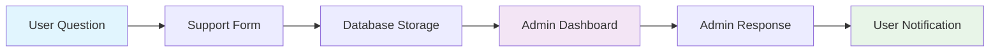
```mermaid
graph LR
    A[User Question] --> B[Support Form]
    B --> C[Database Storage]
    C --> D[Admin Dashboard]
    D --> E[Admin Response]
    E --> F[User Notification]
    
    style A fill:#e1f5fe
    style D fill:#f3e5f5
    style F fill:#e8f5e8
```

Key Support Features:

- **Event-Specific Questions**: Users can link questions to specific events
- **Priority System**: Low, Medium, High priority classification
- **Admin Response System**: Complete response workflow with status tracking
- **Status Management**: Open → In Progress → Resolved lifecycle
- **Role-Based Access**: Only admins can view and respond to support messages

### Advanced Ticket Management

Real-Time Ticket Availability with Observer Pattern

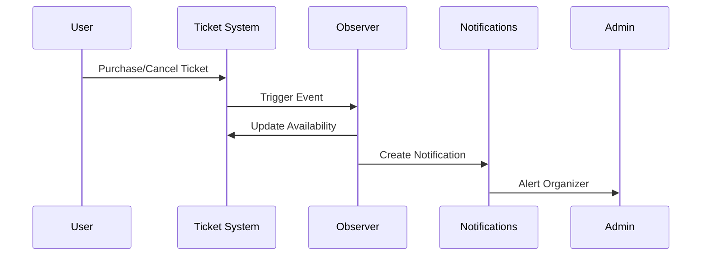
```mermaid
sequenceDiagram
    participant U as User
    participant T as Ticket System
    participant O as Observer
    participant N as Notifications
    participant A as Admin

    U->>T: Purchase/Cancel Ticket
    T->>O: Trigger Event
    O->>T: Update Availability
    O->>N: Create Notification
    N->>A: Alert Organizer
```

Ticket System Features:

- **Real-Time Updates**: AJAX polling every 10 seconds
- **Automatic Notifications**: Organizers get instant alerts
- **Observer Pattern**: Automatic availability updates
- **My Tickets**: Users can view and cancel their tickets
- **Progress Bars**: Visual availability indicators

### Event Approval Workflow

Admin-Controlled Event Publishing System

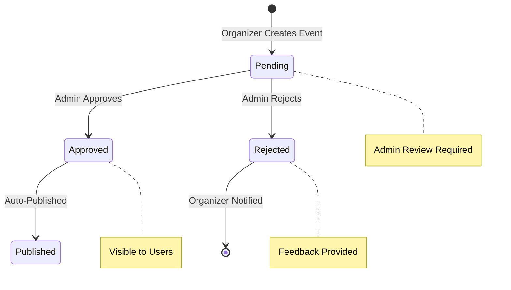
```mermaid
stateDiagram-v2
    [*] --> Pending: Organizer Creates Event
    Pending --> Approved: Admin Approves
    Pending --> Rejected: Admin Rejects
    Approved --> Published: Auto-Published
    Rejected --> [*]: Organizer Notified
    
    note right of Pending: Admin Review Required
    note right of Approved: Visible to Users
    note right of Rejected: Feedback Provided
```

Approval System Features:

- **Three-State Workflow**: Pending → Approved/Rejected
- **Admin Comments**: Required feedback for rejections
- **Audit Trail**: Complete approval history tracking
- **Dashboard Integration**: Pending approvals counter
- **Organizer Notifications**: Automatic approval/rejection alerts

---

## System Design Lifecycle

We followed a comprehensive, iterative approach to building this enterprise-level system, implementing multiple design patterns and advanced features across different development phases:

### Phase 1: Foundation & Security (Weeks 1-2)

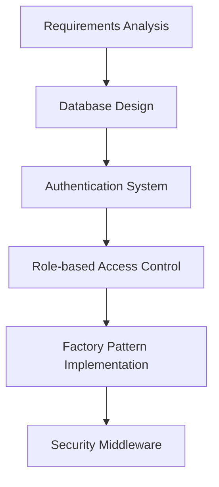
```mermaid
graph TD
    A[Requirements Analysis] --> B[Database Design]
    B --> C[Authentication System]
    C --> D[Role-based Access Control]
    D --> E[Factory Pattern Implementation]
    E --> F[Security Middleware]
```

Completed Features:

- Multi-role authentication system
- Factory pattern for user creation
- Role-based access control
- Login security tracking
- Database schema design

### Phase 2: Core Event System (Weeks 3-4)

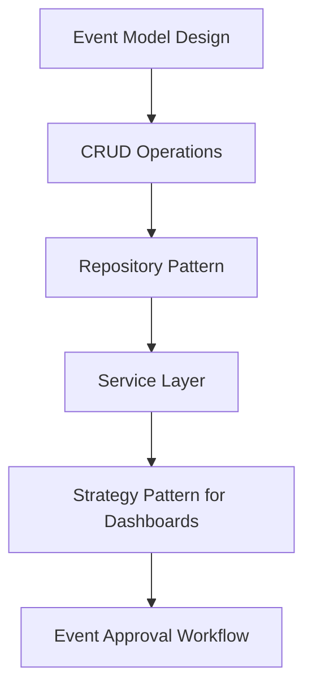
```mermaid
graph TD
    A[Event Model Design] --> B[CRUD Operations]
    B --> C[Repository Pattern]
    C --> D[Service Layer]
    D --> E[Strategy Pattern for Dashboards]
    E --> F[Event Approval Workflow]
```

Completed Features:

- Complete event management CRUD
- Admin approval system for events
- Repository pattern for data access
- Service layer for business logic
- Dashboard routing strategies

### Phase 3: Real-Time Features (Weeks 5-6)

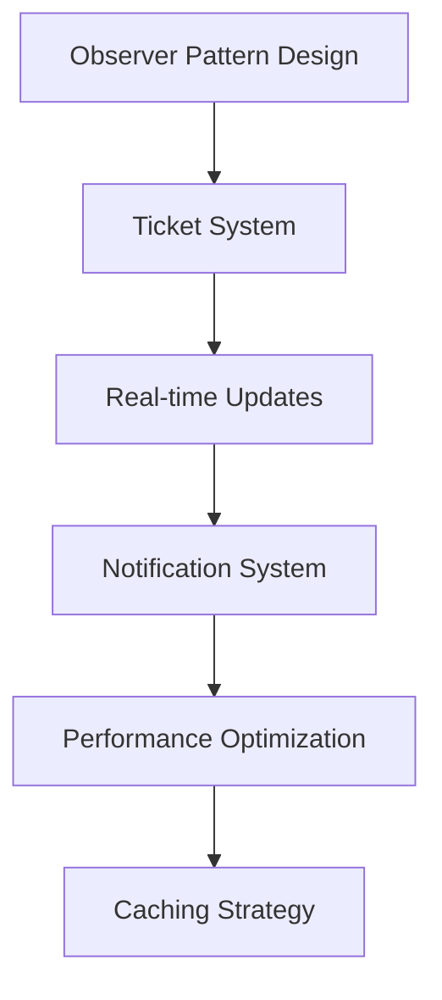
```mermaid
graph TD
    A[Observer Pattern Design] --> B[Ticket System]
    B --> C[Real-time Updates]
    C --> D[Notification System]
    D --> E[Performance Optimization]
    E --> F[Caching Strategy]
```

Completed Features:

- Observer pattern for automatic updates
- Real-time ticket availability
- Automatic organizer notifications
- AJAX polling for live updates
- Intelligent caching system

### Phase 4: Advanced Management (Weeks 7-8)

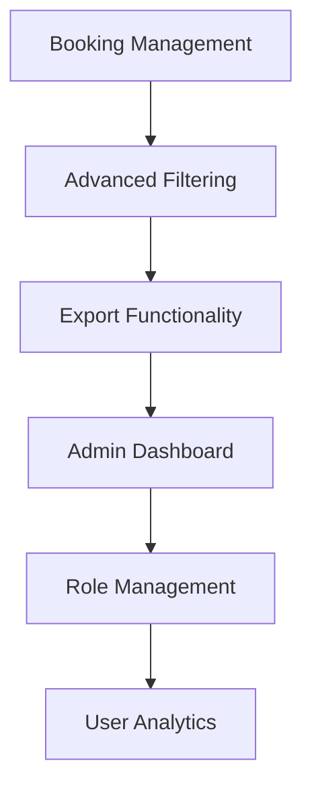
```mermaid
graph TD
    A[Booking Management] --> B[Advanced Filtering]
    B --> C[Export Functionality]
    C --> D[Admin Dashboard]
    D --> E[Role Management]
    E --> F[User Analytics]
```

Completed Features:

- Complete booking management system
- Advanced filtering and search
- CSV export functionality
- Real-time role management
- User analytics and statistics

### Phase 5: Communication System (Weeks 9-10)

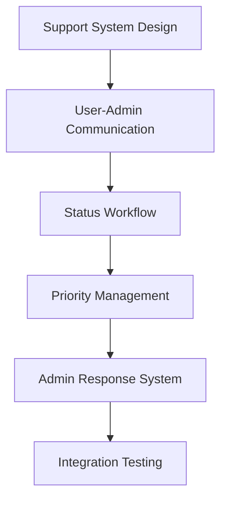
```mermaid
graph TD
    A[Support System Design] --> B[User-Admin Communication]
    B --> C[Status Workflow]
    C --> D[Priority Management]
    D --> E[Admin Response System]
    E --> F[Integration Testing]
```

Completed Features:

- Complete support communication system
- Event-specific support messages
- Priority classification system
- Admin response workflow
- Status tracking (Open → In Progress → Resolved)

---

## Architecture Patterns

### 1. MVC + Service Layer Architecture

Modern Laravel architecture with enhanced service layer for complex business logic:

```
Presentation Layer → Blade Templates + Tailwind CSS + Alpine.js
Controller Layer → Route Handlers + Request Validation
Service Layer → Business Logic + Design Patterns
Repository Layer → Data Access + Query Optimization
Model Layer → Eloquent ORM + Relationships
```

### 2. Layered Architecture with Design Patterns

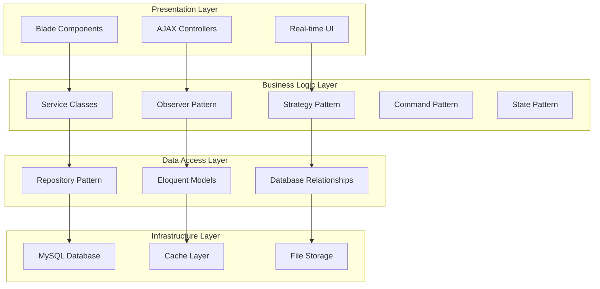
```mermaid
graph TB
    subgraph "Presentation Layer"
    A[Blade Components]
    B[AJAX Controllers]
    C[Real-time UI]
    end
 
    subgraph "Business Logic Layer"
    D[Service Classes]
    E[Observer Pattern]
    F[Strategy Pattern]
    G[Command Pattern]
    H[State Pattern]
    end
 
    subgraph "Data Access Layer"
    I[Repository Pattern]
    J[Eloquent Models]
    K[Database Relationships]
    end
 
    subgraph "Infrastructure Layer"
    L[MySQL Database]
    M[Cache Layer]
    N[File Storage]
    end
 
    A --> D
    B --> E
    C --> F
    D --> I
    E --> J
    F --> K
    I --> L
    J --> M
    K --> N
```

### 3. Event-Driven Architecture

Using Laravel's Observer Pattern for real-time features:

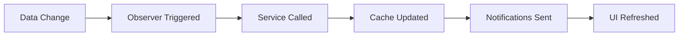
```mermaid
graph LR
    A[Data Change] --> B[Observer Triggered]
    B --> C[Service Called]
    C --> D[Cache Updated]
    D --> E[Notifications Sent]
    E --> F[UI Refreshed]
```

---

## Design Patterns Implementation

### 1. Observer Pattern - Real-Time System

Location: `app/Observers/TicketObserver.php`

Purpose: Automatically handle ticket availability, notifications, and booking updates when tickets change.

```php
// app/Observers/TicketObserver.php
class TicketObserver
{
    public function created(Ticket $ticket): void
    {
        // Automatic availability update
        $this->ticketService->updateAvailability($ticket->event_id);
        
        // Automatic organizer notification
        $this->notificationService->notifyTicketPurchase($ticket);
        
        // Clear booking cache for real-time updates
        $this->bookingService->clearCache();
    }
    
    public function updated(Ticket $ticket): void
    {
        if ($ticket->wasChanged('status') && $ticket->status === 'cancelled') {
            $this->notificationService->notifyTicketCancellation($ticket);
        }
        
        $this->ticketService->updateAvailability($ticket->event_id);
    }
}
```

Observer Pattern Benefits:

- **Automatic Processing**: No manual triggers needed
- **Real-time Updates**: Instant availability changes
- **Loose Coupling**: Services don't need to know about each other
- **Extensible**: Easy to add new automatic behaviors

### 2. Service Layer Pattern - Business Logic Separation

Location: `app/Services/`

Purpose: Clean separation of business logic from controllers and models.

```php
// app/Services/SimpleTicketService.php
class SimpleTicketService
{
    public function getAvailability($eventId): array
 {
    return Cache::remember("event_tickets_{$eventId}", 60, function () use ($eventId) {
 $event = Event::find($eventId);
 $soldTickets = Ticket::where('event_id', $eventId)
 ->where('status', 'confirmed')
 ->sum('quantity');
 
    return [
 'total_capacity' => $event->capacity,
 'available_tickets' => max(0, $event->capacity -$soldTickets),
 'tickets_sold' => $soldTickets,
 'availability_percentage' => ($soldTickets / $event->capacity) * 100
 ];
 });
 }
 
    public function purchaseTickets($eventId, $quantity, $userId): bool
 {
    return DB::transaction(function () use ($eventId, $quantity, $userId) {
 $availability = $this->getAvailability($eventId);
 
    if ($availability['available_tickets'] < $quantity) {
    throw new \Exception('Not enough tickets available');
 }
 
 $event = Event::find($eventId);
 $ticket = Ticket::create([
 'event_id' => $eventId,
 'user_id' => $userId,
 'quantity' => $quantity,
 'total_price' => $event->price * $quantity,
 'status' => 'confirmed'
 ]);
 
 // Observer will automatically handle availability and notifications
    return true;
 });
 }
}
```

### 3. **Strategy Pattern** -Role Management System

**Location**: `app/Services/RoleManagementService.php`

**Purpose**: Flexible role transition logic with validation strategies.

```php
// app/Services/RoleManagementService.php
class RoleManagementService
{
 // Strategy: Define allowed role transitions
    public const ROLE_TRANSITIONS = [
 'user' => ['organizer'],
 'organizer' => ['user', 'admin'],
 'admin' => ['organizer']
 ];
 
    public function changeUserRole(User $user, string $newRole, User $admin): bool
 {
 // Strategy 1: Admin permission validation
    if (!$this->validateAdminAccess($admin)) {
    throw new \Exception('Only admins can change user roles');
 }
 
 // Strategy 2: Self-modification prevention
    if (!$this->validateSelfModification($user, $admin)) {
    throw new \Exception('Cannot change your own role');
 }
 
 // Strategy 3: Role transition validation
    if (!$this->validateRoleTransition($user->role, $newRole)) {
    throw new \Exception("Cannot transition from {$user->role} to {$newRole}");
 }
 
    return $user->update(['role' => $newRole]);
 }
 
    private function validateRoleTransition(string $currentRole, string $newRole): bool
 {
    return in_array($newRole, self::ROLE_TRANSITIONS[$currentRole] ?? []);
 }
}
```

### 4. **Command Pattern** -Password Reset System

**Location**: `app/Services/SimplePasswordResetService.php`

**Purpose**: Encapsulate password reset operations as command objects.

```php
// app/Services/SimplePasswordResetService.php
class SimplePasswordResetService
{
 /**
 * Command: Send Reset Token
 */
    public function sendResetToken(string $email): array
 {
 $user = User::where('email', $email)->first();
 
    if (!$user) {
    return ['success' => false, 'message' => 'User not found'];
 }
 
 $token = Str::random(60);
 $expiresAt = Carbon::now()->addHours(2);
 
 // Store token
    DB::table('password_reset_tokens')->updateOrInsert(
    ['email' => $email],
    [
 'token' => Hash::make($token),
 'created_at' => Carbon::now(),
 'expires_at' => $expiresAt,
 ]
 );
 
 // Send email
 $this->sendResetEmail($user, $token);
 
    return ['success' => true, 'message' => 'Reset link sent'];
 }
 
 /**
 * Command: Reset Password
 */
    public function resetPassword(string $email, string $token, string $newPassword): array
 {
    if (!$this->verifyResetToken($email, $token)) {
    return ['success' => false, 'message' => 'Invalid or expired token'];
 }
 
 $user = User::where('email', $email)->first();
 $user->update(['password' => Hash::make($newPassword)]);
 
 // Clean up used token
    DB::table('password_reset_tokens')->where('email', $email)->delete();
 
    return ['success' => true, 'message' => 'Password reset successful'];
 }
}
```

### 5. **State Pattern** -Payment Processing

**Location**: `app/Services/SimplePaymentService.php`

**Purpose**: Manage payment state transitions safely.

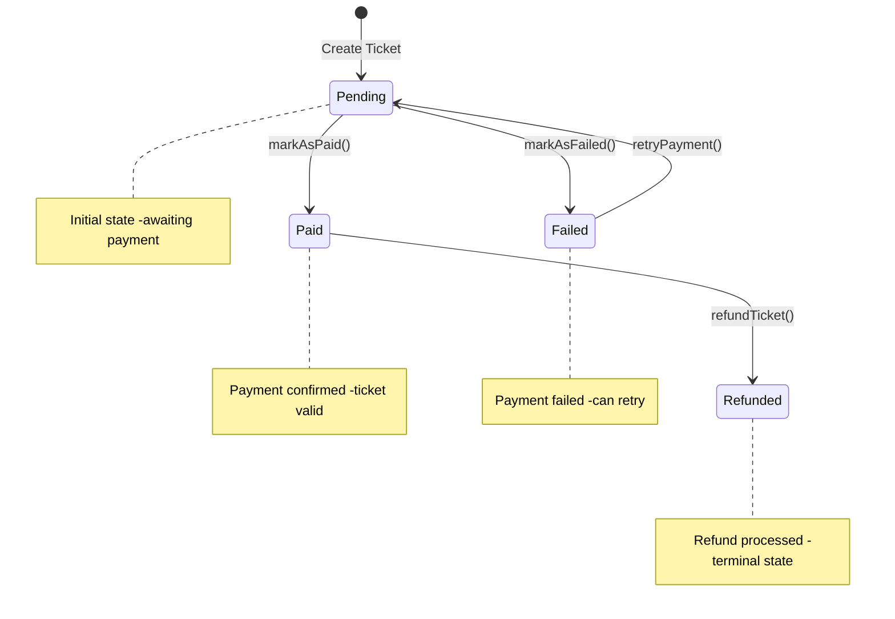
```mermaid
stateDiagram-v2
    [*] --> Pending: Create Ticket
    Pending --> Paid: markAsPaid()
    Pending --> Failed: markAsFailed()
    Paid --> Refunded: refundTicket()
    Failed --> Pending: retryPayment()
 
    note right of Pending: Initial state -awaiting payment
    note right of Paid: Payment confirmed -ticket valid
    note right of Failed: Payment failed -can retry
    note right of Refunded: Refund processed -terminal state
```

```php
// app/Services/SimplePaymentService.php
class SimplePaymentService
{
    public function markAsPaid(Ticket $ticket, ?float $paymentAmount = null, ?string $reference = null): bool
 {
 // State validation: only pending tickets can be marked as paid
    if (!$ticket->isPending()) {
    return false;
 }
 
 $ticket->update([
 'payment_status' => 'paid',
 'payment_amount' => $paymentAmount ?? $ticket->total_price,
 'payment_reference' => $reference,
 'paid_at' => now(),
 ]);
 
    return true;
 }
 
    public function refundTicket(Ticket $ticket, ?string $refundReference = null): bool
 {
 // State validation: only paid tickets can be refunded
    if (!$ticket->isPaid()) {
    return false;
 }
 
 $ticket->update([
 'payment_status' => 'refunded',
 'payment_reference' => $refundReference ?? 'Refunded at ' . now(),
 ]);
 
    return true;
 }
}
```

### 6. **Repository Pattern** -Data Access Layer

**Location**: `app/Repositories/EventRepository.php`

**Purpose**: Abstract database operations and provide clean data access interface.

```php
// app/Repositories/EventRepository.php
class EventRepository
{
    public function getPublishedAndApprovedWithSorting(string $sortBy = 'created_at', string $direction = 'desc'): Collection
 {
    return Event::where('status', 'published')
 ->where('approval_status', 'approved')
 ->orderBy($sortBy, $direction)
 ->get();
 }
 
    public function getPendingApprovalEvents(): Collection
 {
    return Event::where('approval_status', 'pending')
 ->with(['organizer'])
 ->orderBy('created_at', 'asc')
 ->get();
 }
 
    public function getEventsByOrganizer(int $organizerId, array $filters = []): Collection
 {
 $query = Event::where('organizer_id', $organizerId);
 
    if (!empty($filters['status'])) {
 $query->where('status', $filters['status']);
 }
 
    if (!empty($filters['approval_status'])) {
 $query->where('approval_status', $filters['approval_status']);
 }
 
    return $query->orderBy('created_at', 'desc')->get();
 }
}
```

### 7. **Component Pattern** -Reusable UI Components

**Location**: `resources/views/components/`

**Purpose**: Create consistent, reusable UI components across the application.

```blade
{{--resources/views/components/simple-ticket-availability.blade.php --}}
@props(['event'])

<div class="ticket-availability-widget bg-gradient-to-br from-slate-900 to-slate-800 rounded-2xl p-6" 
    data-event-id="{{ $event->id }}">
 
 {{--Availability Display --}}
 <div class="availability-display mb-4">
 <div class="flex justify-between items-center mb-2">
 <span class="text-slate-300">Tickets Available</span>
 <span class="available-count text-2xl font-bold text-cyan-400">
 {{ $event->available_tickets ?? 0 }}
 </span>
 </div>
 
 {{--Progress Bar --}}
 <div class="w-full bg-slate-700 rounded-full h-3">
 <div class="availability-bar bg-gradient-to-r from-cyan-500 to-blue-500 h-3 rounded-full transition-all duration-500" 
    style="width: {{ $event->availability_percentage ?? 0 }}%"></div>
 </div>
 </div>
 
 {{--Purchase Form --}}
 @if(($event->available_tickets ?? 0) > 0)
 <form class="ticket-purchase-form" data-event-id="{{ $event->id }}">
 @csrf
 <div class="flex gap-3">
 <select name="quantity" class="quantity-select bg-slate-800 border border-slate-600 rounded-lg px-3 py-2 text-slate-300">
 @for($i = 1; $i <= min(10, $event->available_tickets ?? 1); $i++)
 <option value="{{ $i }}">{{ $i }} ticket{{ $i > 1 ? 's' : '' }}</option>
 @endfor
 </select>
 <button type="submit" class="purchase-btn bg-gradient-to-r from-cyan-500 to-blue-500 hover:from-cyan-400 hover:to-blue-400 px-6 py-2 rounded-lg text-white font-medium transition-all">
    Buy Now
 </button>
 </div>
 </form>
 @else
        <div class="sold-out text-center p-4 bg-red-900/20 border border-red-700/30 rounded-lg">
            <span class="text-red-400 font-medium">Sold Out</span>
        </div>
 @endif
</div>

<script>
// Real-time updates every 10 seconds
setInterval(() => {
    updateTicketAvailability({{ $event->id }});
}, 10000);

function updateTicketAvailability(eventId) {
    fetch(`/api/events/${eventId}/availability`)
 .then(response => response.json())
 .then(data => {
    document.querySelector('.available-count').textContent = data.available_tickets;
    document.querySelector('.availability-bar').style.width = data.availability_percentage + '%';
 });
}
</script>
```

---
 }
 
    class AdminDashboardStrategy {
 +getDashboardRoute() string
 }
 
    class UserDashboardStrategy {
 +getDashboardRoute() string
 }
 
    class OrganizerDashboardStrategy {
 +getDashboardRoute() string
 }
 
    DashboardStrategy <|--AdminDashboardStrategy
    DashboardStrategy <|--UserDashboardStrategy
    DashboardStrategy <|--OrganizerDashboardStrategy
```

### 3. **Repository Pattern** -Event Data Management

**Location**: `app/Repositories/EventRepository.php`

**Purpose**: Abstract database operations and provide a clean interface for data access.

```php
// app/Repositories/EventRepository.php
class EventRepository
{
    protected $model;

    public function __construct(Event $model)
 {
 $this->model = $model;
 }

    public function getAllWithSorting(string $sortBy = 'created_at', string $direction = 'desc'): Collection
 {
    return $this->model
 ->orderBy($sortBy, $direction)
 ->get();
 }

```php
public function getByOrganizerWithSorting(int $organizerId, string $sortBy, string $direction): Collection
{
    return $this->model
        ->where('organizer_id', $organizerId)
        ->orderBy($sortBy, $direction)
        ->get();
}
```

### 4. Service Layer Pattern -Sorting Logic

Location: `app/Services/SortingService.php`

Purpose: Centralize sorting logic, validation, and configuration.

```php
// app/Services/SortingService.php
class SortingService
{
    public const EVENT_SORT_OPTIONS = [
        'created_at' => 'Date Created',
        'title' => 'Title',
        'event_date' => 'Event Date',
        'price' => 'Price',
        'total_tickets' => 'Total Tickets',
        'tickets_sold' => 'Tickets Sold',
        'status' => 'Status'
    ];

    public function validateEventSortParameters(?string $sortBy, ?string $direction): array
    {
        return [
            'sort_by' => $this->validateSortBy($sortBy, array_keys(self::EVENT_SORT_OPTIONS)),
            'direction' => $this->validateDirection($direction),
        ];
    }
}
```

### 5. **Component Pattern** -Reusable UI Components

**Location**: `resources/views/components/sorting-controls.blade.php`

**Purpose**: Create reusable, consistent UI components across the application.

```blade
{{--resources/views/components/sorting-controls.blade.php --}}
@props([
 'action' => request()->url(),
 'sortOptions' => [],
 'currentSort' => 'created_at',
 'currentDirection' => 'desc',
 'totalCount' => 0,
 'showReset' => false
])

<div class="rounded-2xl border border-cyan-400/20 bg-slate-900/80 backdrop-blur-md p-4 shadow-lg">
 <!--Component implementation -->
</div>
```

**Usage Example**:
```blade
<x-sorting-controls 
 :action="route('events.index')"
 :sort-options="$sortOptions"
 :current-sort="$sortBy"
 :current-direction="$sortDirection"
 :total-count="$events->count()"
 :show-reset="!$isDefaultSort"
/>
```

### 6. **Dependency Injection Pattern**

**Location**: `app/Http/Controllers/EventController.php`

**Purpose**: Improve testability and maintain loose coupling between classes.

```php
// app/Http/Controllers/EventController.php
class EventController extends Controller
{
    protected $eventRepository;
    protected $sortingService;

    public function __construct(EventRepository $eventRepository, SortingService $sortingService)
 {
 $this->eventRepository = $eventRepository;
 $this->sortingService = $sortingService;
 }

    public function index(Request $request)
 {
 $sortParams = $this->sortingService->validateEventSortParameters(
 $request->get('sort'),
 $request->get('direction')
 );

 $events = $this->eventRepository->getAllWithSorting(
 $sortParams['sort_by'],
 $sortParams['direction']
 );

    return view('events.index', [
 'events' => $events,
 'sortBy' => $sortParams['sort_by'],
 'sortDirection' => $sortParams['direction'],
 'sortOptions' => $this->sortingService->getEventSortOptions(),
 'isDefaultSort' => $this->sortingService->isDefaultSort($sortParams['sort_by'], $sortParams['direction'])
 ]);
 }
}
```

### 7. **Strategy Pattern** -Role Management System

**Location**: `app/Services/RoleManagementService.php`

**Purpose**: Implement flexible role transition logic with validation rules and business constraints.

```php
// app/Services/RoleManagementService.php
class RoleManagementService
{
 // Define role transition strategies
    public const ROLE_TRANSITIONS = [
 'user' => ['organizer'],
 'organizer' => ['user', 'admin'],
 'admin' => ['organizer']
 ];

    public function changeUserRole(User $user, string $newRole, User $admin): bool
 {
 // Strategy: Admin permission validation
    if ($admin->role !== 'admin') {
    throw new \Exception('Only admins can change user roles');
 }

 // Strategy: Self-role prevention
    if ($user->id === $admin->id) {
    throw new \Exception('Cannot change your own role');
 }

 // Strategy: Role transition validation
    if (!$this->canTransitionToRole($user->role, $newRole)) {
    throw new \Exception("Cannot transition from {$user->role} to {$newRole}");
 }

    return DB::transaction(function () use ($user, $newRole) {
    return $user->update(['role' => $newRole]);
 });
 }

    private function canTransitionToRole(string $currentRole, string $newRole): bool
 {
    return in_array($newRole, self::ROLE_TRANSITIONS[$currentRole] ?? []);
 }
}
```

**Role Management Strategy Implementation**:
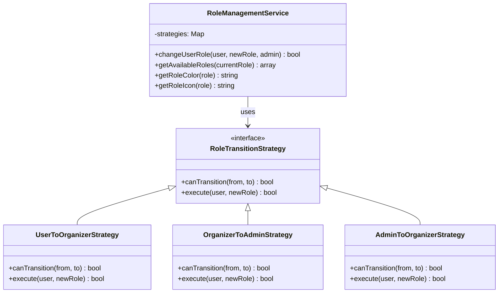
```mermaid
classDiagram
    class RoleTransitionStrategy {
 <<interface>>
 +canTransition(from, to) bool
 +execute(user, newRole) bool
 }
 
    class UserToOrganizerStrategy {
 +canTransition(from, to) bool
 +execute(user, newRole) bool
 }
 
    class OrganizerToAdminStrategy {
 +canTransition(from, to) bool
 +execute(user, newRole) bool
 }
 
    class AdminToOrganizerStrategy {
 +canTransition(from, to) bool
 +execute(user, newRole) bool
 }
 
    class RoleManagementService {
 -strategies: Map
 +changeUserRole(user, newRole, admin) bool
 +getAvailableRoles(currentRole) array
 +getRoleColor(role) string
 +getRoleIcon(role) string
 }
 
    RoleTransitionStrategy <|--UserToOrganizerStrategy
    RoleTransitionStrategy <|--OrganizerToAdminStrategy
    RoleTransitionStrategy <|--AdminToOrganizerStrategy
    RoleManagementService --> RoleTransitionStrategy : uses
```

### 8. **Component Pattern** -Role Selector Component

**Location**: `resources/views/components/role-selector.blade.php`

**Purpose**: Create reusable UI component for role management with AJAX functionality.

```blade
{{--Role Selector Component --}}
@props(['user', 'roleService'])

<div class="role-selector inline-block">
 @if($user->id === auth()->id())
 {{--Current user cannot change their own role --}}
 <span class="inline-flex items-center px-2.5 py-0.5 rounded-full text-xs font-medium {{ $roleService->getRoleColor($user->role) }}">
 {{ $roleService->getRoleIcon($user->role) }} {{ ucfirst($user->role) }}
 </span>
 @else
 {{--Role management interface for other users --}}
 <div class="flex items-center gap-2">
 {{--Current role badge --}}
 <span class="inline-flex items-center px-2.5 py-0.5 rounded-full text-xs font-medium bg-slate-700 text-slate-300">
 {{ $roleService->getRoleIcon($user->role) }} {{ ucfirst($user->role) }}
 </span>

 {{--Change role dropdown with AJAX --}}
 <select class="role-change-select" data-user-id="{{ $user->id }}" data-current-role="{{ $user->role }}">
 <option value="">Change to...</option>
 @foreach($roleService->getAvailableRoles($user->role) as $availableRole)
 <option value="{{ $availableRole }}">
 {{ $roleService->getRoleIcon($availableRole) }} {{ ucfirst($availableRole) }}
 </option>
 @endforeach
 </select>
 </div>
 @endif
</div>
```

**Features**:
- **Real-time Role Updates**: AJAX-based role changes without page refresh
- **Visual Feedback**: Success/error notifications with smooth animations
- **Security**: Prevents self-role modification and validates permissions
- **UX Optimized**: Silent error handling, no intrusive popups


## System Diagrams & Visual Models

The following section presents the visual system documentation of the **Event Management & Ticketing System (EMTS)**. 
It includes both **static** and **dynamic** modeling through UML and DFD representations to illustrate the complete workflow and architecture of the system.

---

### Use Case Diagram
The use case diagram provides an overview of all actors and their interactions with the system.

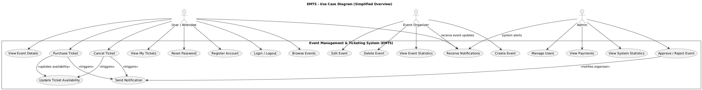 

🔗 [View in SVG (Zoomable)](https://raw.githubusercontent.com/Event-Management-Ticketing-System-EMTS/Event-Management-Ticketing-System/main/docs/diagrams/use_case_diagram.svg)


Description: 
Represents how Users, Organizers, and Admins interact with the EMTS through key functionalities like event creation, booking, and management.

---

### Sequence Diagrams
The following sequence diagrams illustrate the interaction between users, controllers, services, and the database in EMTS (Event Management & Ticketing System). 
Each PNG is previewed below, and each SVG link opens a zoomable version.

---

#### Combined Overview
A high-level sequence diagram combining all core flows (user registration, event creation, ticket booking, admin approval, and notification).

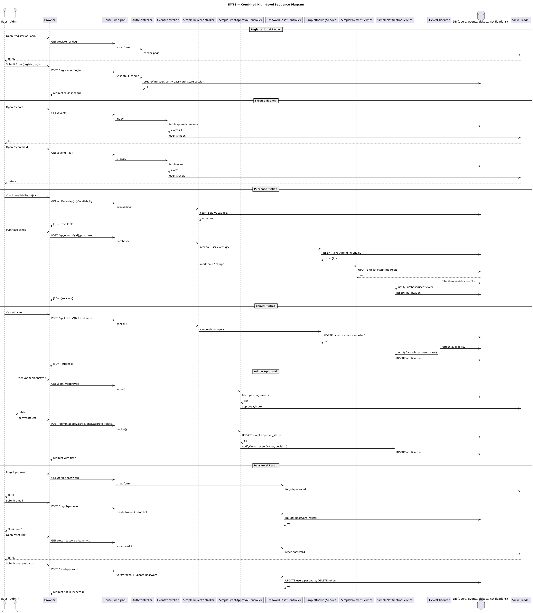 
[View in SVG (Zoomable)](https://raw.githubusercontent.com/Event-Management-Ticketing-System-EMTS/Event-Management-Ticketing-System/main/docs/diagrams/seq_0_combined_overview.svg)


---

#### Registration & Login
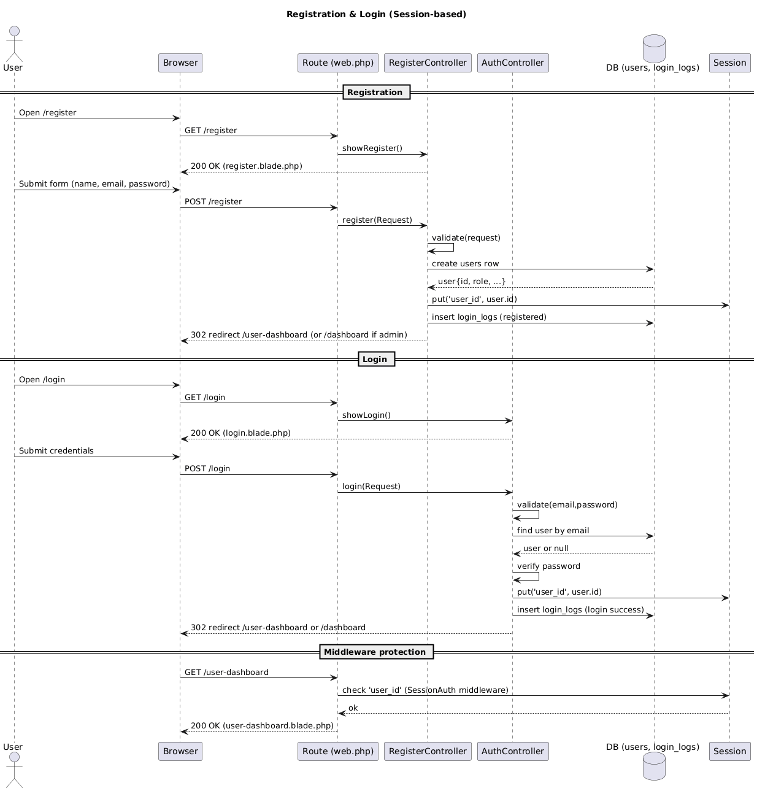 


Description: 
Covers both registration and login flows — showing how the `RegisterController` and `AuthController` interact with the session and database.

---

#### Browse Events & View Details
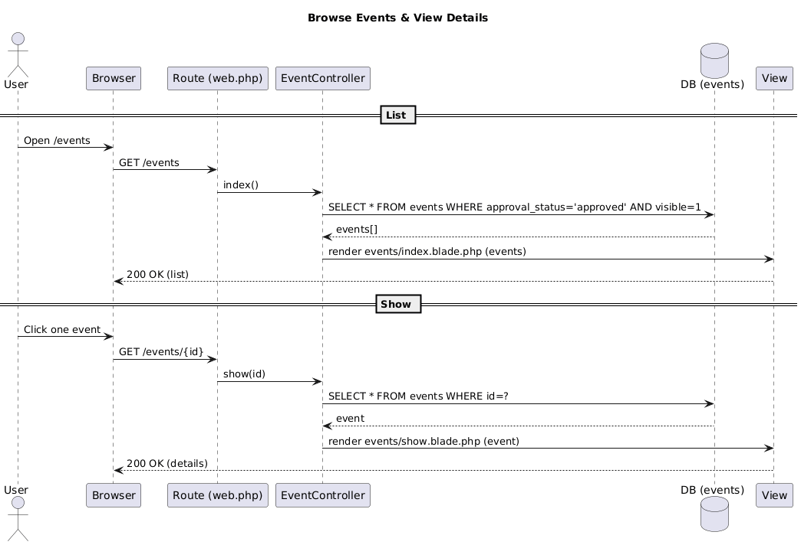 

🔗 [View in SVG (Zoomable)](https://raw.githubusercontent.com/Event-Management-Ticketing-System-EMTS/Event-Management-Ticketing-System/main/docs/diagrams/seq_2_browse_events.svg)

Description: 
Depicts how the `EventController` retrieves event lists and displays details through the MVC rendering process.

---

#### Ticket Purchase
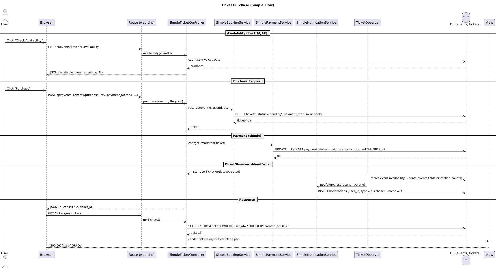 

🔗 [View in SVG (Zoomable)](https://raw.githubusercontent.com/Event-Management-Ticketing-System-EMTS/Event-Management-Ticketing-System/main/docs/diagrams/seq_3_ticket_purchase.svg)


Description: 
Covers the entire purchase flow — checking availability, booking, marking payment, and sending notifications via `TicketObserver`.

---

#### Admin Event Approval
 

    [View in SVG (Zoomable)](https://raw.githubusercontent.com/Event-Management-Ticketing-System-EMTS/Event-Management-Ticketing-System/main/docs/diagrams/seq_4_admin_approval.svg)

Description: 
Demonstrates how the `SimpleEventApprovalController` handles admin decisions (approve/reject) and triggers notifications.

---

#### Ticket Cancellation
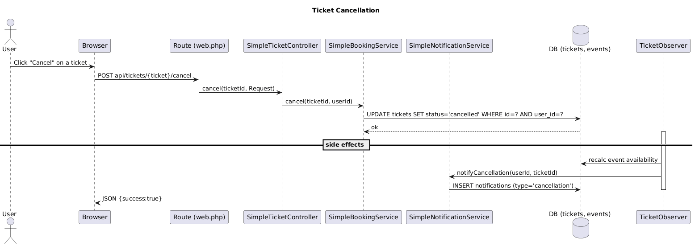 


Description: 
Explains how ticket cancellations are processed, events updated, and users notified through `SimpleBookingService` and `TicketObserver`.

---

#### Password Reset Flow
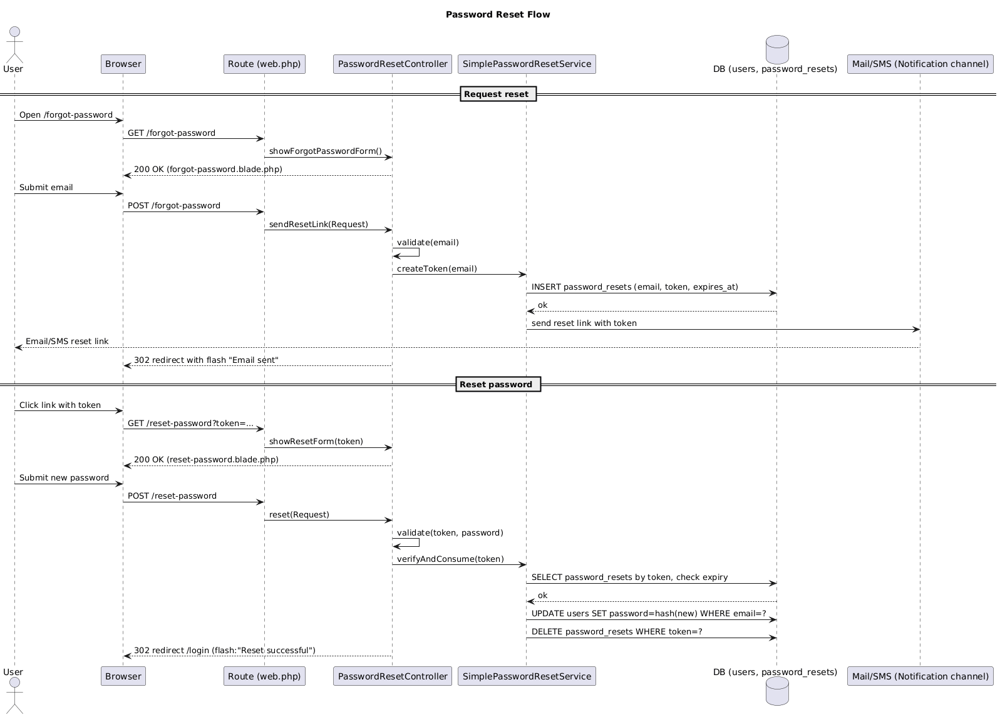 


Description: 
Shows the full password reset lifecycle — from token generation and email dispatch to password update and confirmation.

---

### Data Flow Diagrams (DFD)
These diagrams show how data moves between processes, entities, and data stores in EMTS.

#### Context Level DFD
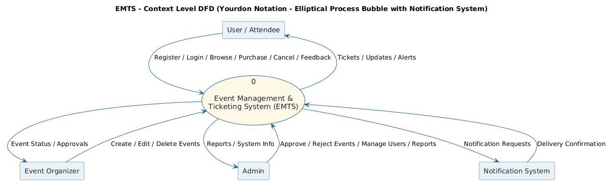 


---

#### Level-0 DFD
 


---

#### Level-1 DFDs

#### Level-1 DFD — User Management
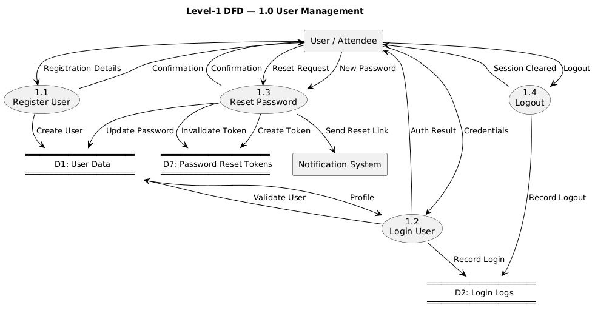 


---

#### Level-1 DFD — Event Management
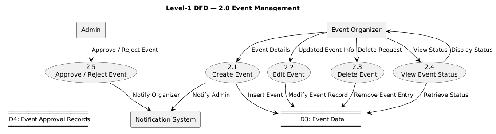 


---

#### Level-1 DFD — Ticket Management
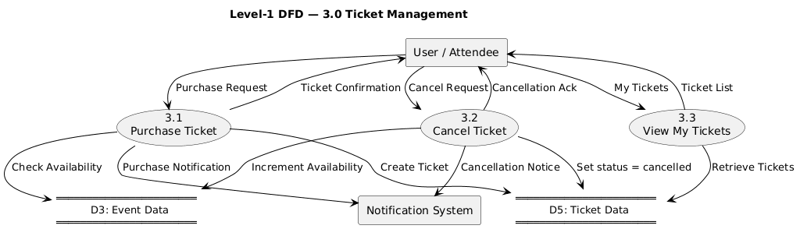 

---

#### Level-1 DFD — Notification Management
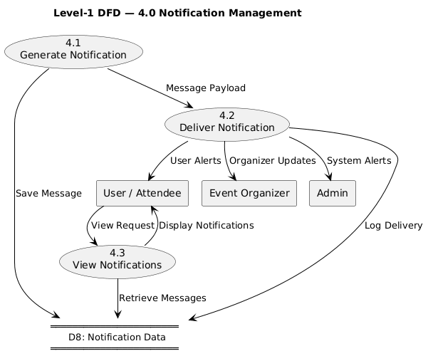 


---

#### Level-1 DFD — Admin Management
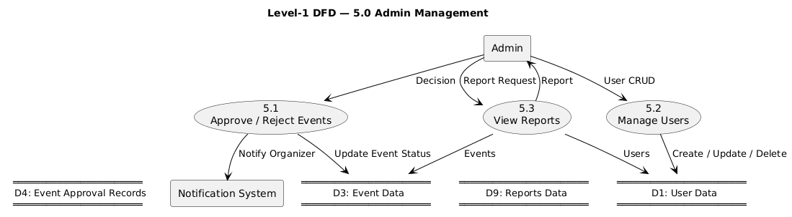 


---

#### Level-1 DFD — Support & Reports
 


---

### Activity Diagram
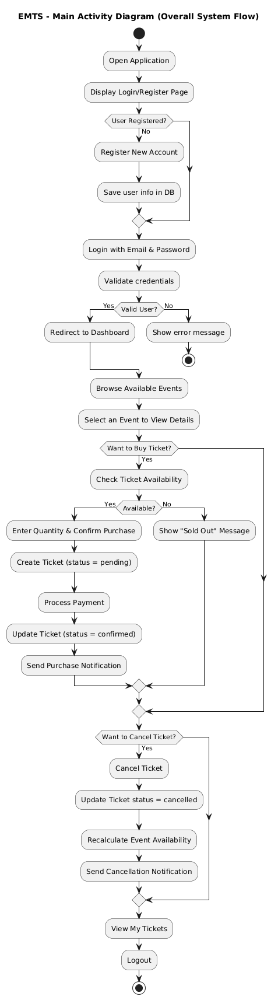 
🔗 [View in SVG (Zoomable)](https://raw.githubusercontent.com/Event-Management-Ticketing-System-EMTS/Event-Management-Ticketing-System/main/docs/diagrams/activity_diagram.svg)

Description: 
Describes the flow of control from login and event creation to ticket purchase, approval, and notifications.

---

### Class Diagram
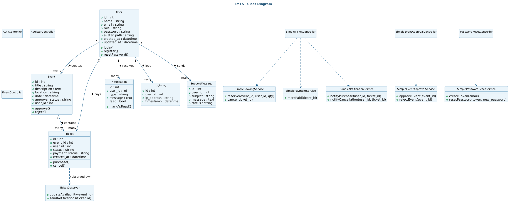 

🔗 [View in SVG (Zoomable)](https://raw.githubusercontent.com/Event-Management-Ticketing-System-EMTS/Event-Management-Ticketing-System/main/docs/diagrams/class_diagram.svg)


Description: 
Shows the structure of the EMTS architecture, including relationships between Controllers, Models, Services, and Observers under the MVC + Service Layer pattern.

---

### Tips
- All PNGs will **display directly on GitHub**. 
- Clicking any SVG link opens a **zoomable version** for clarity. 
- Make sure your files are inside `docs/diagrams/` exactly as named above.


## 🗄️ Database Schema & Relationships

### Complete Entity Relationship Diagram

Our comprehensive database schema supports all system features including support communication, event approval, and real-time ticketing:

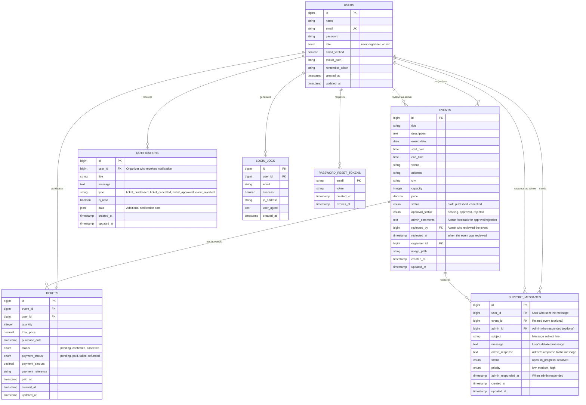
```mermaid
erDiagram
    USERS {
    bigint id PK
    string name
    string email UK
    string password
    enum role "user, organizer, admin"
    boolean email_verified
    string avatar_path
    string remember_token
    timestamp created_at
    timestamp updated_at
 }
 
    EVENTS {
    bigint id PK
    string title
    text description
    date event_date
    time start_time
    time end_time
    string venue
    string address
    string city
    integer capacity
    decimal price
    enum status "draft, published, cancelled"
    enum approval_status "pending, approved, rejected"
    text admin_comments "Admin feedback for approval/rejection"
    bigint reviewed_by FK "Admin who reviewed the event"
    timestamp reviewed_at "When the event was reviewed"
    bigint organizer_id FK
    string image_path
    timestamp created_at
    timestamp updated_at
 }
 
    TICKETS {
    bigint id PK
    bigint event_id FK
    bigint user_id FK
    integer quantity
    decimal total_price
    timestamp purchase_date
    enum status "pending, confirmed, cancelled"
    enum payment_status "pending, paid, failed, refunded"
    decimal payment_amount
    string payment_reference
    timestamp paid_at
    timestamp created_at
    timestamp updated_at
 }
 
    NOTIFICATIONS {
    bigint id PK
    bigint user_id FK "Organizer who receives notification"
    string title
    text message
    string type "ticket_purchased, ticket_cancelled, event_approved, event_rejected"
    boolean is_read
    json data "Additional notification data"
    timestamp created_at
    timestamp updated_at
 }
 
    SUPPORT_MESSAGES {
    bigint id PK
    bigint user_id FK "User who sent the message"
    bigint event_id FK "Related event (optional)"
    bigint admin_id FK "Admin who responded (optional)"
    string subject "Message subject line"
    text message "User's detailed message"
    text admin_response "Admin's response to the message"
    enum status "open, in_progress, resolved"
    enum priority "low, medium, high"
    timestamp admin_responded_at "When admin responded"
    timestamp created_at
    timestamp updated_at
 }
 
    LOGIN_LOGS {
    bigint id PK
    bigint user_id FK
    string email
    boolean success
    string ip_address
    text user_agent
    timestamp created_at
 }
 
    PASSWORD_RESET_TOKENS {
    string email PK
    string token
    timestamp created_at
    timestamp expires_at
 }
 
 %% Relationships
    USERS ||--o{ EVENTS : "organizes"
    USERS ||--o{ TICKETS : "purchases"
    USERS ||--o{ NOTIFICATIONS : "receives"
    USERS ||--o{ LOGIN_LOGS : "generates"
    USERS ||--o{ SUPPORT_MESSAGES : "sends"
    USERS ||--o{ SUPPORT_MESSAGES : "responds as admin"
    USERS ||--o{ EVENTS : "reviews as admin"
    USERS ||--o{ PASSWORD_RESET_TOKENS : "requests"
    EVENTS ||--o{ TICKETS : "has bookings"
    EVENTS ||--o{ SUPPORT_MESSAGES : "relates to"
```

### Database Design Principles

#### **1. Normalized Design**
- **Third Normal Form (3NF)**: Eliminates data redundancy
- **Proper Relationships**: Foreign keys maintain data integrity
- **Indexing Strategy**: Optimized for common queries

#### **2. Audit Trail System**
- **User Actions**: Login logs track all authentication attempts
- **Admin Actions**: Event approval/rejection tracking with comments
- **Support Communication**: Complete message history with timestamps
- **Payment History**: Full payment lifecycle tracking

#### **3. Performance Optimization**
- **Strategic Indexing**: Foreign keys and frequently queried columns
- **Caching Layer**: Redis/File cache for frequently accessed data
- **Query Optimization**: Repository pattern with optimized queries

### Key Database Features

#### **Support System Tables**

Support Messages Table:
```sql
CREATE TABLE support_messages (
    id BIGINT PRIMARY KEY AUTO_INCREMENT,
    user_id BIGINT NOT NULL,
    event_id BIGINT NULL,
    admin_id BIGINT NULL,
    subject VARCHAR(255) NOT NULL,
    message TEXT NOT NULL,
    admin_response TEXT NULL,
    status ENUM('open', 'in_progress', 'resolved') DEFAULT 'open',
    priority ENUM('low', 'medium', 'high') DEFAULT 'medium',
    admin_responded_at TIMESTAMP NULL,
    created_at TIMESTAMP DEFAULT CURRENT_TIMESTAMP,
    updated_at TIMESTAMP DEFAULT CURRENT_TIMESTAMP ON UPDATE CURRENT_TIMESTAMP,
 
    FOREIGN KEY (user_id) REFERENCES users(id) ON DELETE CASCADE,
    FOREIGN KEY (event_id) REFERENCES events(id) ON DELETE SET NULL,
    FOREIGN KEY (admin_id) REFERENCES users(id) ON DELETE SET NULL,
 
    INDEX idx_status (status),
    INDEX idx_priority (priority),
    INDEX idx_created_at (created_at)
);
```

#### **Event Approval System**

Enhanced Events Table:
```sql
CREATE TABLE events (
    id BIGINT PRIMARY KEY AUTO_INCREMENT,
    title VARCHAR(255) NOT NULL,
    description TEXT,
    event_date DATE NOT NULL,
    start_time TIME NOT NULL,
    end_time TIME NOT NULL,
    venue VARCHAR(255) NOT NULL,
    capacity INTEGER NOT NULL,
    price DECIMAL(10,2) NOT NULL,
    status ENUM('draft', 'published', 'cancelled') DEFAULT 'draft',
    approval_status ENUM('pending', 'approved', 'rejected') DEFAULT 'pending',
    admin_comments TEXT NULL,
    reviewed_by BIGINT NULL,
    reviewed_at TIMESTAMP NULL,
    organizer_id BIGINT NOT NULL,
    created_at TIMESTAMP DEFAULT CURRENT_TIMESTAMP,
    updated_at TIMESTAMP DEFAULT CURRENT_TIMESTAMP ON UPDATE CURRENT_TIMESTAMP,
 
    FOREIGN KEY (organizer_id) REFERENCES users(id) ON DELETE CASCADE,
    FOREIGN KEY (reviewed_by) REFERENCES users(id) ON DELETE SET NULL,
 
    INDEX idx_status_approval (status, approval_status),
    INDEX idx_event_date (event_date),
    INDEX idx_organizer (organizer_id)
);
```

#### **Payment System Integration**

Enhanced Tickets Table:
```sql
CREATE TABLE tickets (
    id BIGINT PRIMARY KEY AUTO_INCREMENT,
    event_id BIGINT NOT NULL,
    user_id BIGINT NOT NULL,
    quantity INTEGER NOT NULL,
    total_price DECIMAL(10,2) NOT NULL,
    status ENUM('pending', 'confirmed', 'cancelled') DEFAULT 'pending',
    payment_status ENUM('pending', 'paid', 'failed', 'refunded') DEFAULT 'pending',
    payment_amount DECIMAL(10,2) NULL,
    payment_reference VARCHAR(255) NULL,
    paid_at TIMESTAMP NULL,
    purchase_date TIMESTAMP DEFAULT CURRENT_TIMESTAMP,
    created_at TIMESTAMP DEFAULT CURRENT_TIMESTAMP,
    updated_at TIMESTAMP DEFAULT CURRENT_TIMESTAMP ON UPDATE CURRENT_TIMESTAMP,
 
    FOREIGN KEY (event_id) REFERENCES events(id) ON DELETE CASCADE,
    FOREIGN KEY (user_id) REFERENCES users(id) ON DELETE CASCADE,
 
    INDEX idx_event_status (event_id, status),
    INDEX idx_user_tickets (user_id),
    INDEX idx_payment_status (payment_status)
);
```

---

## 🎨 UI/UX Design System

### Design Philosophy

Our **premium dark theme with cyan accents** creates a modern, professional aesthetic that's both visually appealing and highly functional:

#### **Core Design Principles**
- **Dark Theme Excellence**: Reduced eye strain for extended use
- **Glassmorphism Effects**: Modern blur and transparency effects
- **Gradient Aesthetics**: Sophisticated color transitions
- **Accessibility First**: High contrast ratios and semantic HTML
- **Mobile Responsive**: Mobile-first design approach

### Color Palette & Theming

```css
:root {
 /* Primary Background Gradient */
 --bg-primary: linear-gradient(135deg, #0F172A 0%, #1E293B 100%);
 --bg-secondary: #1E293B; /* slate-800 */
 --bg-tertiary: #334155; /* slate-700 */
 
 /* Accent Colors */
 --accent-primary: #06B6D4; /* cyan-500 */
 --accent-secondary: #0891B2; /* cyan-600 */
 --accent-light: #67E8F9; /* cyan-300 */
 --accent-gradient: linear-gradient(135deg, #06B6D4 0%, #3B82F6 100%);
 
 /* Text Colors */
 --text-primary: #F8FAFC; /* slate-50 */
 --text-secondary: #CBD5E1; /* slate-300 */
 --text-muted: #64748B; /* slate-500 */
 
 /* Status Colors */
 --success: #10B981; /* emerald-500 */
 --warning: #F59E0B; /* amber-500 */
 --error: #EF4444; /* red-500 */
 --info: #3B82F6; /* blue-500 */
}
```

### Component Design System

#### **Form Components**
```css
.form-input {
 @apply px-4 py-3 rounded-xl bg-slate-800/50 border border-slate-700/50 
    text-slate-300 placeholder-slate-500
    focus:border-cyan-400 focus:ring-2 focus:ring-cyan-400/20 
    focus:outline-none transition-all duration-200
    backdrop-blur-sm;
}

.form-label {
 @apply block text-sm font-medium text-slate-300 mb-2;
}

.form-error {
 @apply text-red-400 text-sm mt-1 flex items-center gap-1;
}
```

#### **Button System**
```css
.btn-primary {
 @apply px-6 py-3 rounded-xl bg-gradient-to-r from-cyan-500 to-blue-500 
    hover:from-cyan-400 hover:to-blue-400 text-white font-medium
    shadow-lg shadow-cyan-500/25 hover:shadow-cyan-400/30
    transform hover:scale-105 transition-all duration-200;
}

.btn-secondary {
 @apply px-6 py-3 rounded-xl bg-slate-800/80 hover:bg-slate-700/80 
    border border-cyan-400/20 hover:border-cyan-400/40 text-slate-300
    backdrop-blur-sm transition-all duration-200;
}

.btn-success {
 @apply px-4 py-2 rounded-lg bg-gradient-to-r from-emerald-500 to-green-500 
    hover:from-emerald-400 hover:to-green-400 text-white font-medium
    shadow-lg shadow-emerald-500/25 transition-all duration-200;
}
```

#### **Card Components**
```css
.card {
 @apply rounded-2xl border border-slate-700/50 bg-slate-900/80 
    backdrop-blur-md shadow-xl shadow-slate-900/50;
}

.card-header {
 @apply p-6 border-b border-slate-700/50;
}

.card-body {
 @apply p-6;
}

.glass-card {
 @apply rounded-2xl border border-cyan-400/20 bg-slate-900/60 
    backdrop-blur-xl shadow-2xl shadow-slate-900/50
    hover:border-cyan-400/30 transition-all duration-300;
}
```

#### **Status Badges**
```css
.badge-open {
 @apply inline-flex items-center px-3 py-1 rounded-full text-xs font-medium 
    bg-amber-900/20 text-amber-400 border border-amber-700/30;
}

.badge-resolved {
 @apply inline-flex items-center px-3 py-1 rounded-full text-xs font-medium 
    bg-emerald-900/20 text-emerald-400 border border-emerald-700/30;
}

.badge-high-priority {
 @apply inline-flex items-center px-3 py-1 rounded-full text-xs font-medium 
    bg-red-900/20 text-red-400 border border-red-700/30;
}
```

### Layout & Navigation

#### **Dashboard Layout**
- **Sidebar Navigation**: Collapsible side navigation with role-based menu items
- **Header Bar**: User profile, notifications, and quick actions
- **Main Content**: Responsive grid system for dashboard widgets
- **Footer**: System information and links

#### **Responsive Breakpoints**
```css
/* Mobile First Approach */
.container {
 @apply px-4; /* Mobile: 16px padding */
}

@media (min-width: 640px) { /* sm: tablet */
 .container { @apply px-6; } /* 24px padding */
}

@media (min-width: 1024px) { /* lg: desktop */
 .container { @apply px-8; } /* 32px padding */
}

@media (min-width: 1280px) { /* xl: large desktop */
 .container { @apply px-12; } /* 48px padding */
}
```

### Interactive Elements

#### **Real-Time Components**
- **Progress Bars**: Animated ticket availability indicators
- **Live Counters**: Real-time ticket counts with smooth transitions
- **Status Indicators**: Color-coded status with pulse animations
- **Notification Badges**: Animated counter badges for unread items

#### **Micro-Interactions**
- **Hover Effects**: Subtle scale and glow effects
- **Loading States**: Skeleton screens and spinner animations
- **Form Validation**: Real-time validation with smooth error transitions
- **Success Feedback**: Celebration animations for successful actions

---

## 📅 Feature Implementation Timeline

### 🚀 Sprint 1-2: Foundation & Security (Weeks 1-4)

Core Infrastructure:
-✅ Laravel 11 application setup with latest dependencies
-✅ MySQL database design and migration system
-✅ Multi-role authentication (Admin, Organizer, User)
-✅ Factory pattern for user creation with role-specific logic
-✅ Security middleware and role-based access control
-✅ Login tracking and audit trail system

Completed Deliverables:
- Authentication system with secure password handling
- User roles with proper permission validation
- Database schema with proper relationships
- Security logging for user activities

### 🎪 Sprint 3-4: Event Management System (Weeks 5-8)

Event Platform:
-✅ Complete event CRUD operations with validation
-✅ Event approval workflow (Admin review system)
-✅ Repository pattern for optimized data access
-✅ Service layer for business logic separation
-✅ Strategy pattern for dashboard routing
-✅ Advanced sorting and filtering capabilities

Admin Features:
-✅ Event approval dashboard with pending counters
-✅ Admin comments system for feedback
-✅ Approval audit trail with timestamps
-✅ Organizer notification system for approvals

### 🎫 Sprint 5-6: Real-Time Ticket System (Weeks 9-12)

Observer Pattern Implementation:
-✅ Automatic ticket availability updates
-✅ Real-time inventory synchronization
-✅ Observer-triggered cache invalidation
-✅ Event-driven notification system

Live Features:
-✅ AJAX polling for real-time updates (10-second intervals)
-✅ Progress bars and visual availability indicators
-✅ Instant purchase feedback and error handling
-✅ Mobile-responsive ticket widgets

Notification System:
-✅ Automatic organizer alerts for ticket changes
-✅ Rich notification data with customer details
-✅ Notification badge system with unread counts
-✅ Beautiful notification interface with status tracking

### 📊 Sprint 7-8: Booking & Analytics (Weeks 13-16)

Booking Management:
-✅ Complete booking dashboard with advanced filtering
-✅ Revenue tracking and booking statistics
-✅ CSV export functionality for data analysis
-✅ Booking details with customer and event information
-✅ Cache optimization for performance

User Experience:
-✅ "My Tickets" interface for users
-✅ Ticket cancellation with automatic refund processing
-✅ Booking history with status tracking
-✅ Mobile-optimized booking interface

### 👥 Sprint 9-10: Advanced User Management (Weeks 17-20)

Role Management System:
-✅ Strategy pattern for role transitions
-✅ Real-time role changes with AJAX
-✅ Role transition validation and security
-✅ Admin-only user management interface
-✅ User analytics and statistics dashboard

Security Enhancements:
-✅ Command pattern for password reset system
-✅ Token-based password reset with expiration
-✅ Email integration for reset notifications
-✅ Admin dashboard for security monitoring

### 💳 Sprint 11-12: Payment System (Weeks 21-24)

State Pattern Implementation:
-✅ Payment state machine (Pending → Paid → Refunded)
-✅ Safe state transitions with validation
-✅ Payment reference tracking
-✅ Refund processing system
-✅ Payment dashboard for admin monitoring

### 💬 Sprint 13-14: Support Communication System ⭐ (Weeks 25-28)

Support Infrastructure:
-✅ Complete support message system
-✅ Event-specific support questions
-✅ Priority classification (Low, Medium, High)
-✅ Status workflow (Open → In Progress → Resolved)
-✅ Admin response system with timestamps

User Experience:
-✅ Intuitive support form with event selection
-✅ Character counters and validation feedback
-✅ Success confirmations and error handling
-✅ Mobile-responsive support interface

Admin Management:
-✅ Centralized support dashboard
-✅ Priority-based message organization
-✅ Complete user and event context display
-✅ Response tracking with admin identification
-✅ Bulk status updates and management tools

### 📚 Sprint 15-16: Documentation & Optimization (Weeks 29-32)

Documentation:
-✅ Comprehensive architecture documentation
-✅ Complete README with visual diagrams
-✅ Code examples and usage patterns
-✅ API documentation for all endpoints
-✅ Deployment guides and best practices

Performance & Testing:
-✅ Database indexing optimization
-✅ Cache strategy implementation
-✅ Unit and integration testing
-✅ Performance monitoring and optimization
-✅ Security audit and vulnerability assessment

```php
public function markAsPaid(Ticket $ticket, ?float $paymentAmount = null, ?string $paymentReference = null): bool
{
    // State validation: only pending tickets can be marked as paid
    if (!$ticket->isPending()) {
        return false;
    }

    $ticket->update([
        'payment_status' => 'paid',
        'payment_amount' => $paymentAmount ?? $ticket->total_price,
        'payment_reference' => $paymentReference,
        'paid_at' => now(),
    ]);

    return true;
}

/**
 * Refund a ticket
 * This changes the payment status from 'paid' to 'refunded'
 */
public function refundTicket(Ticket $ticket, ?string $refundReference = null): bool
{
    // Only allow refund if ticket is paid
    if (!$ticket->isPaid()) {
        return false;
    }
}    
```

**State Pattern Implementation**:

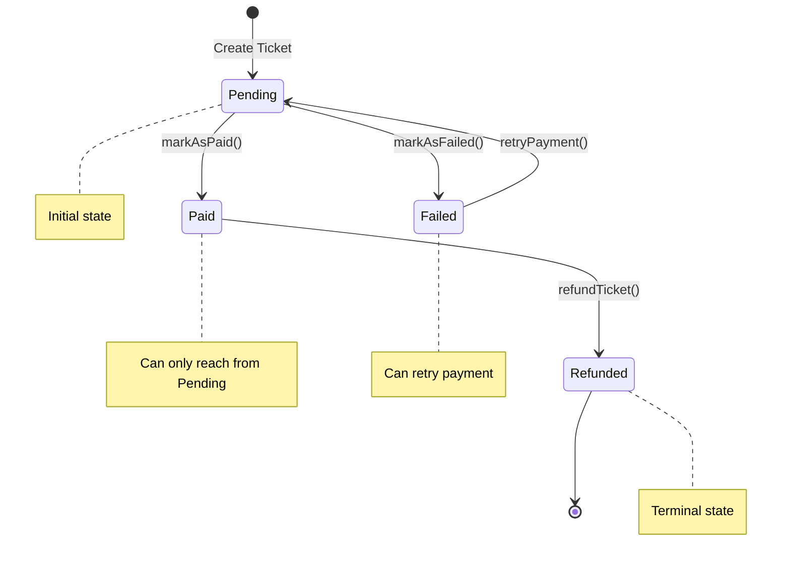
```mermaid
stateDiagram-v2
    [*] --> Pending: Create Ticket
 
    Pending --> Paid: markAsPaid()
    Pending --> Failed: markAsFailed()
 
    Paid --> Refunded: refundTicket()
    Failed --> Pending: retryPayment()
 
    Refunded --> [*]
 
    note right of Pending: Initial state
    note right of Paid: Can only reach from Pending
    note right of Failed: Can retry payment
    note right of Refunded: Terminal state
```

**Why State Pattern?**

-✅ **Safe Transitions**: Only valid state changes are allowed
-✅ **Business Logic**: Clear representation of business rules
-✅ **Maintainable**: Easy to understand the payment lifecycle
-✅ **Extensible**: Simple to add new states or transitions
-✅ **Error Prevention**: Prevents invalid state changes

### 11. Real-time UI Component

Location: `resources/views/components/simple-ticket-availability.blade.php`

Purpose: A widget that shows ticket availability and lets users purchase tickets with real-time updates.

Features:

- Auto-refresh every 10 seconds - No manual page refresh needed
- Progress bar - Visual representation of ticket availability
- Purchase form - Buy tickets directly from the component
- Instant feedback - Shows success/error messages
- Responsive design - Works on all screen sizes

Usage Example:

```blade
<!-- Add this to your event details page -->
<x-simple-ticket-availability :event="$event" />
```

Display Components:
- Available tickets count (e.g., "45 / 100")
- Availability percentage with color-coded progress bar
- Purchase form with quantity selector
- Success/error messages
- Sold out status when no tickets left

**Simple JavaScript Logic**:
```javascript
// Updates every 10 seconds automatically
setInterval(() => {
    fetch(`/api/events/${eventId}/availability`)
 .then(response => response.json())
 .then(data => updateDisplay(data));
}, 10000);
```

**Benefits**:
-✅ **No complex setup** -Drop into any page
-✅ **Real-time updates** -Always shows current availability
-✅ **User-friendly** -Clear visual feedback
-✅ **Mobile responsive** -Works on phones and tablets
    public function getAvailableCount(Event $event): int;
}

// Simple Strategy -Basic calculation
class SimpleTicketStrategy implements TicketUpdateStrategyInterface
{
    public function updateAvailability(Event $event): bool
 {
 $soldTickets = Ticket::where('event_id', $event->id)
 ->where('status', 'confirmed')
 ->sum('quantity');
 
 $event->update(['tickets_sold' => $soldTickets]);
    return true;
 }
}

// Advanced Strategy -Includes pending tickets and buffers
class AdvancedTicketStrategy implements TicketUpdateStrategyInterface
{
    private const BUFFER_PERCENTAGE = 0.05; // 5% buffer for high-demand events
 
    public function isAvailable(Event $event, int $requestedQuantity): bool
 {
 $availableCount = $this->getAvailableCount($event);
 
 // Apply buffer for high-demand events (>80% sold)
    if ($event->tickets_sold / $event->total_tickets > 0.8) {
 $buffer = (int) ($event->total_tickets * self::BUFFER_PERCENTAGE);
 $availableCount -= $buffer;
 }
 
    return $availableCount >= $requestedQuantity;
 }
}
```

**Strategy Selection Flow**:

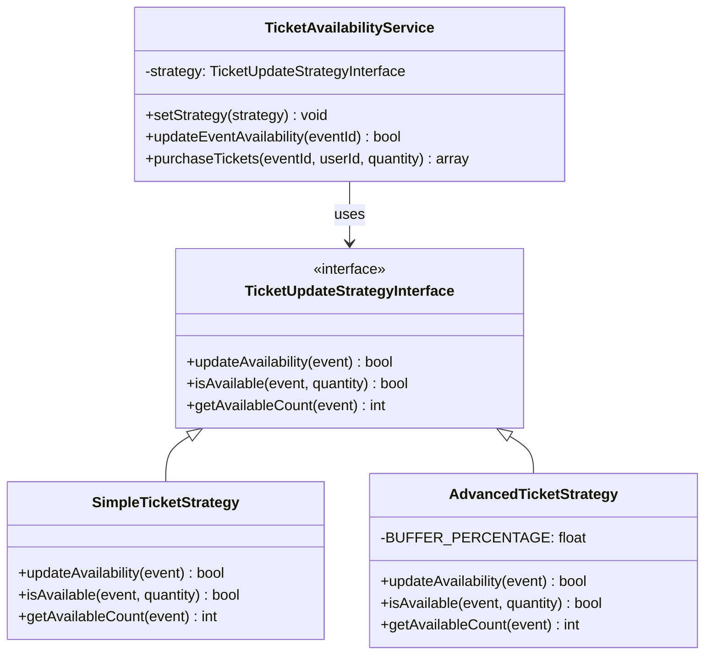
```mermaid
classDiagram
    class TicketAvailabilityService {
        -strategy: TicketUpdateStrategyInterface
        +setStrategy(strategy) void
        +updateEventAvailability(eventId) bool
        +purchaseTickets(eventId, userId, quantity) array
    }
    
    class TicketUpdateStrategyInterface {
        <<interface>>
        +updateAvailability(event) bool
        +isAvailable(event, quantity) bool
        +getAvailableCount(event) int
    }
    
    class SimpleTicketStrategy {
        +updateAvailability(event) bool
        +isAvailable(event, quantity) bool
        +getAvailableCount(event) int
    }
    
    class AdvancedTicketStrategy {
        -BUFFER_PERCENTAGE: float
        +updateAvailability(event) bool
        +isAvailable(event, quantity) bool
        +getAvailableCount(event) int
    }
    
    TicketAvailabilityService --> TicketUpdateStrategyInterface : uses
    TicketUpdateStrategyInterface <|-- SimpleTicketStrategy
    TicketUpdateStrategyInterface <|-- AdvancedTicketStrategy
```

### 11. Real-time Component Pattern - Ticket Availability Widget

Location: `resources/views/components/ticket-availability.blade.php`

Purpose: Reusable UI component with real-time ticket availability updates.

```blade
{{--Real-time Ticket Availability Component --}}
@props(['event'])

<div class="ticket-availability-widget" data-event-id="{{ $event->id }}">
 {{--Availability Status with Progress Bar --}}
 <div class="availability-status">
 <span class="available-count">{{ $event->available_tickets }}</span>
 <div class="availability-bar" style="width: {{ $event->availability_percentage }}%"></div>
 </div>

 {{--Purchase Form with Real-time Updates --}}
 <form class="ticket-purchase-form" data-event-id="{{ $event->id }}">
 <select name="quantity" class="quantity-select">
 @for($i = 1; $i <= min(10, $event->available_tickets); $i++)
 <option value="{{ $i }}">{{ $i }} ticket{{ $i > 1 ? 's' : '' }}</option>
 @endfor
 </select>
 <button type="submit" class="purchase-btn">Buy Now</button>
 </form>
</div>

<script>
// Real-time updates every 10 seconds
setInterval(() => {
    updateAvailability(eventId);
}, 10000);
</script>
```

**Features**:
- **Real-time Updates**: AJAX polling every 10 seconds
- **Visual Progress**: Animated progress bars and counters
- Instant Feedback: Purchase confirmations and error handling
- Responsive Design: Mobile-friendly interface
- Caching: Optimized performance with intelligent caching

---

### 12. Booking Management System

Location: `app/Services/SimpleBookingService.php`, `app/Http/Controllers/SimpleBookingController.php`

Purpose: Complete booking lifecycle management with advanced filtering, export capabilities, and real-time updates.

Design Patterns Used:

- Service Layer Pattern: Business logic separation
- Observer Pattern Extension: Automatic cache invalidation
- Filter Pattern: Advanced filtering capabilities

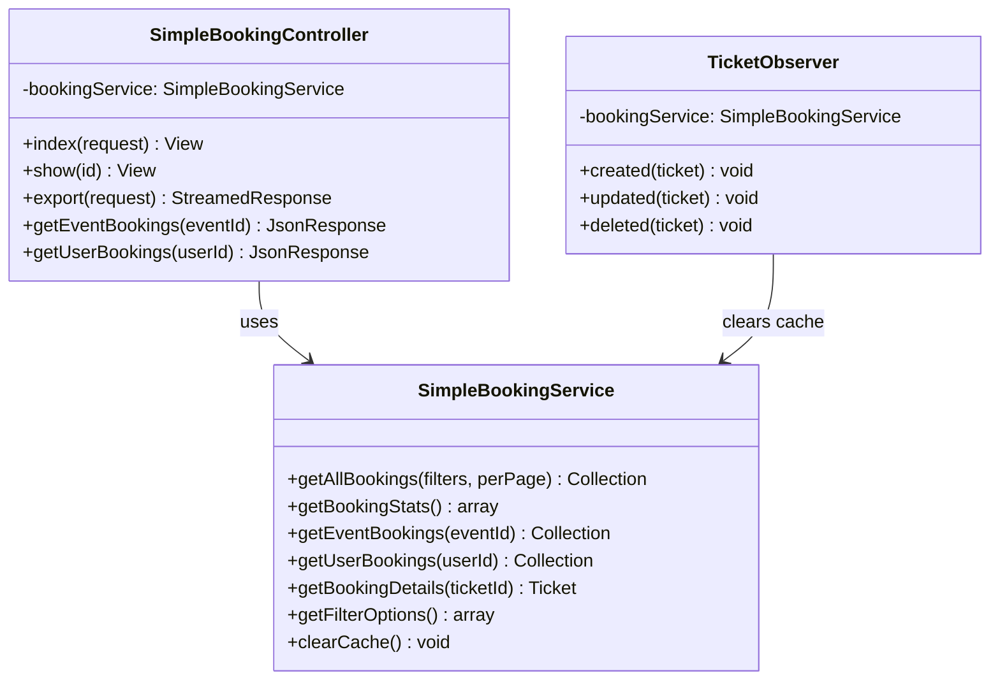
```mermaid
classDiagram
    class SimpleBookingService {
        +getAllBookings(filters, perPage) Collection
        +getBookingStats() array
        +getEventBookings(eventId) Collection
        +getUserBookings(userId) Collection
        +getBookingDetails(ticketId) Ticket
        +getFilterOptions() array
 +clearCache() void
 }
 
    class SimpleBookingController {
 -bookingService: SimpleBookingService
 +index(request) View
 +show(id) View
 +export(request) StreamedResponse
 +getEventBookings(eventId) JsonResponse
 +getUserBookings(userId) JsonResponse
 }
 
    class TicketObserver {
 -bookingService: SimpleBookingService
 +created(ticket) void
 +updated(ticket) void
 +deleted(ticket) void
 }
 
    SimpleBookingController --> SimpleBookingService : uses
    TicketObserver --> SimpleBookingService : clears cache
```

**Observer Pattern Integration**:
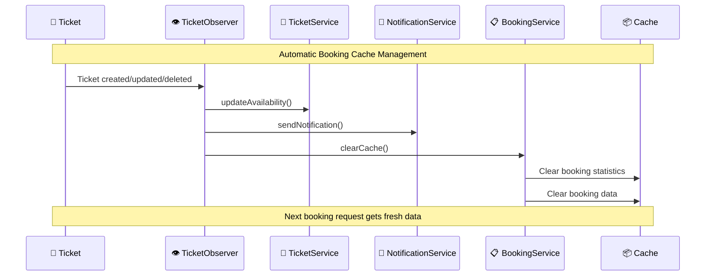
```mermaid
sequenceDiagram
    participant T as 🎫 Ticket
    participant O as 👁️ TicketObserver
    participant TS as 🎫 TicketService
    participant NS as 🔔 NotificationService
    participant BS as 📋 BookingService
    participant C as 📦 Cache

    Note over T,C: Automatic Booking Cache Management
 
    T->>O: Ticket created/updated/deleted
    O->>TS: updateAvailability()
    O->>NS: sendNotification()
    O->>BS: clearCache()
    BS->>C: Clear booking statistics
    BS->>C: Clear booking data
 
    Note over T,C: Next booking request gets fresh data
```

**Key Features**:

**📊 Advanced Statistics Dashboard**
```php
public function getBookingStats()
{
    return Cache::remember('booking_stats', 300, function () {
    return [
 'total_bookings' => Ticket::count(),
 'confirmed_bookings' => Ticket::where('status', 'confirmed')->count(),
 'cancelled_bookings' => Ticket::where('status', 'cancelled')->count(),
 'pending_bookings' => Ticket::where('status', 'pending')->count(),
 'total_revenue' => Ticket::where('status', 'confirmed')->sum('total_price'),
 'recent_bookings' => Ticket::with(['event', 'user'])
 ->orderBy('created_at', 'desc')->take(5)->get()
 ];
 });
}
```

**🔍 Advanced Filtering System**
- **Status Filtering**: All, Confirmed, Pending, Cancelled
- **Event Filtering**: Filter by specific events
- **Date Range Filtering**: Custom date ranges
- **User Filtering**: Filter by specific customers
- **Combined Filters**: Multiple filters work together

**� CSV Export Functionality**
```php
public function export(Request $request)
{
 $bookings = $this->bookingService->getAllBookings($filters, 999999);
 
    return response()->stream(function() use($bookings) {
 $file = fopen('php://output', 'w');
    fputcsv($file, ['Booking ID', 'Event', 'Customer', 'Status', 'Revenue']);
 
    foreach ($bookings as $booking) {
    fputcsv($file, [
 $booking->id,
 $booking->event->title,
 $booking->user->name,
 $booking->status,
 $booking->total_price
 ]);
 }
    fclose($file);
 }, 200, ['Content-Type' => 'text/csv']);
}
```

**Benefits**:
-✅ **Complete Lifecycle**: View, filter, export, and analyze all bookings
-✅ **Real-time Data**: Observer pattern ensures fresh data
-✅ **Performance Optimized**: Intelligent caching with auto-invalidation
-✅ **Professional UI**: Consistent with login page design
-✅ **Export Ready**: CSV export for external analysis
-✅ **Multi-filter Support**: Advanced filtering capabilities

---

## 🗄️ Database Schema

### Simple & Clean Database Design

Our simplified ticketing system with notifications, bookings, and password reset uses 6 main tables:

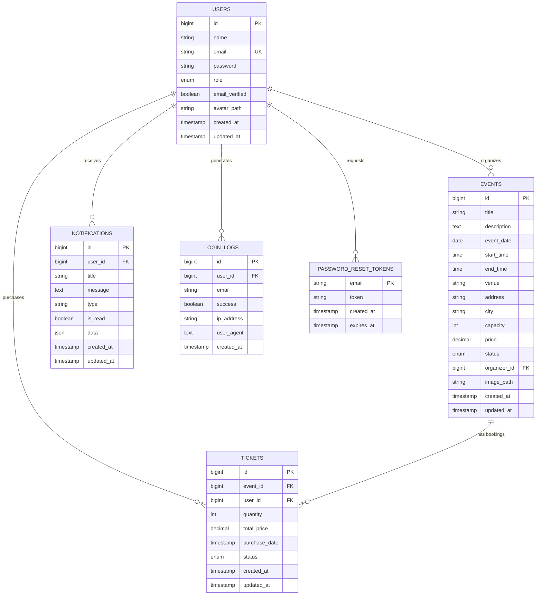
```mermaid
erDiagram
    USERS {
    bigint id PK
    string name
    string email UK
    string password
    enum role
    boolean email_verified
    string avatar_path
    timestamp created_at
    timestamp updated_at
 }
 
    EVENTS {
    bigint id PK
    string title
    text description
    date event_date
    time start_time
    time end_time
    string venue
    string address
    string city
    int capacity
    decimal price
    enum status
    bigint organizer_id FK
    string image_path
    timestamp created_at
    timestamp updated_at
 }
 
    TICKETS {
    bigint id PK
    bigint event_id FK
    bigint user_id FK
    int quantity
    decimal total_price
    timestamp purchase_date
    enum status
    timestamp created_at
    timestamp updated_at
 }
 
    NOTIFICATIONS {
    bigint id PK
    bigint user_id FK
    string title
    text message
    string type
    boolean is_read
    json data
    timestamp created_at
    timestamp updated_at
 }
 
    LOGIN_LOGS {
    bigint id PK
    bigint user_id FK
    string email
    boolean success
    string ip_address
    text user_agent
    timestamp created_at
 }
 
    PASSWORD_RESET_TOKENS {
    string email PK
    string token
    timestamp created_at
    timestamp expires_at
 }
 
    USERS ||--o{ EVENTS : organizes
    USERS ||--o{ LOGIN_LOGS : generates
    USERS ||--o{ TICKETS : purchases
    USERS ||--o{ NOTIFICATIONS : receives
    USERS ||--o{ PASSWORD_RESET_TOKENS : requests
    EVENTS ||--o{ TICKETS : "has bookings"
```

### Key Relationships & Observer Pattern Flow

- **Users** can organize multiple Events (organizer role)
- **Users** can purchase multiple **Tickets** for different events
- **Users** receive **Notifications** about their events (organizers) or purchases (customers)
- **Events** can have multiple Tickets (bookings) from different users
- **When tickets change** → **Observer automatically creates notifications** for organizers
- **Login Logs** track all login attempts for security

### Notification Types

The system supports different notification types with rich data:

```php
// Ticket Cancellation Notification
{
 "title": "Ticket Cancelled",
 "message": "Customer John Doe cancelled 2 tickets for your event 'Summer Concert'",
 "type": "ticket_cancelled",
 "data": {
 "customer_name": "John Doe",
 "quantity": 2,
 "refund_amount": "50.00",
 "event_id": 123,
 "ticket_id": 456
 }
}

// Ticket Purchase Notification 
{
 "title": "New Ticket Purchase",
 "message": "Great news! Jane Smith just bought 3 tickets for your event 'Summer Concert'",
 "type": "ticket_purchased",
 "data": {
 "customer_name": "Jane Smith",
 "quantity": 3,
 "revenue": "75.00",
 "event_id": 123,
 "ticket_id": 789
 }
}
```

### Entity Relationship Diagram

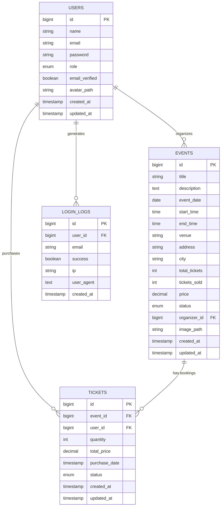
```mermaid
erDiagram
    USERS {
        bigint id PK
        string name
        string email
        string password
        enum role
        boolean email_verified
        string avatar_path
        timestamp created_at
        timestamp updated_at
    }
    
    EVENTS {
        bigint id PK
        string title
        text description
        date event_date
        time start_time
        time end_time
        string venue
        string address
        string city
        int total_tickets
        int tickets_sold
        decimal price
        enum status
        bigint organizer_id FK
        string image_path
        timestamp created_at
        timestamp updated_at
    }
    
    TICKETS {
        bigint id PK
        bigint event_id FK
        bigint user_id FK
        int quantity
        decimal total_price
        timestamp purchase_date
        enum status
        timestamp created_at
        timestamp updated_at
    }
    
    LOGIN_LOGS {
        bigint id PK
        bigint user_id FK
        string email
        boolean success
        string ip
        text user_agent
        timestamp created_at
    }
    
    USERS ||--o{ EVENTS : organizes
    USERS ||--o{ LOGIN_LOGS : generates
    USERS ||--o{ TICKETS : purchases
    EVENTS ||--o{ TICKETS : "has bookings"
```

---
## 🎨 UI/UX Design System
### Design Philosophy
Our design system follows a **dark theme with cyan accents** approach, emphasizing:

- **Consistency**: Unified color palette and component styling
- **Accessibility**: High contrast ratios and semantic HTML
- **Modern Aesthetics**: Glassmorphism effects and subtle animations
- **Professional Look**: Clean layouts with appropriate spacing

### Color Palette
```css
:root {
 /* Primary Background */
 --bg-primary: #0F172A; /* slate-950 */
 --bg-secondary: #1E293B; /* slate-800 */
 --bg-tertiary: #334155; /* slate-700 */
 
 /* Accent Colors */
 --accent-primary: #06B6D4; /* cyan-500 */
 --accent-secondary: #0891B2; /* cyan-600 */
 --accent-light: #67E8F9; /* cyan-300 */
 
 /* Text Colors */
 --text-primary: #F8FAFC; /* slate-50 */
 --text-secondary: #CBD5E1; /* slate-300 */
 --text-muted: #64748B; /* slate-500 */
}
```

### Component Examples

**Form Input Style**:
```css
.form-input {
 @apply px-3 py-2 rounded-lg bg-slate-800 border border-slate-700 
    text-slate-300 focus:border-cyan-400 focus:outline-none;
}
```

**Button Styles**:
```css
.btn-primary {
 @apply px-4 py-2 rounded-lg bg-gradient-to-r from-cyan-500 to-sky-500 
    hover:from-cyan-400 hover:to-sky-400 text-white font-medium;
}

.btn-secondary {
 @apply px-4 py-2 rounded-lg bg-slate-800 hover:bg-slate-700 
    border border-cyan-400/20 text-sm transition;
}
```

---

## 📅 Feature Implementation Timeline

### Sprint 1: Foundation (Week 1-2)
-✅ Project setup and Laravel installation
-✅ Database schema design and migrations
-✅ User authentication system
-✅ Factory pattern for user creation
-✅ Basic routing and middleware setup

### Sprint 2: Core Features (Week 3-4)
-✅ Event CRUD operations
-✅ Role-based dashboard routing (Strategy pattern)
-✅ Profile management
-✅ Basic UI implementation with consistent design

### Sprint 3: Advanced Features (Week 5-6)
-✅ Repository pattern implementation
-✅ Service layer for business logic
-✅ Event sorting functionality
-✅ Reusable Blade components
-✅ Advanced UI enhancements

### Sprint 4: Role Management & Admin Features (Week 7-8)

-✅ **Role Management System Implementation**
 -Strategy Pattern for role transitions
 -Admin-only user management interface
 -Real-time role updates with AJAX
 -Role transition validation and security
-✅ **Advanced User Interface Components**
 -Reusable role-selector component
 -Interactive dropdown with visual feedback
 -Silent error handling (no intrusive popups)
 -Responsive admin dashboard
-✅ **Security & Access Control**
 -Admin privilege validation
 -Self-role modification prevention
 -Role-based route protection
 -Comprehensive user statistics

### Sprint 5: Real-time Ticket System (Week 9-10)

-✅ **Observer Pattern Implementation**
 -Automatic ticket availability updates
 -Real-time event inventory synchronization
 -Observer-triggered database updates
 -Event-driven architecture
-✅ **Smart Notification System**
 -Automatic organizer notifications via Observer Pattern
 -Real-time cancellation alerts with customer details
 -Beautiful notifications interface with icons and badges
 -Persistent notification storage and read status tracking
 -AJAX-powered notification management
-✅ **Strategy Pattern for Ticket Management**
 -Simple vs Advanced calculation strategies
 -Flexible business rule implementation
 -Pending ticket handling with timeouts
 -High-demand event buffer management
-✅ **Real-time UI Components**
 -Live ticket availability widgets
 -AJAX-powered purchase forms
 -Progress bars and visual indicators
 -Instant feedback and notifications
-✅ **Performance Optimization**
 -Intelligent caching strategies
 -Database indexing for ticket queries
 -Optimized real-time polling

### Sprint 6: Booking Management System (Week 11-12)

-✅ **Booking Service Layer**
 -SimpleBookingService for business logic
 -Advanced filtering and search capabilities
 -Performance-optimized with caching
-✅ **Booking Management Interface**
 -Beautiful booking dashboard with statistics
 -Advanced filtering (status, event, date range)
 -Professional table with booking details
 -Detailed booking view with customer/event info
-✅ **Observer Pattern Extension**
 -Automatic cache invalidation on ticket changes
 -Real-time booking data updates
 -Integration with existing notification system
-✅ **Export Functionality**
 -CSV export with filters applied
 -Professional format for external analysis
-✅ **UI Consistency**
 -Matching login page premium design
 -Glassmorphism and gradient effects
 -Consistent color palette and typography

### Sprint 7: Event Approval System (Week 13-14)

-✅ **Event Approval Workflow**
 -Admin-controlled approval/rejection system
 -Three-state approval status (pending, approved, rejected)
 -Admin comments and feedback system
 -Approval timestamp and reviewer tracking
-✅ **Service Layer Pattern**
 -SimpleEventApprovalService for business logic
 -Centralized approval operations
 -Admin access validation
 -Approval statistics and analytics
-✅ **Enhanced Admin Dashboard**
 -Pending approvals counter with visual indicators
 -Quick access to approval management
 -Real-time approval status updates
-✅ **Professional Approval Interface**
 -Detailed event review page
 -Side-by-side approve/reject forms
 -Organizer information display
 -Previous admin comments history
-✅ **Database Schema Enhancement**
 -Approval status tracking
 -Admin comments storage
 -Reviewer relationship tracking
 -Audit trail implementation

### Sprint 8: Documentation & Polish (Week 15-16)

-✅ Performance optimization
-✅ Comprehensive testing
-✅ Documentation completion
-✅ Deployment preparation

### Sprint 9: Advanced Security & Payment Features (Week 17-18)

-✅ **Command Pattern Implementation** with Password Reset System
-✅ **State Pattern Implementation** with Payment Processing
-✅ Secure password reset flow with token expiration
-✅ Payment state management with validation rules
-✅ Admin dashboard for payment and security monitoring

---

## 📂 Code Structure & Architecture

```text
app/
├── Http/
│ ├── Controllers/
│ │ ├── AuthController.php # Authentication logic
│ │ ├── EventController.php # Event CRUD with DI
│ │ ├── SimpleTicketController.php # Simple ticket purchase & availability
│ │ ├── SimpleNotificationController.php # Notification management
│ │ ├── SimpleBookingController.php # Booking management with filtering
│ │ ├── SimpleEventApprovalController.php # Event approval management (Admin-only)
│ │ ├── SimplePasswordResetController.php # Password reset with Command pattern
│ │ ├── SimplePaymentController.php # Payment processing with State pattern
│ │ ├── UserController.php # User management & roles
│ │ ├── RegisterController.php # User registration
│ │ └── ProfileController.php # Profile management
│ └── Middleware/ # Custom middleware
├── Models/
│ ├── User.php # User model with roles & notifications
│ ├── Event.php # Event model with tickets & organizer
│ ├── Ticket.php # Ticket model with relationships
│ ├── Notification.php # Notification model for organizers
│ └── LoginLog.php # Security logging
├── Observers/
│ └── TicketObserver.php # Observer pattern: tickets, notifications & bookings
├── Repositories/
│ ├── EventRepository.php # Event data access
│ └── UserRepository.php # User data access
├── Services/
│ ├── SortingService.php # Sorting logic
│ ├── RoleManagementService.php # Role transition strategy
│ ├── SimpleTicketService.php # Simple ticket availability (Observer pattern)
│ ├── SimpleNotificationService.php # Notification creation & management
│ ├── SimpleBookingService.php # Booking business logic with caching
│ ├── SimpleEventApprovalService.php # Event approval workflow (Admin-only)
│ ├── SimplePasswordResetService.php # Password reset logic (Command pattern)
│ ├── SimplePaymentService.php # Payment processing (State pattern)
│ └── UserCreation/
│ ├── UserFactory.php # Factory pattern
│ └── UserFactoryInterface.php # Factory contract
└── Providers/
 └── AppServiceProvider.php # DI container setup

resources/
├── views/
│ ├── auth/ # Authentication views
│ ├── events/ # Event management views
│ ├── bookings/ # Booking management views
│ │ ├── index.blade.php # Booking dashboard with statistics
│ │ └── show.blade.php # Detailed booking view
│ ├── notifications/
│ │ └── index.blade.php # Beautiful notifications page
│ ├── admin/
│ │ └── users/ # User management interface
│ │ ├── index.blade.php # User listing
│ │ └── show.blade.php # User details
│ ├── components/
│ │ ├── sorting-controls.blade.php # Reusable sorting
│ │ ├── role-selector.blade.php # Role management component
│ │ └── simple-ticket-availability.blade.php # Simple real-time ticket widget
│ └── layouts/ # Layout templates
├── css/
│ └── app.css # Tailwind CSS with premium design
└── js/
 └── app.js # Frontend logic with real-time updates

database/
├── migrations/ # Database structure evolution
├── seeders/ # Test data generators
└── factories/ # Model factories
```

### Design Pattern Implementation Details

#### 1. Service Layer Pattern (Booking System)
```php
// app/Services/SimpleBookingService.php
class SimpleBookingService {
    public function getAllBookings($filters = []) {
 $query = Ticket::with(['user', 'event']);
 
 // Apply filters with method chaining
    if (!empty($filters['status'])) {
 $query->where('status', $filters['status']);
 }
 
    return $query->orderBy('created_at', 'desc')->paginate(10);
 }
 
    public function getBookingStats() {
    return Cache::remember('booking_stats', 60, function() {
    return [
 'total_bookings' => Ticket::count(),
 'pending_bookings' => Ticket::where('status', 'pending')->count(),
 'confirmed_bookings' => Ticket::where('status', 'confirmed')->count(),
 'cancelled_bookings' => Ticket::where('status', 'cancelled')->count(),
 ];
 });
 }
}
```

#### 2. Observer Pattern Extension
```php
// app/Observers/TicketObserver.php -Enhanced for booking management
class TicketObserver {
    public function created(Ticket $ticket) {
 // Clear booking cache for real-time updates
    Cache::forget('booking_stats');
    Cache::forget('recent_bookings');
 
 // Existing notification logic
 $this->createOrganizerNotification($ticket);
 }
 
    public function updated(Ticket $ticket) {
 // Clear cache when booking status changes
    Cache::forget('booking_stats');
 }
}
```

#### 3. MVC Pattern with Service Integration
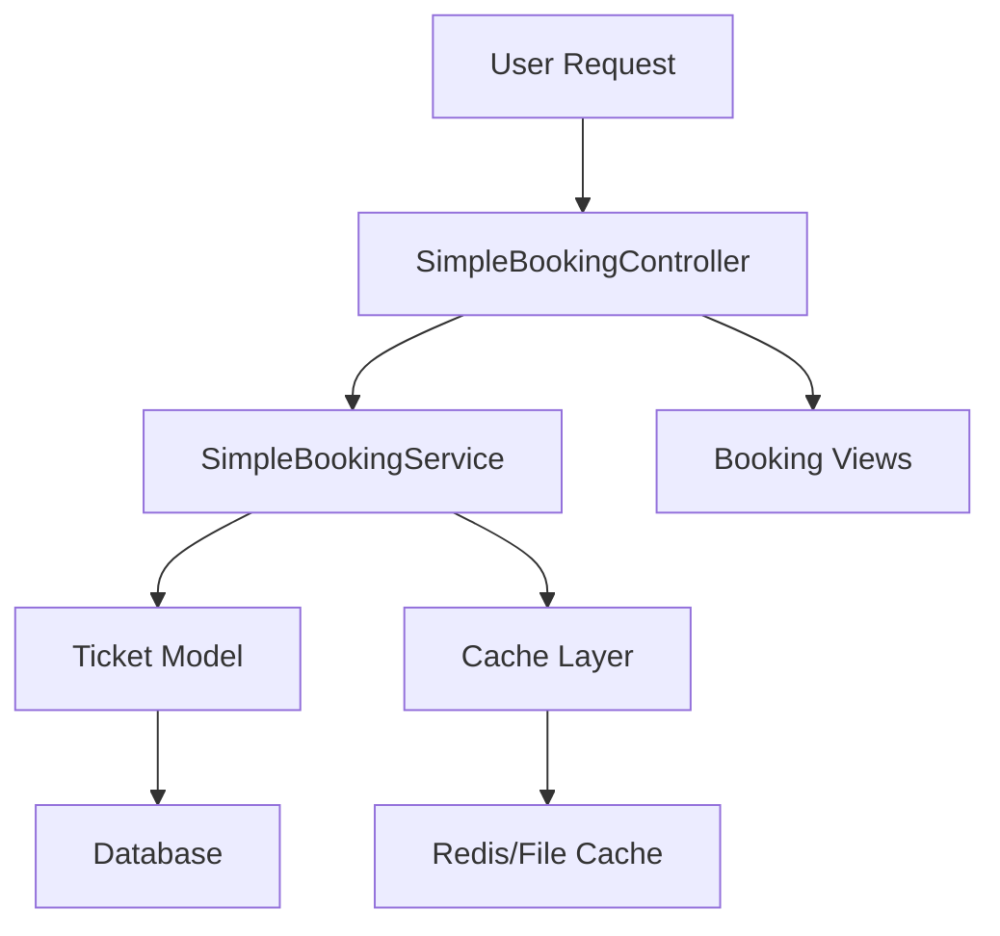
```mermaid
graph TD
    A[User Request] --> B[SimpleBookingController]
    B --> C[SimpleBookingService]
    C --> D[Ticket Model]
    C --> E[Cache Layer]
    D --> F[Database]
    E --> G[Redis/File Cache]
    B --> H[Booking Views]
```

---

## 🚀 Installation & Setup

### Prerequisites
- PHP 8.1+
- Composer
- Node.js & NPM
- SQLite/MySQL

### Installation Steps

1. **Clone the repository**
```bash
git clone https://github.com/Event-Management-Ticketing-System-EMTS/Event-Management-Ticketing-System.git
cd Event-Management-Ticketing-System/laravel
```

2. **Install dependencies**
```bash
composer install
npm install
```

3. **Environment setup**
```bash
cp .env.example .env
php artisan key:generate
```

4. **Database setup**
```bash
php artisan migrate
php artisan db:seed
```

5. **Build assets**
```bash
npm run build
```

6. **Start development server**
```bash
php artisan serve
```

### Default Users
After seeding, you can login with:

- **Admin**: admin@gmail.com / admin1234
 -Access to all features including user management
 -Can change user roles and access admin panel
- **User**: abcd@gmail.com / aaaa1234
 -Basic user access for event browsing
 -Can be promoted to organizer by admin

**Role Management Features**:
- Admin can access user management at `/users`
- Real-time role changes with dropdown selection
- Role transition validation (user→organizer, organizer→admin/user, admin→organizer)
- Comprehensive user statistics and analytics

---

## 🧪 Testing Strategy

### Unit Testing
- **Repository Tests**: Data access layer validation
- **Service Tests**: Business logic verification
- **Factory Tests**: User creation scenarios
- **Role Management Tests**: Role transition validation and security

### Integration Testing
- **Authentication Flow**: Login, registration, password reset
- **Event Management**: CRUD operations with sorting
- **Role-based Access**: Dashboard routing and permissions
- **User Management**: Admin role management workflows
- **Component Testing**: Role selector and UI components

### Feature Testing
- **End-to-End Workflows**: Complete user journeys
- **UI Component Testing**: Sorting controls and form interactions
- **Security Testing**: Authentication and authorization

---

## 🔄 Design Pattern Benefits

### Factory Pattern Benefits
- **Flexibility**: Easy to add new user types
- **Maintainability**: Centralized user creation logic
- **Testability**: Mock different user creation scenarios

### Repository Pattern Benefits
- **Separation of Concerns**: Data access isolated from business logic
- **Testability**: Easy to mock database operations
- **Flexibility**: Switch between different data sources

### Service Layer Benefits
- **Business Logic Centralization**: Sorting rules in one place
- **Reusability**: Services can be used across controllers
- **Maintainability**: Easy to modify business rules

### Component Pattern Benefits
- **Consistency**: Uniform UI across the application
- **Reusability**: Same component for different entity types
- **Maintainability**: Single source of truth for UI elements

### Role Management Strategy Benefits
- **Security**: Controlled role transitions with validation rules
- **Flexibility**: Easy to modify role hierarchy and permissions
- **User Experience**: Real-time updates with smooth UI interactions
- **Maintainability**: Centralized role logic in dedicated service

---

## 🎯 Key Learning Outcomes

Through building this ticketing system, we've demonstrated:

1. **Observer Pattern**: Automatic ticket availability updates when data changes
2. **Service Layer**: Clean business logic separation with caching
3. **Real-time UI**: JavaScript components that update every 10 seconds
4. **Laravel Fundamentals**: Models, Controllers, Observers, and Service Providers
5. **Database Relationships**: Effective table structure with proper relationships
6. **User Role Management**: Role-based access control
7. **Clean Code**: Well-structured, maintainable implementation
8. **Caching Strategy**: Effective performance optimization

## Key System Capabilities

The system provides:

- Live ticket availability tracking with progress indicators
- Automatic updates every 10 seconds
- Instant ticket purchasing functionality
- Performance-optimized caching system
- Responsive design for all devices
- User feedback and error handling
- Automated updates using Observer Pattern

---

## � API Documentation

The application exposes several API endpoints for real-time functionality and integration with other services.

### Event & Ticket Management APIs

#### `GET /api/events/{id}/availability`

Retrieves the real-time ticket availability for a specific event. This endpoint is used by the ticket availability widget for automatic updates.

Response Example:
```json
{
 "total_capacity": 100,
 "available_tickets": 45,
 "tickets_sold": 55,
 "availability_percentage": 55
}
```

#### `POST /api/tickets/purchase`

Creates a new ticket purchase for an event.

Request Body:
```json
{
 "event_id": 5,
 "quantity": 2
}
```

Response Example:
```json
{
 "success": true,
 "ticket": {
 "id": 123,
 "event_id": 5,
 "quantity": 2,
 "total_price": 50.00,
 "status": "confirmed",
 "created_at": "2025-10-01T12:34:56Z"
 },
 "message": "Ticket purchased successfully!"
}
```

### Support System APIs

#### `POST /api/support-messages`

Submits a new support message from a user.

Request Body:
```json
{
 "event_id": 12,
 "subject": "Question about parking",
 "message": "Is there free parking available at the venue?",
 "priority": "medium"
}
```

Response Example:
```json
{
 "success": true,
 "message": "Your support request has been submitted successfully.",
 "support_id": 45
}
```

#### `GET /api/admin/support-messages`

Admin-only endpoint to retrieve all support messages (with filtering).

Query Parameters:
-`status`: Filter by message status (`open`, `in_progress`, `resolved`)
-`priority`: Filter by priority (`low`, `medium`, `high`) 
-`event_id`: Filter by specific event

Response Example:
```json
{
 "total": 25,
 "per_page": 10,
 "current_page": 1,
 "data": [
 {
 "id": 45,
 "user": {
 "id": 12,
 "name": "John Doe",
 "email": "john@example.com"
 },
 "event": {
 "id": 5,
 "title": "Summer Concert"
 },
 "subject": "Question about parking",
 "message": "Is there free parking available at the venue?",
 "status": "open",
 "priority": "medium",
 "created_at": "2025-09-30T15:23:42Z"
 },
 // More messages...
 ]
}
```

### Notification APIs

#### `GET /api/notifications`

Retrieves notifications for the authenticated user.

Query Parameters:
-`is_read`: Filter by read status (`true`, `false`)
-`type`: Filter by notification type

Response Example:
```json
{
 "unread_count": 3,
 "notifications": [
 {
 "id": 78,
 "title": "New Ticket Purchase",
 "message": "User Jane Smith purchased 2 tickets for your event 'Summer Concert'",
 "type": "ticket_purchased",
 "is_read": false,
 "data": {
 "event_id": 5,
 "ticket_id": 123,
 "quantity": 2
 },
 "created_at": "2025-10-01T10:45:23Z"
 },
 // More notifications...
 ]
}
```

#### `PATCH /api/notifications/{id}/mark-as-read`

Marks a notification as read.

Response Example:
```json
{
 "success": true,
 "message": "Notification marked as read"
}
```

### API Authentication

All API endpoints require authentication with the exception of public event data. The application uses Laravel Sanctum for API authentication:

```php
// Example API authentication
Route::middleware('auth:sanctum')->group(function () {
    Route::get('/notifications', [NotificationController::class, 'index']);
    Route::patch('/notifications/{id}/mark-as-read', [NotificationController::class, 'markAsRead']);
 // Admin-only routes
    Route::middleware('admin')->prefix('admin')->group(function () {
    Route::get('/support-messages', [SupportMessageController::class, 'index']);
 });
});
```

### API Response Standards

All API responses follow a consistent format:

- Success responses include a `success: true` field
- Error responses include a `success: false` field and an `errors` object
- Paginated responses include `total`, `per_page`, `current_page`, and `last_page` fields
- Timestamps are in ISO 8601 format

---

## ⚡ Performance & Optimization

The application is optimized for performance, scalability, and resource efficiency through several key strategies:

### 1. Database Optimization

#### Strategic Indexing
```php
// Migration example
Schema::table('events', function (Blueprint $table) {
 $table->index('status');
 $table->index('approval_status');
 $table->index('event_date');
 $table->index('organizer_id');
});

Schema::table('tickets', function (Blueprint $table) {
 $table->index(['event_id', 'status']);
 $table->index('payment_status');
});
```

#### Query Optimization
- **Eager Loading**: All relationships are eagerly loaded to avoid N+1 query issues
- **Repository Pattern**: Centralized, optimized queries through repository classes
- **Chunk Processing**: Large datasets are processed in chunks for memory efficiency

### 2. Caching Strategy

The application implements a multi-level caching system to minimize database load and improve response times:

#### Data Caching
```php
// Example from BookingService
public function getBookingStats()
{
    return Cache::remember('booking_stats', 300, function () {
    return [
 'total_bookings' => Ticket::count(),
 'confirmed_bookings' => Ticket::where('status', 'confirmed')->count(),
 'cancelled_bookings' => Ticket::where('status', 'cancelled')->count(),
 'total_revenue' => Ticket::where('status', 'confirmed')->sum('total_price'),
 // More statistics...
 ];
 });
}
```

#### Intelligent Cache Invalidation
The Observer Pattern automatically clears relevant caches when data changes:

```php
// Example from TicketObserver
public function created(Ticket $ticket)
{
 // Clear availability cache
    Cache::forget("event_availability_{$ticket->event_id}");
 
 // Clear booking statistics
    Cache::forget('booking_stats');
 
 // Clear event statistics
    Cache::forget("event_stats_{$ticket->event_id}");
}
```

#### Tiered TTL Strategy
Different types of data are cached with appropriate time-to-live values:

- **Real-time data**: 30-60 seconds (ticket availability)
- **Semi-dynamic data**: 5-15 minutes (dashboard statistics)
- **Static data**: 1 hour or more (event details, venue information)

### 3. Frontend Optimization

#### Asset Management
- **CSS/JS Bundling**: Vite bundles assets to minimize HTTP requests
- **Code Splitting**: Only necessary JavaScript is loaded per page
- **Minification**: All production assets are minified and compressed

#### Asynchronous Loading
```javascript
// Example of asynchronous data loading
function updateTicketAvailability(eventId) {
    fetch(`/api/events/${eventId}/availability`)
        .then(response => response.json())
        .then(data => {
            document.querySelector('.availability-count').textContent = data.available_tickets;
            document.querySelector('.availability-bar').style.width = data.availability_percentage + '%';
        });
}

// Update every 10 seconds
setInterval(() => {
    updateTicketAvailability(eventId);
}, 10000);
```

#### Resource Hints

```html
<!-- Preload critical assets -->
<link rel="preload" href="/fonts/inter-var.woff2" as="font" type="font/woff2" crossorigin>
<link rel="preconnect" href="https://api.example.com">
```### 4. Real-time Updates Optimization

The system uses efficient AJAX polling instead of WebSockets for simplicity and broad compatibility:

- **Optimized Polling**: 10-second intervals for ticket availability
- **Conditional Requests**: ETag/If-None-Match headers to minimize transfer
- **Micro-Updates**: Only transmit changed data, not entire page content

### 5. Performance Monitoring

The application includes built-in performance monitoring:

```php
// Example from AppServiceProvider
public function boot()
{
    // Track query performance in development
    if (app()->environment('local')) {
        DB::listen(function ($query) {
            if ($query->time > 100) {
                Log::channel('performance')->warning('Slow query: ' . $query->sql, [
                    'time' => $query->time,
                    'bindings' => $query->bindings
                ]);
            }
        });
    }
}
```

### 6. Lazy Loading & Pagination

All large datasets are paginated for optimal performance:

```php
// Example from EventController
public function index(Request $request)
{
    $sortParams = $this->sortingService->validateEventSortParameters(
        $request->get('sort'),
        $request->get('direction')
    );
    
    $events = $this->eventRepository->getPaginatedEventsWithSorting(
        $sortParams['sort_by'],
        $sortParams['direction'],
        15 // Items per page
    );
    
    return view('events.index', compact('events', 'sortParams'));
}
```

This combination of strategies ensures the application remains fast and responsive even under heavy load, providing an optimal user experience while maintaining server efficiency.

---

## Contributing

This project serves as an educational reference for learning Laravel and design patterns. Feel free to fork, experiment, and contribute improvements.

## License

This project is open-sourced software licensed under the [MIT license](LICENSE).

---
