# Event Management & Ticketing System (EMTS)

## 🏗️ System Design Lifecycle & Architecture Documentation

A comprehensive event management and ticketing system built with Laravel, showcasing modern software design patterns and best practices for educational purposes.

---

## 📋 Table of Contents

1. [Project Overview](#-project-overview)
2. [System Design Lifecycle](#-system-design-lifecycle)
3. [Architecture Patterns](#-architecture-patterns)
4. [Design Patterns Implementation](#-design-patterns-implementation)
5. [Database Schema](#-database-schema)
6. [UI/UX Design System](#-uiux-design-system)
7. [Feature Implementation Timeline](#-feature-implementation-timeline)
8. [Code Structure & Architecture](#-code-structure--architecture)
9. [Installation & Setup](#-installation--setup)
10. [Testing Strategy](#-testing-strategy)

---

## 🎯 Project Overview

The Event Management & Ticketing System (EMTS) is a full-stack web application that allows organizers to create, manage, and track events while enabling users to browse and purchase tickets. The project emphasizes clean architecture, design patterns, and modern development practices.

### Core Features
- 🔐 **Multi-role Authentication** (Admin, Organizer, User)
- 👥 **Advanced User Management** (Admin-only access with role transitions)
- 🔄 **Dynamic Role Management** (Real-time role changes with validation)
- 🎪 **Event Management** (CRUD operations with sorting/filtering)
- 🎫 **Real-time Ticket System** (Live availability with automatic updates)
- 📬 **Smart Notification System** (Automatic organizer notifications via Observer Pattern)
- 📋 **Advanced Booking Management** (Complete booking lifecycle with filters & export)
- ⚡ **Real-time Updates** (Live ticket availability and inventory tracking)
- 📊 **Analytics Dashboard** (Event statistics and insights)
- 🎛️ **Admin Control Panel** (User oversight and system management)
- 🔄 **Smart Sorting** (Dynamic content organization)
- 🎨 **Component-based UI** (Reusable interface components)
- 🛡️ **Security Features** (Login tracking, role-based access control)
- 🏗️ **Design Patterns** (Observer Pattern for tickets & notifications & bookings, Service Layer, Component patterns)

---

## 🔄 System Design Lifecycle

We followed a structured approach to building this system, implementing design patterns at each phase:

### Phase 1: Foundation & Authentication


### Phase 2: Core Features Development


### Phase 3: Advanced Features & Optimization


---

## 🏛️ Architecture Patterns

### 1. **MVC (Model-View-Controller) Architecture**
The foundation of our Laravel application following the MVC pattern:

```
app/
├── Models/          # Data layer (Eloquent models)
├── Http/Controllers/ # Business logic controllers
├── Services/        # Business logic services
└── Repositories/    # Data access layer
```

### 2. **Layered Architecture**


---

## 🎨 Design Patterns Implementation

### 1. **Factory Pattern** - User Creation System

**Location**: `app/Services/UserCreation/`

**Purpose**: Create different types of users (Admin, Organizer, Regular User) with role-specific validation and setup.

```php
// app/Services/UserCreation/UserFactory.php
class UserFactory implements UserFactoryInterface
{
    public function createUser(array $userData, string $role): User
    {
        // Validate based on role
        $validationRules = $this->validateUserData($userData, $role);
        
        // Role-specific processing
        switch ($role) {
            case User::ROLE_ADMIN:
                return $this->createAdminUser($userData);
            case User::ROLE_ORGANIZER:
                return $this->createOrganizerUser($userData);
            default:
                return $this->createRegularUser($userData);
        }
    }
}
```

**Implementation Diagram**:


### 2. **Strategy Pattern** - Dashboard Routing

**Location**: `app/Http/Controllers/AuthController.php`

**Purpose**: Redirect users to appropriate dashboards based on their role after authentication.

```php
// app/Http/Controllers/AuthController.php
public function showLogin()
{
    if (Auth::check()) {
        $user = Auth::user();
        
        // Strategy pattern: different behavior based on user role
        return $user->role === User::ROLE_ADMIN
            ? redirect()->route('dashboard')           // Admin strategy
            : redirect()->route('user.dashboard');     // User strategy
    }
    
    return view('auth.login');
}
```

**Strategy Pattern Implementation**:


### 3. **Repository Pattern** - Event Data Management

**Location**: `app/Repositories/EventRepository.php`

**Purpose**: Abstract database operations and provide a clean interface for data access.

```php
// app/Repositories/EventRepository.php
class EventRepository
{
    protected $model;

    public function __construct(Event $model)
    {
        $this->model = $model;
    }

    public function getAllWithSorting(string $sortBy = 'created_at', string $direction = 'desc'): Collection
    {
        return $this->model
            ->orderBy($sortBy, $direction)
            ->get();
    }

    public function getByOrganizerWithSorting(int $organizerId, string $sortBy, string $direction): Collection
    {
        return $this->model
            ->where('organizer_id', $organizerId)
            ->orderBy($sortBy, $direction)
            ->get();
    }
}
```

### 4. **Service Layer Pattern** - Sorting Logic

**Location**: `app/Services/SortingService.php`

**Purpose**: Centralize sorting logic, validation, and configuration.

```php
// app/Services/SortingService.php
class SortingService
{
    public const EVENT_SORT_OPTIONS = [
        'created_at' => '📅 Date Created',
        'title' => '📝 Title',
        'event_date' => '🗓️ Event Date',
        'price' => '💰 Price',
        'total_tickets' => '🎫 Total Tickets',
        'tickets_sold' => '📊 Tickets Sold',
        'status' => '⭐ Status'
    ];

    public function validateEventSortParameters(?string $sortBy, ?string $direction): array
    {
        return [
            'sort_by' => $this->validateSortBy($sortBy, array_keys(self::EVENT_SORT_OPTIONS)),
            'direction' => $this->validateDirection($direction),
        ];
    }
}
```

### 5. **Component Pattern** - Reusable UI Components

**Location**: `resources/views/components/sorting-controls.blade.php`

**Purpose**: Create reusable, consistent UI components across the application.

```blade
{{-- resources/views/components/sorting-controls.blade.php --}}
@props([
    'action' => request()->url(),
    'sortOptions' => [],
    'currentSort' => 'created_at',
    'currentDirection' => 'desc',
    'totalCount' => 0,
    'showReset' => false
])

<div class="rounded-2xl border border-cyan-400/20 bg-slate-900/80 backdrop-blur-md p-4 shadow-lg">
    <!-- Component implementation -->
</div>
```

**Usage Example**:
```blade
<x-sorting-controls 
    :action="route('events.index')"
    :sort-options="$sortOptions"
    :current-sort="$sortBy"
    :current-direction="$sortDirection"
    :total-count="$events->count()"
    :show-reset="!$isDefaultSort"
/>
```

### 6. **Dependency Injection Pattern**

**Location**: `app/Http/Controllers/EventController.php`

**Purpose**: Improve testability and maintain loose coupling between classes.

```php
// app/Http/Controllers/EventController.php
class EventController extends Controller
{
    protected $eventRepository;
    protected $sortingService;

    public function __construct(EventRepository $eventRepository, SortingService $sortingService)
    {
        $this->eventRepository = $eventRepository;
        $this->sortingService = $sortingService;
    }

    public function index(Request $request)
    {
        $sortParams = $this->sortingService->validateEventSortParameters(
            $request->get('sort'),
            $request->get('direction')
        );

        $events = $this->eventRepository->getAllWithSorting(
            $sortParams['sort_by'],
            $sortParams['direction']
        );

        return view('events.index', [
            'events' => $events,
            'sortBy' => $sortParams['sort_by'],
            'sortDirection' => $sortParams['direction'],
            'sortOptions' => $this->sortingService->getEventSortOptions(),
            'isDefaultSort' => $this->sortingService->isDefaultSort($sortParams['sort_by'], $sortParams['direction'])
        ]);
    }
}
```

### 7. **Strategy Pattern** - Role Management System

**Location**: `app/Services/RoleManagementService.php`

**Purpose**: Implement flexible role transition logic with validation rules and business constraints.

```php
// app/Services/RoleManagementService.php
class RoleManagementService
{
    // Define role transition strategies
    public const ROLE_TRANSITIONS = [
        'user' => ['organizer'],
        'organizer' => ['user', 'admin'],
        'admin' => ['organizer']
    ];

    public function changeUserRole(User $user, string $newRole, User $admin): bool
    {
        // Strategy: Admin permission validation
        if ($admin->role !== 'admin') {
            throw new \Exception('Only admins can change user roles');
        }

        // Strategy: Self-role prevention
        if ($user->id === $admin->id) {
            throw new \Exception('Cannot change your own role');
        }

        // Strategy: Role transition validation
        if (!$this->canTransitionToRole($user->role, $newRole)) {
            throw new \Exception("Cannot transition from {$user->role} to {$newRole}");
        }

        return DB::transaction(function () use ($user, $newRole) {
            return $user->update(['role' => $newRole]);
        });
    }

    private function canTransitionToRole(string $currentRole, string $newRole): bool
    {
        return in_array($newRole, self::ROLE_TRANSITIONS[$currentRole] ?? []);
    }
}
```

**Role Management Strategy Implementation**:


### 8. **Component Pattern** - Role Selector Component

**Location**: `resources/views/components/role-selector.blade.php`

**Purpose**: Create reusable UI component for role management with AJAX functionality.

```blade
{{-- Role Selector Component --}}
@props(['user', 'roleService'])

<div class="role-selector inline-block">
    @if($user->id === auth()->id())
        {{-- Current user cannot change their own role --}}
        <span class="inline-flex items-center px-2.5 py-0.5 rounded-full text-xs font-medium {{ $roleService->getRoleColor($user->role) }}">
            {{ $roleService->getRoleIcon($user->role) }} {{ ucfirst($user->role) }}
        </span>
    @else
        {{-- Role management interface for other users --}}
        <div class="flex items-center gap-2">
            {{-- Current role badge --}}
            <span class="inline-flex items-center px-2.5 py-0.5 rounded-full text-xs font-medium bg-slate-700 text-slate-300">
                {{ $roleService->getRoleIcon($user->role) }} {{ ucfirst($user->role) }}
            </span>

            {{-- Change role dropdown with AJAX --}}
            <select class="role-change-select" data-user-id="{{ $user->id }}" data-current-role="{{ $user->role }}">
                <option value="">Change to...</option>
                @foreach($roleService->getAvailableRoles($user->role) as $availableRole)
                    <option value="{{ $availableRole }}">
                        {{ $roleService->getRoleIcon($availableRole) }} {{ ucfirst($availableRole) }}
                    </option>
                @endforeach
            </select>
        </div>
    @endif
</div>
```

**Features**:
- **Real-time Role Updates**: AJAX-based role changes without page refresh
- **Visual Feedback**: Success/error notifications with smooth animations
- **Security**: Prevents self-role modification and validates permissions
- **UX Optimized**: Silent error handling, no intrusive popups

### 7. **Observer Pattern** - Simple Ticket Availability ⭐ **BEGINNER FRIENDLY**

**Location**: `app/Observers/TicketObserver.php` + `app/Services/SimpleTicketService.php`

**Purpose**: Automatically update ticket availability whenever someone buys, cancels, or modifies tickets.

**How it works**: 
1. When a ticket is created/updated/deleted → Observer notices
2. Observer calls the service to recalculate availability
3. Service updates the cache with fresh data
4. Next user sees updated availability instantly

```php
// app/Observers/TicketObserver.php
class TicketObserver
{
    public function created(Ticket $ticket): void
    {
        // Automatically update availability when ticket is bought
        $this->ticketService->updateAvailability($ticket->event_id);
    }
    
    public function updated(Ticket $ticket): void
    {
        // Update when ticket status changes
        $this->ticketService->updateAvailability($ticket->event_id);
    }
}
```

```php
// app/Services/SimpleTicketService.php
class SimpleTicketService
{
    public function getAvailability($eventId)
    {
        // Get from cache first (faster!)
        return Cache::remember("event_tickets_{$eventId}", 60, function () use ($eventId) {
            $event = Event::find($eventId);
            $soldTickets = Ticket::where('event_id', $eventId)->count();
            $available = $event->capacity - $soldTickets;
            
            return [
                'total_capacity' => $event->capacity,
                'available_tickets' => max(0, $available),
                'is_sold_out' => $available <= 0
            ];
        });
    }
}
```

**Why Observer Pattern?**
- ✅ **Automatic**: No need to manually update availability everywhere
- ✅ **Real-time**: Changes happen instantly when tickets change  
- ✅ **Clean**: Business logic separated from ticket operations
- ✅ **Beginner-friendly**: Easy to understand "when X happens, do Y"

**Observer Pattern Flow**:


### 8. **Observer Pattern Extended - Smart Notification System** ⭐ **BEGINNER FRIENDLY**

**Location**: `app/Services/SimpleNotificationService.php` + `app/Models/Notification.php`

**Purpose**: Automatically notify organizers when important events happen with their tickets using the same Observer Pattern you already know!

**How it works**: 
1. When a ticket is cancelled → Observer notices the change
2. Observer calls NotificationService → Creates notification for organizer
3. Organizer sees notification → Gets informed instantly about the cancellation
4. Notification includes details → Customer name, quantity, refund amount

```php
// app/Services/SimpleNotificationService.php
class SimpleNotificationService
{
    /**
     * Notify organizer when their event's ticket is cancelled
     */
    public function notifyTicketCancellation(Ticket $ticket): void
    {
        $event = $ticket->event;
        $organizer = $event->organizer;
        $customer = $ticket->user;

        // Create a simple, clear notification
        Notification::create([
            'user_id' => $organizer->id,
            'title' => 'Ticket Cancelled',
            'message' => "Customer {$customer->name} cancelled {$ticket->quantity} ticket(s) for your event '{$event->title}'",
            'type' => Notification::TYPE_TICKET_CANCELLED,
            'is_read' => false,
            'data' => [
                'ticket_id' => $ticket->id,
                'event_id' => $event->id,
                'customer_name' => $customer->name,
                'quantity' => $ticket->quantity,
                'refund_amount' => $ticket->total_price
            ]
        ]);
    }
}
```

```php
// Updated app/Observers/TicketObserver.php
class TicketObserver
{
    public function updated(Ticket $ticket): void
    {
        // 1. Update availability (existing functionality)
        $this->ticketService->updateAvailability($ticket->event_id);
        
        // 2. Check if ticket was cancelled and notify organizer (NEW!)
        if ($ticket->wasChanged('status') && $ticket->status === Ticket::STATUS_CANCELLED) {
            $this->notificationService->notifyTicketCancellation($ticket);
        }
    }
}
```

**Why Observer Pattern for Notifications?**
- ✅ **Automatic**: No need to remember to send notifications manually
- ✅ **Real-time**: Organizers get notified instantly when tickets are cancelled
- ✅ **Consistent**: Uses the same pattern as ticket availability updates
- ✅ **Extensible**: Easy to add more notification types (purchases, updates, etc.)
- ✅ **Beginner-friendly**: Same "when X happens, do Y" logic you already understand

**Notification System Features**:
- 📬 **Smart Notifications**: Beautiful notifications page with icons and colors
- 🔔 **Unread Badges**: Shows count of new notifications in header
- 📱 **Mobile Responsive**: Works perfectly on all devices
- 💾 **Persistent Storage**: Notifications saved in database for history
- 🎨 **Rich Content**: Includes customer details, amounts, and context
- ⚡ **AJAX Updates**: Mark as read without page refresh

**Complete Observer Pattern Flow with Notifications**:


### 9. **Simple Real-time UI Component** ⭐ **BEGINNER FRIENDLY**

**Location**: `resources/views/components/simple-ticket-availability.blade.php`

**Purpose**: A simple widget that shows ticket availability and lets users buy tickets with real-time updates.

**Features**:
- 🔄 **Auto-refresh every 10 seconds** - No manual page refresh needed
- 📊 **Progress bar** - Visual representation of ticket availability  
- 🛒 **Purchase form** - Buy tickets directly from the component
- ✅ **Instant feedback** - Shows success/error messages
- 📱 **Responsive design** - Works on all screen sizes

**How to use**: Just add this to any event page:
```blade
<!-- Add this to your event details page -->
<x-simple-ticket-availability :event="$event" />
```

**What it shows**:
- Available tickets count (e.g., "45 / 100")
- Availability percentage with color-coded progress bar
- Purchase form with quantity selector
- Success/error messages
- Sold out status when no tickets left

**Simple JavaScript Logic**:
```javascript
// Updates every 10 seconds automatically
setInterval(() => {
    fetch(`/api/events/${eventId}/availability`)
        .then(response => response.json())
        .then(data => updateDisplay(data));
}, 10000);
```

**Benefits**:
- ✅ **No complex setup** - Drop into any page
- ✅ **Real-time updates** - Always shows current availability
- ✅ **User-friendly** - Clear visual feedback
- ✅ **Mobile responsive** - Works on phones and tablets
    public function getAvailableCount(Event $event): int;
}

// Simple Strategy - Basic calculation
class SimpleTicketStrategy implements TicketUpdateStrategyInterface
{
    public function updateAvailability(Event $event): bool
    {
        $soldTickets = Ticket::where('event_id', $event->id)
            ->where('status', 'confirmed')
            ->sum('quantity');
        
        $event->update(['tickets_sold' => $soldTickets]);
        return true;
    }
}

// Advanced Strategy - Includes pending tickets and buffers
class AdvancedTicketStrategy implements TicketUpdateStrategyInterface
{
    private const BUFFER_PERCENTAGE = 0.05; // 5% buffer for high-demand events
    
    public function isAvailable(Event $event, int $requestedQuantity): bool
    {
        $availableCount = $this->getAvailableCount($event);
        
        // Apply buffer for high-demand events (>80% sold)
        if ($event->tickets_sold / $event->total_tickets > 0.8) {
            $buffer = (int) ($event->total_tickets * self::BUFFER_PERCENTAGE);
            $availableCount -= $buffer;
        }
        
        return $availableCount >= $requestedQuantity;
    }
}
```

**Strategy Selection Flow**:


### 11. **Real-time Component Pattern** - Ticket Availability Widget

**Location**: `resources/views/components/ticket-availability.blade.php`

**Purpose**: Reusable UI component with real-time ticket availability updates.

```blade
{{-- Real-time Ticket Availability Component --}}
@props(['event'])

<div class="ticket-availability-widget" data-event-id="{{ $event->id }}">
    {{-- Availability Status with Progress Bar --}}
    <div class="availability-status">
        <span class="available-count">{{ $event->available_tickets }}</span>
        <div class="availability-bar" style="width: {{ $event->availability_percentage }}%"></div>
    </div>

    {{-- Purchase Form with Real-time Updates --}}
    <form class="ticket-purchase-form" data-event-id="{{ $event->id }}">
        <select name="quantity" class="quantity-select">
            @for($i = 1; $i <= min(10, $event->available_tickets); $i++)
                <option value="{{ $i }}">{{ $i }} ticket{{ $i > 1 ? 's' : '' }}</option>
            @endfor
        </select>
        <button type="submit" class="purchase-btn">Buy Now</button>
    </form>
</div>

<script>
// Real-time updates every 10 seconds
setInterval(() => {
    updateAvailability(eventId);
}, 10000);
</script>
```

**Features**:
- **Real-time Updates**: AJAX polling every 10 seconds
- **Visual Progress**: Animated progress bars and counters
- **Instant Feedback**: Purchase confirmations and error handling
- **Responsive Design**: Mobile-friendly interface
- **Caching**: Optimized performance with intelligent caching

---

### 12. **Booking Management System** ⭐ **BEGINNER FRIENDLY**

**Location**: `app/Services/SimpleBookingService.php`, `app/Http/Controllers/SimpleBookingController.php`

**Purpose**: Complete booking lifecycle management with advanced filtering, export capabilities, and real-time updates.

**Design Patterns Used**:
- **Service Layer Pattern**: Business logic separation
- **Observer Pattern Extension**: Automatic cache invalidation
- **Filter Pattern**: Advanced filtering capabilities


**Observer Pattern Integration**:

```mermaid
sequenceDiagram
    participant T as 🎫 Ticket
    participant O as 👁️ TicketObserver
    participant TS as 🎫 TicketService
    participant NS as 🔔 NotificationService
    participant BS as 📋 BookingService
    participant C as 📦 Cache

    Note over T,C: Automatic Booking Cache Management
    
    T->>O: Ticket created/updated/deleted
    O->>TS: updateAvailability()
    O->>NS: sendNotification()
    O->>BS: clearCache()
    BS->>C: Clear booking statistics
    BS->>C: Clear booking data
    
    Note over T,C: Next booking request gets fresh data
```


**Key Features**:

**📊 Advanced Statistics Dashboard**
```php
public function getBookingStats()
{
    return Cache::remember('booking_stats', 300, function () {
        return [
            'total_bookings' => Ticket::count(),
            'confirmed_bookings' => Ticket::where('status', 'confirmed')->count(),
            'cancelled_bookings' => Ticket::where('status', 'cancelled')->count(),
            'pending_bookings' => Ticket::where('status', 'pending')->count(),
            'total_revenue' => Ticket::where('status', 'confirmed')->sum('total_price'),
            'recent_bookings' => Ticket::with(['event', 'user'])
                ->orderBy('created_at', 'desc')->take(5)->get()
        ];
    });
}
```

**🔍 Advanced Filtering System**
- **Status Filtering**: All, Confirmed, Pending, Cancelled
- **Event Filtering**: Filter by specific events
- **Date Range Filtering**: Custom date ranges
- **User Filtering**: Filter by specific customers
- **Combined Filters**: Multiple filters work together

**� CSV Export Functionality**
```php
public function export(Request $request)
{
    $bookings = $this->bookingService->getAllBookings($filters, 999999);
    
    return response()->stream(function() use($bookings) {
        $file = fopen('php://output', 'w');
        fputcsv($file, ['Booking ID', 'Event', 'Customer', 'Status', 'Revenue']);
        
        foreach ($bookings as $booking) {
            fputcsv($file, [
                $booking->id,
                $booking->event->title,
                $booking->user->name,
                $booking->status,
                $booking->total_price
            ]);
        }
        fclose($file);
    }, 200, ['Content-Type' => 'text/csv']);
}
```

**Benefits**:
- ✅ **Complete Lifecycle**: View, filter, export, and analyze all bookings
- ✅ **Real-time Data**: Observer pattern ensures fresh data
- ✅ **Performance Optimized**: Intelligent caching with auto-invalidation
- ✅ **Professional UI**: Consistent with login page design
- ✅ **Export Ready**: CSV export for external analysis
- ✅ **Multi-filter Support**: Advanced filtering capabilities

---

## �🗄️ Database Schema

### Simple & Clean Database Design

Our simplified ticketing system with notifications and bookings uses 5 main tables:


### Key Relationships & Observer Pattern Flow

- **Users** can organize multiple **Events** (organizer role)
- **Users** can purchase multiple **Tickets** for different events
- **Users** receive **Notifications** about their events (organizers) or purchases (customers)
- **Events** can have multiple **Tickets** (bookings) from different users
- **When tickets change** → **Observer automatically creates notifications** for organizers
- **Login Logs** track all login attempts for security

### Notification Types

The system supports different notification types with rich data:

```php
// Ticket Cancellation Notification
{
    "title": "Ticket Cancelled",
    "message": "Customer John Doe cancelled 2 tickets for your event 'Summer Concert'",
    "type": "ticket_cancelled",
    "data": {
        "customer_name": "John Doe",
        "quantity": 2,
        "refund_amount": "50.00",
        "event_id": 123,
        "ticket_id": 456
    }
}

// Ticket Purchase Notification  
{
    "title": "New Ticket Purchase",
    "message": "Great news! Jane Smith just bought 3 tickets for your event 'Summer Concert'",
    "type": "ticket_purchased",
    "data": {
        "customer_name": "Jane Smith",
        "quantity": 3,
        "revenue": "75.00",
        "event_id": 123,
        "ticket_id": 789
    }
}
```
```

### Entity Relationship Diagram


---

## 🎨 UI/UX Design System

### Design Philosophy
Our design system follows a **dark theme with cyan accents** approach, emphasizing:

- **Consistency**: Unified color palette and component styling
- **Accessibility**: High contrast ratios and semantic HTML
- **Modern Aesthetics**: Glassmorphism effects and subtle animations
- **Professional Look**: Clean layouts with appropriate spacing

### Color Palette
```css
:root {
    /* Primary Background */
    --bg-primary: #0F172A;          /* slate-950 */
    --bg-secondary: #1E293B;        /* slate-800 */
    --bg-tertiary: #334155;         /* slate-700 */
    
    /* Accent Colors */
    --accent-primary: #06B6D4;      /* cyan-500 */
    --accent-secondary: #0891B2;    /* cyan-600 */
    --accent-light: #67E8F9;        /* cyan-300 */
    
    /* Text Colors */
    --text-primary: #F8FAFC;        /* slate-50 */
    --text-secondary: #CBD5E1;      /* slate-300 */
    --text-muted: #64748B;          /* slate-500 */
}
```

### Component Examples

**Form Input Style**:
```css
.form-input {
    @apply px-3 py-2 rounded-lg bg-slate-800 border border-slate-700 
           text-slate-300 focus:border-cyan-400 focus:outline-none;
}
```

**Button Styles**:
```css
.btn-primary {
    @apply px-4 py-2 rounded-lg bg-gradient-to-r from-cyan-500 to-sky-500 
           hover:from-cyan-400 hover:to-sky-400 text-white font-medium;
}

.btn-secondary {
    @apply px-4 py-2 rounded-lg bg-slate-800 hover:bg-slate-700 
           border border-cyan-400/20 text-sm transition;
}
```

---

## 📅 Feature Implementation Timeline

### Sprint 1: Foundation (Week 1-2)
- ✅ Project setup and Laravel installation
- ✅ Database schema design and migrations
- ✅ User authentication system
- ✅ Factory pattern for user creation
- ✅ Basic routing and middleware setup

### Sprint 2: Core Features (Week 3-4)
- ✅ Event CRUD operations
- ✅ Role-based dashboard routing (Strategy pattern)
- ✅ Profile management
- ✅ Basic UI implementation with consistent design

### Sprint 3: Advanced Features (Week 5-6)
- ✅ Repository pattern implementation
- ✅ Service layer for business logic
- ✅ Event sorting functionality
- ✅ Reusable Blade components
- ✅ Advanced UI enhancements

### Sprint 4: Role Management & Admin Features (Week 7-8)

- ✅ **Role Management System Implementation**
  - Strategy Pattern for role transitions
  - Admin-only user management interface
  - Real-time role updates with AJAX
  - Role transition validation and security
- ✅ **Advanced User Interface Components**
  - Reusable role-selector component
  - Interactive dropdown with visual feedback
  - Silent error handling (no intrusive popups)
  - Responsive admin dashboard
- ✅ **Security & Access Control**
  - Admin privilege validation
  - Self-role modification prevention
  - Role-based route protection
  - Comprehensive user statistics

### Sprint 5: Real-time Ticket System (Week 9-10)

- ✅ **Observer Pattern Implementation**
  - Automatic ticket availability updates
  - Real-time event inventory synchronization
  - Observer-triggered database updates
  - Event-driven architecture
- ✅ **Smart Notification System**
  - Automatic organizer notifications via Observer Pattern
  - Real-time cancellation alerts with customer details
  - Beautiful notifications interface with icons and badges
  - Persistent notification storage and read status tracking
  - AJAX-powered notification management
- ✅ **Strategy Pattern for Ticket Management**
  - Simple vs Advanced calculation strategies
  - Flexible business rule implementation
  - Pending ticket handling with timeouts
  - High-demand event buffer management
- ✅ **Real-time UI Components**
  - Live ticket availability widgets
  - AJAX-powered purchase forms
  - Progress bars and visual indicators
  - Instant feedback and notifications
- ✅ **Performance Optimization**
  - Intelligent caching strategies
  - Database indexing for ticket queries
  - Optimized real-time polling

### Sprint 6: Booking Management System (Week 11-12)

- ✅ **Booking Service Layer**
  - SimpleBookingService for business logic
  - Advanced filtering and search capabilities
  - Performance-optimized with caching
- ✅ **Booking Management Interface**
  - Beautiful booking dashboard with statistics
  - Advanced filtering (status, event, date range)
  - Professional table with booking details
  - Detailed booking view with customer/event info
- ✅ **Observer Pattern Extension**
  - Automatic cache invalidation on ticket changes
  - Real-time booking data updates
  - Integration with existing notification system
- ✅ **Export Functionality**
  - CSV export with filters applied
  - Professional format for external analysis
- ✅ **UI Consistency**
  - Matching login page premium design
  - Glassmorphism and gradient effects
  - Consistent color palette and typography

### Sprint 7: Documentation & Polish (Week 13-14)

- 🔄 Performance optimization
- 🔄 Comprehensive testing
- 🔄 Documentation completion
- 🔄 Deployment preparation

---

## 📂 Code Structure & Architecture

```text
app/
├── Http/
│   ├── Controllers/
│   │   ├── AuthController.php               # Authentication logic
│   │   ├── EventController.php              # Event CRUD with DI
│   │   ├── SimpleTicketController.php       # Simple ticket purchase & availability
│   │   ├── SimpleNotificationController.php # Notification management
│   │   ├── SimpleBookingController.php      # Booking management with filtering
│   │   ├── UserController.php               # User management & roles
│   │   ├── RegisterController.php           # User registration
│   │   └── ProfileController.php            # Profile management
│   └── Middleware/                          # Custom middleware
├── Models/
│   ├── User.php                             # User model with roles & notifications
│   ├── Event.php                            # Event model with tickets & organizer
│   ├── Ticket.php                           # Ticket model with relationships
│   ├── Notification.php                     # Notification model for organizers
│   └── LoginLog.php                         # Security logging
├── Observers/
│   └── TicketObserver.php                   # Observer pattern: tickets, notifications & bookings
├── Repositories/
│   ├── EventRepository.php                  # Event data access
│   └── UserRepository.php                   # User data access
├── Services/
│   ├── SortingService.php                   # Sorting logic
│   ├── RoleManagementService.php            # Role transition strategy
│   ├── SimpleTicketService.php              # Simple ticket availability (Observer pattern)
│   ├── SimpleNotificationService.php        # Notification creation & management
│   ├── SimpleBookingService.php             # Booking business logic with caching
│   └── UserCreation/
│       ├── UserFactory.php                  # Factory pattern
│       └── UserFactoryInterface.php         # Factory contract
└── Providers/
    └── AppServiceProvider.php               # DI container setup

resources/
├── views/
│   ├── auth/                                # Authentication views
│   ├── events/                              # Event management views
│   ├── bookings/                            # Booking management views
│   │   ├── index.blade.php                  # Booking dashboard with statistics
│   │   └── show.blade.php                   # Detailed booking view
│   ├── notifications/
│   │   └── index.blade.php                  # Beautiful notifications page
│   ├── admin/
│   │   └── users/                           # User management interface
│   │       ├── index.blade.php              # User listing
│   │       └── show.blade.php               # User details
│   ├── components/
│   │   ├── sorting-controls.blade.php       # Reusable sorting
│   │   ├── role-selector.blade.php          # Role management component
│   │   └── simple-ticket-availability.blade.php # Simple real-time ticket widget
│   └── layouts/                             # Layout templates
├── css/
│   └── app.css                              # Tailwind CSS with premium design
└── js/
    └── app.js                               # Frontend logic with real-time updates

database/
├── migrations/                              # Database structure evolution
├── seeders/                                 # Test data generators
└── factories/                               # Model factories
```

### Design Pattern Implementation Details

#### 1. Service Layer Pattern (Booking System)
```php
// app/Services/SimpleBookingService.php
class SimpleBookingService {
    public function getAllBookings($filters = []) {
        $query = Ticket::with(['user', 'event']);
        
        // Apply filters with method chaining
        if (!empty($filters['status'])) {
            $query->where('status', $filters['status']);
        }
        
        return $query->orderBy('created_at', 'desc')->paginate(10);
    }
    
    public function getBookingStats() {
        return Cache::remember('booking_stats', 60, function() {
            return [
                'total_bookings' => Ticket::count(),
                'pending_bookings' => Ticket::where('status', 'pending')->count(),
                'confirmed_bookings' => Ticket::where('status', 'confirmed')->count(),
                'cancelled_bookings' => Ticket::where('status', 'cancelled')->count(),
            ];
        });
    }
}
```

#### 2. Observer Pattern Extension
```php
// app/Observers/TicketObserver.php - Enhanced for booking management
class TicketObserver {
    public function created(Ticket $ticket) {
        // Clear booking cache for real-time updates
        Cache::forget('booking_stats');
        Cache::forget('recent_bookings');
        
        // Existing notification logic
        $this->createOrganizerNotification($ticket);
    }
    
    public function updated(Ticket $ticket) {
        // Clear cache when booking status changes
        Cache::forget('booking_stats');
    }
}
```

#### 3. MVC Pattern with Service Integration


---

## 🚀 Installation & Setup

### Prerequisites
- PHP 8.1+
- Composer
- Node.js & NPM
- SQLite/MySQL

### Installation Steps

1. **Clone the repository**
```bash
git clone https://github.com/Event-Management-Ticketing-System-EMTS/Event-Management-Ticketing-System.git
cd Event-Management-Ticketing-System/laravel
```

2. **Install dependencies**
```bash
composer install
npm install
```

3. **Environment setup**
```bash
cp .env.example .env
php artisan key:generate
```

4. **Database setup**
```bash
php artisan migrate
php artisan db:seed
```

5. **Build assets**
```bash
npm run build
```

6. **Start development server**
```bash
php artisan serve
```

### Default Users
After seeding, you can login with:

- **Admin**: admin@gmail.com / admin1234
  - Access to all features including user management
  - Can change user roles and access admin panel
- **User**: abcd@gmail.com / aaaa1234
  - Basic user access for event browsing
  - Can be promoted to organizer by admin

**Role Management Features**:
- Admin can access user management at `/users`
- Real-time role changes with dropdown selection
- Role transition validation (user→organizer, organizer→admin/user, admin→organizer)
- Comprehensive user statistics and analytics

---

## 🧪 Testing Strategy

### Unit Testing
- **Repository Tests**: Data access layer validation
- **Service Tests**: Business logic verification
- **Factory Tests**: User creation scenarios
- **Role Management Tests**: Role transition validation and security

### Integration Testing
- **Authentication Flow**: Login, registration, password reset
- **Event Management**: CRUD operations with sorting
- **Role-based Access**: Dashboard routing and permissions
- **User Management**: Admin role management workflows
- **Component Testing**: Role selector and UI components

### Feature Testing
- **End-to-End Workflows**: Complete user journeys
- **UI Component Testing**: Sorting controls and form interactions
- **Security Testing**: Authentication and authorization

---

## 🔄 Design Pattern Benefits

### Factory Pattern Benefits
- **Flexibility**: Easy to add new user types
- **Maintainability**: Centralized user creation logic
- **Testability**: Mock different user creation scenarios

### Repository Pattern Benefits
- **Separation of Concerns**: Data access isolated from business logic
- **Testability**: Easy to mock database operations
- **Flexibility**: Switch between different data sources

### Service Layer Benefits
- **Business Logic Centralization**: Sorting rules in one place
- **Reusability**: Services can be used across controllers
- **Maintainability**: Easy to modify business rules

### Component Pattern Benefits
- **Consistency**: Uniform UI across the application
- **Reusability**: Same component for different entity types
- **Maintainability**: Single source of truth for UI elements

### Role Management Strategy Benefits
- **Security**: Controlled role transitions with validation rules
- **Flexibility**: Easy to modify role hierarchy and permissions
- **User Experience**: Real-time updates with smooth UI interactions
- **Maintainability**: Centralized role logic in dedicated service

---

## 🎯 Key Learning Outcomes

Through building this simplified ticketing system, we've demonstrated:

1. **Observer Pattern**: Automatic ticket availability updates when data changes
2. **Simple Service Layer**: Clean business logic separation with caching
3. **Real-time UI**: JavaScript components that update every 10 seconds
4. **Laravel Basics**: Models, Controllers, Observers, and Service Providers
5. **Database Relationships**: Simple but effective table structure
6. **User Role Management**: Basic role-based access control
7. **Clean Code**: Easy-to-understand, beginner-friendly implementation
8. **Caching Strategy**: Simple but effective performance optimization

## 🎓 Perfect for Beginners Because:

- ✅ **One Pattern at a Time**: Observer pattern is easy to understand
- ✅ **No Over-Engineering**: Simple solutions that work
- ✅ **Clear Comments**: Every important piece is explained
- ✅ **Step-by-Step Learning**: Build complexity gradually
- ✅ **Real-World Example**: Actual ticketing system you can use
- ✅ **Modern Best Practices**: Laravel 10+ standards

---

## 🚀 What You've Built

A **real-time ticket availability system** that:
- 🎫 Shows live ticket counts with progress bars
- 🔄 Updates automatically every 10 seconds  
- 🛒 Lets users buy tickets instantly
- 📊 Uses caching for fast performance
- 🎨 Works on all devices (responsive)
- 🔔 Shows success/error messages
- 🏗️ Uses the Observer Pattern for automatic updates

---

## 👥 Contributing

This project serves as an educational reference for learning Laravel and design patterns. Feel free to fork, experiment, and contribute improvements!

## 📄 License

This project is open-sourced software licensed under the [MIT license](LICENSE).

---

**Built with ❤️ for learning - Perfect for students and beginners!**
