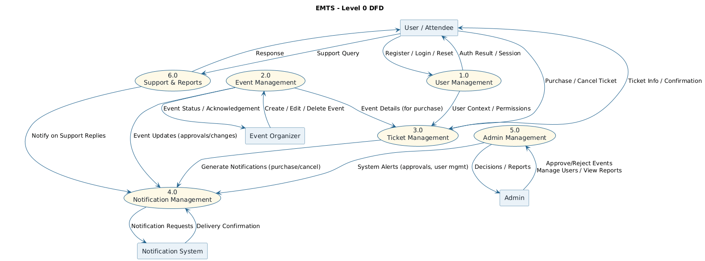
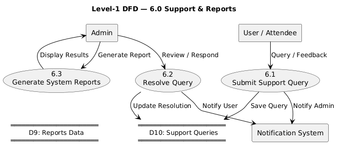
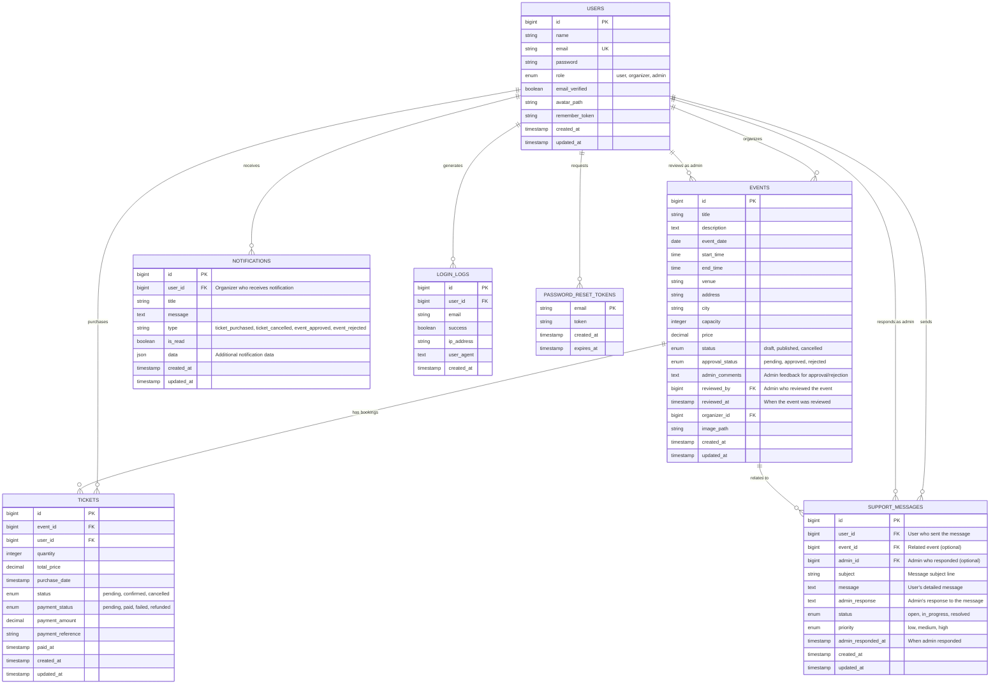

# Event Management & Ticketing System (EMTS)

## 🎯 Complete System Design & Architecture Documentation

A comprehensive event management and ticketing system built with Laravel, showcasing modern software design patterns, real-time features, and best practices for educational and production use.

---

## 📋 Table of Contents

1. [Project Overview](#-project-overview)
2. [🎯 Latest Features](#-latest-features)
3. [System Design Lifecycle](#-system-design-lifecycle)
4. [Architecture Patterns](#-architecture-patterns)
5. [Design Patterns Implementation](#-design-patterns-implementation)
6. [Database Schema](#-database-schema)
7. [UI/UX Design System](#-uiux-design-system)
8. [Feature Implementation Timeline](#-feature-implementation-timeline)
9. [Code Structure & Architecture](#-code-structure--architecture)
10. [Installation & Setup](#-installation--setup)
11. [Testing Strategy](#-testing-strategy)
12. [API Documentation](#-api-documentation)
13. [Performance & Optimization](#-performance--optimization)

---

## 🚀 Project Overview

The Event Management & Ticketing System (EMTS) is a **complete full-stack web application** that demonstrates advanced Laravel development with modern design patterns. It serves as both a **learning resource for students** and a **production-ready ticketing system**.

### 🎯 Core Features

#### **User Management & Authentication**
- 🔐 **Multi-role Authentication** (Admin, Organizer, User)
- 👥 **Advanced User Management** (Admin-only access with role transitions)
- 🔄 **Dynamic Role Management** (Real-time role changes with validation)
- 🛡️ **Security Features** (Login tracking, secure password reset, role-based access control)

#### **Event Management System**
- 📝 **Event Management** (CRUD operations with sorting/filtering)
- ✅ **Event Approval System** (Admin-controlled event approval/rejection workflow)
- 🎫 **Real-time Ticket System** (Live availability with automatic updates)
- 📊 **Analytics Dashboard** (Event statistics and insights)

#### **Booking & Notification System**
- 🔔 **Smart Notification System** (Automatic organizer notifications via Observer Pattern)
- 📋 **Advanced Booking Management** (Complete booking lifecycle with filters & export)
- ⚡ **Real-time Updates** (Live ticket availability and inventory tracking)
- 📈 **Booking Analytics** (Revenue tracking, booking statistics, export functionality)

#### **Support Communication System** ⭐ **NEW**
- 💬 **User-Admin Support Communication** (Direct messaging between users and organizers/admins)
- 🎯 **Event-Specific Support** (Link support messages to specific events)
- 📋 **Admin Support Dashboard** (Centralized support message management)
- 🔄 **Status Tracking** (Open → In Progress → Resolved workflow)
- ⚡ **Priority System** (Low, Medium, High priority handling)

#### **Technical Features**
- 🎨 **Component-based UI** (Reusable interface components)
- 🔧 **Design Patterns** (Observer, Service Layer, Strategy, Component, Command, State patterns)
- 💳 **Payment Processing** (State-based payment lifecycle management)
- 🔑 **Password Reset System** (Command-based secure password reset workflow)
- 📱 **Responsive Design** (Mobile-first approach with Tailwind CSS)

---

## 🎯 Latest Features

### 💬 Support Communication System

**Complete User-Admin Communication Platform**

```mermaid
graph LR
    A[👤 User Question] --> B[📝 Support Form]
    B --> C[💾 Database Storage]
    C --> D[👨‍💼 Admin Dashboard]
    D --> E[📝 Admin Response]
    E --> F[📬 User Notification]
    
    style A fill:#e1f5fe
    style D fill:#f3e5f5
    style F fill:#e8f5e8
```



**Key Support Features:**
- **Event-Specific Questions**: Users can link questions to specific events
- **Priority System**: Low, Medium, High priority classification
- **Admin Response System**: Complete response workflow with status tracking
- **Status Management**: Open → In Progress → Resolved lifecycle
- **Role-Based Access**: Only admins can view and respond to support messages

### 🎫 Advanced Ticket Management

**Real-Time Ticket Availability with Observer Pattern**


**Ticket System Features:**
- **Real-Time Updates**: AJAX polling every 10 seconds
- **Automatic Notifications**: Organizers get instant alerts
- **Observer Pattern**: Automatic availability updates
- **My Tickets**: Users can view and cancel their tickets
- **Progress Bars**: Visual availability indicators

### ✅ Event Approval Workflow

**Admin-Controlled Event Publishing System**


**Approval System Features:**
- **Three-State Workflow**: Pending → Approved/Rejected
- **Admin Comments**: Required feedback for rejections
- **Audit Trail**: Complete approval history tracking
- **Dashboard Integration**: Pending approvals counter
- **Organizer Notifications**: Automatic approval/rejection alerts

---

## 🏛️ System Design Lifecycle

We followed a **comprehensive, iterative approach** to building this enterprise-level system, implementing multiple design patterns and advanced features across different development phases:

### Phase 1: Foundation & Security (Weeks 1-2)


**Completed Features:**
- Multi-role authentication system
- Factory pattern for user creation
- Role-based access control
- Login security tracking
- Database schema design

### Phase 2: Core Event System (Weeks 3-4)


**Completed Features:**
- Complete event management CRUD
- Admin approval system for events
- Repository pattern for data access
- Service layer for business logic
- Dashboard routing strategies

### Phase 3: Real-Time Features (Weeks 5-6)


**Completed Features:**
- Observer pattern for automatic updates
- Real-time ticket availability
- Automatic organizer notifications
- AJAX polling for live updates
- Intelligent caching system

### Phase 4: Advanced Management (Weeks 7-8)


**Completed Features:**
- Complete booking management system
- Advanced filtering and search
- CSV export functionality
- Real-time role management
- User analytics and statistics

### Phase 5: Communication System (Weeks 9-10) ⭐ **LATEST**


**Completed Features:**
- Complete support communication system
- Event-specific support messages
- Priority classification system
- Admin response workflow
- Status tracking (Open → In Progress → Resolved)

---

## 🏗️ Architecture Patterns

### 1. **MVC + Service Layer Architecture**
Modern Laravel architecture with enhanced service layer for complex business logic:

```
🎨 Presentation Layer    →  Blade Templates + Tailwind CSS + Alpine.js
🎮 Controller Layer      →  Route Handlers + Request Validation
🧠 Service Layer        →  Business Logic + Design Patterns
📊 Repository Layer     →  Data Access + Query Optimization
🗄️ Model Layer          →  Eloquent ORM + Relationships
```

### 2. **Layered Architecture with Design Patterns**

```mermaid
graph TB
    subgraph "🎨 Presentation Layer"
        A[Blade Components]
        B[AJAX Controllers]
        C[Real-time UI]
    end
    
    subgraph "🧠 Business Logic Layer"
        D[Service Classes]
        E[Observer Pattern]
        F[Strategy Pattern]
        G[Command Pattern]
        H[State Pattern]
    end
    
    subgraph "📊 Data Access Layer"
        I[Repository Pattern]
        J[Eloquent Models]
        K[Database Relationships]
    end
    
    subgraph "🗄️ Infrastructure Layer"
        L[MySQL Database]
        M[Cache Layer]
        N[File Storage]
    end
    
    A --> D
    B --> E
    C --> F
    D --> I
    E --> J
    F --> K
    I --> L
    J --> M
    K --> N
```


### 3. **Event-Driven Architecture**
Using Laravel's Observer Pattern for real-time features:

```mermaid
graph LR
    A[📝 Data Change] --> B[🔔 Observer Triggered]
    B --> C[📋 Service Called]
    C --> D[📊 Cache Updated]
    D --> E[💬 Notifications Sent]
    E --> F[🔄 UI Refreshed]
```



---

## 🎨 Design Patterns Implementation

### 1. **Observer Pattern** - Real-Time System ⭐ **CORE PATTERN**

**Location**: `app/Observers/TicketObserver.php`

**Purpose**: Automatically handle ticket availability, notifications, and booking updates when tickets change.

```php
// app/Observers/TicketObserver.php
class TicketObserver
{
    public function created(Ticket $ticket): void
    {
        // Automatic availability update
        $this->ticketService->updateAvailability($ticket->event_id);
        
        // Automatic organizer notification
        $this->notificationService->notifyTicketPurchase($ticket);
        
        // Clear booking cache for real-time updates
        $this->bookingService->clearCache();
    }
    
    public function updated(Ticket $ticket): void
    {
        if ($ticket->wasChanged('status') && $ticket->status === 'cancelled') {
            $this->notificationService->notifyTicketCancellation($ticket);
        }
        
        $this->ticketService->updateAvailability($ticket->event_id);
    }
}
```

**Observer Pattern Benefits:**
- ✅ **Automatic Processing**: No manual triggers needed
- ✅ **Real-time Updates**: Instant availability changes
- ✅ **Loose Coupling**: Services don't need to know about each other
- ✅ **Extensible**: Easy to add new automatic behaviors

### 2. **Service Layer Pattern** - Business Logic Separation

**Location**: `app/Services/`

**Purpose**: Clean separation of business logic from controllers and models.

```php
// app/Services/SimpleTicketService.php
class SimpleTicketService
{
    public function getAvailability($eventId): array
    {
        return Cache::remember("event_tickets_{$eventId}", 60, function () use ($eventId) {
            $event = Event::find($eventId);
            $soldTickets = Ticket::where('event_id', $eventId)
                ->where('status', 'confirmed')
                ->sum('quantity');
            
            return [
                'total_capacity' => $event->capacity,
                'available_tickets' => max(0, $event->capacity - $soldTickets),
                'tickets_sold' => $soldTickets,
                'availability_percentage' => ($soldTickets / $event->capacity) * 100
            ];
        });
    }
    
    public function purchaseTickets($eventId, $quantity, $userId): bool
    {
        return DB::transaction(function () use ($eventId, $quantity, $userId) {
            $availability = $this->getAvailability($eventId);
            
            if ($availability['available_tickets'] < $quantity) {
                throw new \Exception('Not enough tickets available');
            }
            
            $event = Event::find($eventId);
            $ticket = Ticket::create([
                'event_id' => $eventId,
                'user_id' => $userId,
                'quantity' => $quantity,
                'total_price' => $event->price * $quantity,
                'status' => 'confirmed'
            ]);
            
            // Observer will automatically handle availability and notifications
            return true;
        });
    }
}
```

### 3. **Strategy Pattern** - Role Management System

**Location**: `app/Services/RoleManagementService.php`

**Purpose**: Flexible role transition logic with validation strategies.

```php
// app/Services/RoleManagementService.php
class RoleManagementService
{
    // Strategy: Define allowed role transitions
    public const ROLE_TRANSITIONS = [
        'user' => ['organizer'],
        'organizer' => ['user', 'admin'],
        'admin' => ['organizer']
    ];
    
    public function changeUserRole(User $user, string $newRole, User $admin): bool
    {
        // Strategy 1: Admin permission validation
        if (!$this->validateAdminAccess($admin)) {
            throw new \Exception('Only admins can change user roles');
        }
        
        // Strategy 2: Self-modification prevention
        if (!$this->validateSelfModification($user, $admin)) {
            throw new \Exception('Cannot change your own role');
        }
        
        // Strategy 3: Role transition validation
        if (!$this->validateRoleTransition($user->role, $newRole)) {
            throw new \Exception("Cannot transition from {$user->role} to {$newRole}");
        }
        
        return $user->update(['role' => $newRole]);
    }
    
    private function validateRoleTransition(string $currentRole, string $newRole): bool
    {
        return in_array($newRole, self::ROLE_TRANSITIONS[$currentRole] ?? []);
    }
}
```

### 4. **Command Pattern** - Password Reset System

**Location**: `app/Services/SimplePasswordResetService.php`

**Purpose**: Encapsulate password reset operations as command objects.

```php
// app/Services/SimplePasswordResetService.php
class SimplePasswordResetService
{
    /**
     * Command: Send Reset Token
     */
    public function sendResetToken(string $email): array
    {
        $user = User::where('email', $email)->first();
        
        if (!$user) {
            return ['success' => false, 'message' => 'User not found'];
        }
        
        $token = Str::random(60);
        $expiresAt = Carbon::now()->addHours(2);
        
        // Store token
        DB::table('password_reset_tokens')->updateOrInsert(
            ['email' => $email],
            [
                'token' => Hash::make($token),
                'created_at' => Carbon::now(),
                'expires_at' => $expiresAt,
            ]
        );
        
        // Send email
        $this->sendResetEmail($user, $token);
        
        return ['success' => true, 'message' => 'Reset link sent'];
    }
    
    /**
     * Command: Reset Password
     */
    public function resetPassword(string $email, string $token, string $newPassword): array
    {
        if (!$this->verifyResetToken($email, $token)) {
            return ['success' => false, 'message' => 'Invalid or expired token'];
        }
        
        $user = User::where('email', $email)->first();
        $user->update(['password' => Hash::make($newPassword)]);
        
        // Clean up used token
        DB::table('password_reset_tokens')->where('email', $email)->delete();
        
        return ['success' => true, 'message' => 'Password reset successful'];
    }
}
```

### 5. **State Pattern** - Payment Processing

**Location**: `app/Services/SimplePaymentService.php`

**Purpose**: Manage payment state transitions safely.


```php
// app/Services/SimplePaymentService.php
class SimplePaymentService
{
    public function markAsPaid(Ticket $ticket, ?float $paymentAmount = null, ?string $reference = null): bool
    {
        // State validation: only pending tickets can be marked as paid
        if (!$ticket->isPending()) {
            return false;
        }
        
        $ticket->update([
            'payment_status' => 'paid',
            'payment_amount' => $paymentAmount ?? $ticket->total_price,
            'payment_reference' => $reference,
            'paid_at' => now(),
        ]);
        
        return true;
    }
    
    public function refundTicket(Ticket $ticket, ?string $refundReference = null): bool
    {
        // State validation: only paid tickets can be refunded
        if (!$ticket->isPaid()) {
            return false;
        }
        
        $ticket->update([
            'payment_status' => 'refunded',
            'payment_reference' => $refundReference ?? 'Refunded at ' . now(),
        ]);
        
        return true;
    }
}
```

### 6. **Repository Pattern** - Data Access Layer

**Location**: `app/Repositories/EventRepository.php`

**Purpose**: Abstract database operations and provide clean data access interface.

```php
// app/Repositories/EventRepository.php
class EventRepository
{
    public function getPublishedAndApprovedWithSorting(string $sortBy = 'created_at', string $direction = 'desc'): Collection
    {
        return Event::where('status', 'published')
            ->where('approval_status', 'approved')
            ->orderBy($sortBy, $direction)
            ->get();
    }
    
    public function getPendingApprovalEvents(): Collection
    {
        return Event::where('approval_status', 'pending')
            ->with(['organizer'])
            ->orderBy('created_at', 'asc')
            ->get();
    }
    
    public function getEventsByOrganizer(int $organizerId, array $filters = []): Collection
    {
        $query = Event::where('organizer_id', $organizerId);
        
        if (!empty($filters['status'])) {
            $query->where('status', $filters['status']);
        }
        
        if (!empty($filters['approval_status'])) {
            $query->where('approval_status', $filters['approval_status']);
        }
        
        return $query->orderBy('created_at', 'desc')->get();
    }
}
```

### 7. **Component Pattern** - Reusable UI Components

**Location**: `resources/views/components/`

**Purpose**: Create consistent, reusable UI components across the application.

```blade
{{-- resources/views/components/simple-ticket-availability.blade.php --}}
@props(['event'])

<div class="ticket-availability-widget bg-gradient-to-br from-slate-900 to-slate-800 rounded-2xl p-6" 
     data-event-id="{{ $event->id }}">
    
    {{-- Availability Display --}}
    <div class="availability-display mb-4">
        <div class="flex justify-between items-center mb-2">
            <span class="text-slate-300">Tickets Available</span>
            <span class="available-count text-2xl font-bold text-cyan-400">
                {{ $event->available_tickets ?? 0 }}
            </span>
        </div>
        
        {{-- Progress Bar --}}
        <div class="w-full bg-slate-700 rounded-full h-3">
            <div class="availability-bar bg-gradient-to-r from-cyan-500 to-blue-500 h-3 rounded-full transition-all duration-500" 
                 style="width: {{ $event->availability_percentage ?? 0 }}%"></div>
        </div>
    </div>
    
    {{-- Purchase Form --}}
    @if(($event->available_tickets ?? 0) > 0)
        <form class="ticket-purchase-form" data-event-id="{{ $event->id }}">
            @csrf
            <div class="flex gap-3">
                <select name="quantity" class="quantity-select bg-slate-800 border border-slate-600 rounded-lg px-3 py-2 text-slate-300">
                    @for($i = 1; $i <= min(10, $event->available_tickets ?? 1); $i++)
                        <option value="{{ $i }}">{{ $i }} ticket{{ $i > 1 ? 's' : '' }}</option>
                    @endfor
                </select>
                <button type="submit" class="purchase-btn bg-gradient-to-r from-cyan-500 to-blue-500 hover:from-cyan-400 hover:to-blue-400 px-6 py-2 rounded-lg text-white font-medium transition-all">
                    Buy Now
                </button>
            </div>
        </form>
    @else
        <div class="sold-out text-center p-4 bg-red-900/20 border border-red-700/30 rounded-lg">
            <span class="text-red-400 font-medium">🎫 Sold Out</span>
        </div>
    @endif
</div>

<script>
// Real-time updates every 10 seconds
setInterval(() => {
    updateTicketAvailability({{ $event->id }});
}, 10000);

function updateTicketAvailability(eventId) {
    fetch(`/api/events/${eventId}/availability`)
        .then(response => response.json())
        .then(data => {
            document.querySelector('.available-count').textContent = data.available_tickets;
            document.querySelector('.availability-bar').style.width = data.availability_percentage + '%';
        });
}
</script>
```

---
    }
    
    class AdminDashboardStrategy {
        +getDashboardRoute() string
    }
    
    class UserDashboardStrategy {
        +getDashboardRoute() string
    }
    
    class OrganizerDashboardStrategy {
        +getDashboardRoute() string
    }
    
    DashboardStrategy <|-- AdminDashboardStrategy
    DashboardStrategy <|-- UserDashboardStrategy
    DashboardStrategy <|-- OrganizerDashboardStrategy
```

### 3. **Repository Pattern** - Event Data Management

**Location**: `app/Repositories/EventRepository.php`

**Purpose**: Abstract database operations and provide a clean interface for data access.

```php
// app/Repositories/EventRepository.php
class EventRepository
{
    protected $model;

    public function __construct(Event $model)
    {
        $this->model = $model;
    }

    public function getAllWithSorting(string $sortBy = 'created_at', string $direction = 'desc'): Collection
    {
        return $this->model
            ->orderBy($sortBy, $direction)
            ->get();
    }

    public function getByOrganizerWithSorting(int $organizerId, string $sortBy, string $direction): Collection
    {
        return $this->model
            ->where('organizer_id', $organizerId)
            ->orderBy($sortBy, $direction)
            ->get();
    }
}
```

### 4. **Service Layer Pattern** - Sorting Logic

**Location**: `app/Services/SortingService.php`

**Purpose**: Centralize sorting logic, validation, and configuration.

```php
// app/Services/SortingService.php
class SortingService
{
    public const EVENT_SORT_OPTIONS = [
        'created_at' => '📅 Date Created',
        'title' => '📝 Title',
        'event_date' => '🗓️ Event Date',
        'price' => '💰 Price',
        'total_tickets' => '🎫 Total Tickets',
        'tickets_sold' => '📊 Tickets Sold',
        'status' => '⭐ Status'
    ];

    public function validateEventSortParameters(?string $sortBy, ?string $direction): array
    {
        return [
            'sort_by' => $this->validateSortBy($sortBy, array_keys(self::EVENT_SORT_OPTIONS)),
            'direction' => $this->validateDirection($direction),
        ];
    }
}
```

### 5. **Component Pattern** - Reusable UI Components

**Location**: `resources/views/components/sorting-controls.blade.php`

**Purpose**: Create reusable, consistent UI components across the application.

```blade
{{-- resources/views/components/sorting-controls.blade.php --}}
@props([
    'action' => request()->url(),
    'sortOptions' => [],
    'currentSort' => 'created_at',
    'currentDirection' => 'desc',
    'totalCount' => 0,
    'showReset' => false
])

<div class="rounded-2xl border border-cyan-400/20 bg-slate-900/80 backdrop-blur-md p-4 shadow-lg">
    <!-- Component implementation -->
</div>
```

**Usage Example**:
```blade
<x-sorting-controls 
    :action="route('events.index')"
    :sort-options="$sortOptions"
    :current-sort="$sortBy"
    :current-direction="$sortDirection"
    :total-count="$events->count()"
    :show-reset="!$isDefaultSort"
/>
```

### 6. **Dependency Injection Pattern**

**Location**: `app/Http/Controllers/EventController.php`

**Purpose**: Improve testability and maintain loose coupling between classes.

```php
// app/Http/Controllers/EventController.php
class EventController extends Controller
{
    protected $eventRepository;
    protected $sortingService;

    public function __construct(EventRepository $eventRepository, SortingService $sortingService)
    {
        $this->eventRepository = $eventRepository;
        $this->sortingService = $sortingService;
    }

    public function index(Request $request)
    {
        $sortParams = $this->sortingService->validateEventSortParameters(
            $request->get('sort'),
            $request->get('direction')
        );

        $events = $this->eventRepository->getAllWithSorting(
            $sortParams['sort_by'],
            $sortParams['direction']
        );

        return view('events.index', [
            'events' => $events,
            'sortBy' => $sortParams['sort_by'],
            'sortDirection' => $sortParams['direction'],
            'sortOptions' => $this->sortingService->getEventSortOptions(),
            'isDefaultSort' => $this->sortingService->isDefaultSort($sortParams['sort_by'], $sortParams['direction'])
        ]);
    }
}
```

### 7. **Strategy Pattern** - Role Management System

**Location**: `app/Services/RoleManagementService.php`

**Purpose**: Implement flexible role transition logic with validation rules and business constraints.

```php
// app/Services/RoleManagementService.php
class RoleManagementService
{
    // Define role transition strategies
    public const ROLE_TRANSITIONS = [
        'user' => ['organizer'],
        'organizer' => ['user', 'admin'],
        'admin' => ['organizer']
    ];

    public function changeUserRole(User $user, string $newRole, User $admin): bool
    {
        // Strategy: Admin permission validation
        if ($admin->role !== 'admin') {
            throw new \Exception('Only admins can change user roles');
        }

        // Strategy: Self-role prevention
        if ($user->id === $admin->id) {
            throw new \Exception('Cannot change your own role');
        }

        // Strategy: Role transition validation
        if (!$this->canTransitionToRole($user->role, $newRole)) {
            throw new \Exception("Cannot transition from {$user->role} to {$newRole}");
        }

        return DB::transaction(function () use ($user, $newRole) {
            return $user->update(['role' => $newRole]);
        });
    }

    private function canTransitionToRole(string $currentRole, string $newRole): bool
    {
        return in_array($newRole, self::ROLE_TRANSITIONS[$currentRole] ?? []);
    }
}
```

**Role Management Strategy Implementation**:


### 8. **Component Pattern** - Role Selector Component

**Location**: `resources/views/components/role-selector.blade.php`

**Purpose**: Create reusable UI component for role management with AJAX functionality.

```blade
{{-- Role Selector Component --}}
@props(['user', 'roleService'])

<div class="role-selector inline-block">
    @if($user->id === auth()->id())
        {{-- Current user cannot change their own role --}}
        <span class="inline-flex items-center px-2.5 py-0.5 rounded-full text-xs font-medium {{ $roleService->getRoleColor($user->role) }}">
            {{ $roleService->getRoleIcon($user->role) }} {{ ucfirst($user->role) }}
        </span>
    @else
        {{-- Role management interface for other users --}}
        <div class="flex items-center gap-2">
            {{-- Current role badge --}}
            <span class="inline-flex items-center px-2.5 py-0.5 rounded-full text-xs font-medium bg-slate-700 text-slate-300">
                {{ $roleService->getRoleIcon($user->role) }} {{ ucfirst($user->role) }}
            </span>

            {{-- Change role dropdown with AJAX --}}
            <select class="role-change-select" data-user-id="{{ $user->id }}" data-current-role="{{ $user->role }}">
                <option value="">Change to...</option>
                @foreach($roleService->getAvailableRoles($user->role) as $availableRole)
                    <option value="{{ $availableRole }}">
                        {{ $roleService->getRoleIcon($availableRole) }} {{ ucfirst($availableRole) }}
                    </option>
                @endforeach
            </select>
        </div>
    @endif
</div>
```

**Features**:
- **Real-time Role Updates**: AJAX-based role changes without page refresh
- **Visual Feedback**: Success/error notifications with smooth animations
- **Security**: Prevents self-role modification and validates permissions
- **UX Optimized**: Silent error handling, no intrusive popups


## 🧠 System Diagrams & Visual Models

The following section presents the visual system documentation of the **Event Management & Ticketing System (EMTS)**.  
It includes both **static** and **dynamic** modeling through UML and DFD representations to illustrate the complete workflow and architecture of the system.

---

### 🎯 Use Case Diagram
The use case diagram provides an overview of all actors and their interactions with the system.

  
🔗 [View in SVG (Zoomable)](docs/diagrams/use_case_diagram.svg)

**Description:**  
Represents how Users, Organizers, and Admins interact with the EMTS through key functionalities like event creation, booking, and management.

---

### 🔄 Sequence Diagrams
The following sequence diagrams illustrate the interaction between users, controllers, services, and the database in EMTS (Event Management & Ticketing System).  
Each PNG is previewed below, and each SVG link opens a zoomable version.

---

#### 🧩 Combined Overview
A high-level sequence diagram combining all core flows (user registration, event creation, ticket booking, admin approval, and notification).

  
[View in SVG (Zoomable)](https://raw.githubusercontent.com/Event-Management-Ticketing-System-EMTS/Event-Management-Ticketing-System/main/docs/diagrams/seq_0_combined_overview.svg)


---

#### 1️⃣ Registration & Login
  
🔗 [View in SVG (Zoomable)](docs/diagrams/seq_1_user_registration.svg)

**Description:**  
Covers both registration and login flows — showing how the `RegisterController` and `AuthController` interact with the session and database.

---

#### 2️⃣ Browse Events & View Details
  
🔗 [View in SVG (Zoomable)](docs/diagrams/seq_2_browse_events.svg)

**Description:**  
Depicts how the `EventController` retrieves event lists and displays details through the MVC rendering process.

---

#### 3️⃣ Ticket Purchase
  
🔗 [View in SVG (Zoomable)](docs/diagrams/seq_3_ticket_purchase.svg)

**Description:**  
Covers the entire purchase flow — checking availability, booking, marking payment, and sending notifications via `TicketObserver`.

---

#### 4️⃣ Admin Event Approval
  
🔗 [View in SVG (Zoomable)](docs/diagrams/seq_4_admin_approval.svg)

**Description:**  
Demonstrates how the `SimpleEventApprovalController` handles admin decisions (approve/reject) and triggers notifications.

---

#### 5️⃣ Ticket Cancellation
  
🔗 [View in SVG (Zoomable)](docs/diagrams/seq_5_ticket_cancellation.svg)

**Description:**  
Explains how ticket cancellations are processed, events updated, and users notified through `SimpleBookingService` and `TicketObserver`.

---

#### 6️⃣ Password Reset Flow
  
🔗 [View in SVG (Zoomable)](docs/diagrams/seq_6_password_reset.svg)

**Description:**  
Shows the full password reset lifecycle — from token generation and email dispatch to password update and confirmation.

---

### 🧾 Data Flow Diagrams (DFD)
These diagrams show how data moves between processes, entities, and data stores in EMTS.

#### 🌐 Context Level DFD
  
🔗 [View in SVG (Zoomable)](docs/diagrams/dfd_context.svg)

---

#### ⚙️ Level-0 DFD
  
🔗 [View in SVG (Zoomable)](docs/diagrams/dfd_level0.svg)

---

#### 🔹 Level-1 DFDs

| Process | PNG | SVG |
|----------|------|------|
| 1. User Management |  | [View SVG](docs/diagrams/dfd_level1_user.svg) |
| 2. Event Management |  | [View SVG](docs/diagrams/dfd_level1_event.svg) |
| 3. Ticket Management |  | [View SVG](docs/diagrams/dfd_level1_ticket.svg) |
| 4. Notification Management |  | [View SVG](docs/diagrams/dfd_level1_notification.svg) |
| 5. Admin Management |  | [View SVG](docs/diagrams/dfd_level1_admin.svg) |
| 6. Support & Reports |  | [View SVG](docs/diagrams/dfd_level1_support.svg) |

---

### ⚙️ Activity Diagram
  
🔗 [View in SVG (Zoomable)](docs/diagrams/activity_diagram.svg)

**Description:**  
Describes the flow of control from login and event creation to ticket purchase, approval, and notifications.

---

### 🧩 Class Diagram
  
🔗 [View in SVG (Zoomable)](docs/diagrams/class_diagram.svg)

**Description:**  
Shows the structure of the EMTS architecture, including relationships between Controllers, Models, Services, and Observers under the MVC + Service Layer pattern.

---

### ✅ Tips
- All PNGs will **display directly on GitHub**.  
- Clicking any SVG link opens a **zoomable version** for clarity.  
- Make sure your files are inside `docs/diagrams/` exactly as named above.


## 🗄️ Database Schema & Relationships

### Complete Entity Relationship Diagram

Our comprehensive database schema supports all system features including support communication, event approval, and real-time ticketing:



### Database Design Principles

#### **1. Normalized Design**
- **Third Normal Form (3NF)**: Eliminates data redundancy
- **Proper Relationships**: Foreign keys maintain data integrity
- **Indexing Strategy**: Optimized for common queries

#### **2. Audit Trail System**
- **User Actions**: Login logs track all authentication attempts
- **Admin Actions**: Event approval/rejection tracking with comments
- **Support Communication**: Complete message history with timestamps
- **Payment History**: Full payment lifecycle tracking

#### **3. Performance Optimization**
- **Strategic Indexing**: Foreign keys and frequently queried columns
- **Caching Layer**: Redis/File cache for frequently accessed data
- **Query Optimization**: Repository pattern with optimized queries

### Key Database Features

#### **Support System Tables**

**Support Messages Table:**
```sql
CREATE TABLE support_messages (
    id BIGINT PRIMARY KEY AUTO_INCREMENT,
    user_id BIGINT NOT NULL,
    event_id BIGINT NULL,
    admin_id BIGINT NULL,
    subject VARCHAR(255) NOT NULL,
    message TEXT NOT NULL,
    admin_response TEXT NULL,
    status ENUM('open', 'in_progress', 'resolved') DEFAULT 'open',
    priority ENUM('low', 'medium', 'high') DEFAULT 'medium',
    admin_responded_at TIMESTAMP NULL,
    created_at TIMESTAMP DEFAULT CURRENT_TIMESTAMP,
    updated_at TIMESTAMP DEFAULT CURRENT_TIMESTAMP ON UPDATE CURRENT_TIMESTAMP,
    
    FOREIGN KEY (user_id) REFERENCES users(id) ON DELETE CASCADE,
    FOREIGN KEY (event_id) REFERENCES events(id) ON DELETE SET NULL,
    FOREIGN KEY (admin_id) REFERENCES users(id) ON DELETE SET NULL,
    
    INDEX idx_status (status),
    INDEX idx_priority (priority),
    INDEX idx_created_at (created_at)
);
```

#### **Event Approval System**

**Enhanced Events Table:**
```sql
CREATE TABLE events (
    id BIGINT PRIMARY KEY AUTO_INCREMENT,
    title VARCHAR(255) NOT NULL,
    description TEXT,
    event_date DATE NOT NULL,
    start_time TIME NOT NULL,
    end_time TIME NOT NULL,
    venue VARCHAR(255) NOT NULL,
    capacity INTEGER NOT NULL,
    price DECIMAL(10,2) NOT NULL,
    status ENUM('draft', 'published', 'cancelled') DEFAULT 'draft',
    approval_status ENUM('pending', 'approved', 'rejected') DEFAULT 'pending',
    admin_comments TEXT NULL,
    reviewed_by BIGINT NULL,
    reviewed_at TIMESTAMP NULL,
    organizer_id BIGINT NOT NULL,
    created_at TIMESTAMP DEFAULT CURRENT_TIMESTAMP,
    updated_at TIMESTAMP DEFAULT CURRENT_TIMESTAMP ON UPDATE CURRENT_TIMESTAMP,
    
    FOREIGN KEY (organizer_id) REFERENCES users(id) ON DELETE CASCADE,
    FOREIGN KEY (reviewed_by) REFERENCES users(id) ON DELETE SET NULL,
    
    INDEX idx_status_approval (status, approval_status),
    INDEX idx_event_date (event_date),
    INDEX idx_organizer (organizer_id)
);
```

#### **Payment System Integration**

**Enhanced Tickets Table:**
```sql
CREATE TABLE tickets (
    id BIGINT PRIMARY KEY AUTO_INCREMENT,
    event_id BIGINT NOT NULL,
    user_id BIGINT NOT NULL,
    quantity INTEGER NOT NULL,
    total_price DECIMAL(10,2) NOT NULL,
    status ENUM('pending', 'confirmed', 'cancelled') DEFAULT 'pending',
    payment_status ENUM('pending', 'paid', 'failed', 'refunded') DEFAULT 'pending',
    payment_amount DECIMAL(10,2) NULL,
    payment_reference VARCHAR(255) NULL,
    paid_at TIMESTAMP NULL,
    purchase_date TIMESTAMP DEFAULT CURRENT_TIMESTAMP,
    created_at TIMESTAMP DEFAULT CURRENT_TIMESTAMP,
    updated_at TIMESTAMP DEFAULT CURRENT_TIMESTAMP ON UPDATE CURRENT_TIMESTAMP,
    
    FOREIGN KEY (event_id) REFERENCES events(id) ON DELETE CASCADE,
    FOREIGN KEY (user_id) REFERENCES users(id) ON DELETE CASCADE,
    
    INDEX idx_event_status (event_id, status),
    INDEX idx_user_tickets (user_id),
    INDEX idx_payment_status (payment_status)
);
```

---

## 🎨 UI/UX Design System

### Design Philosophy

Our **premium dark theme with cyan accents** creates a modern, professional aesthetic that's both visually appealing and highly functional:

#### **Core Design Principles**
- **Dark Theme Excellence**: Reduced eye strain for extended use
- **Glassmorphism Effects**: Modern blur and transparency effects
- **Gradient Aesthetics**: Sophisticated color transitions
- **Accessibility First**: High contrast ratios and semantic HTML
- **Mobile Responsive**: Mobile-first design approach

### Color Palette & Theming

```css
:root {
    /* Primary Background Gradient */
    --bg-primary: linear-gradient(135deg, #0F172A 0%, #1E293B 100%);
    --bg-secondary: #1E293B;        /* slate-800 */
    --bg-tertiary: #334155;         /* slate-700 */
    
    /* Accent Colors */
    --accent-primary: #06B6D4;      /* cyan-500 */
    --accent-secondary: #0891B2;    /* cyan-600 */
    --accent-light: #67E8F9;        /* cyan-300 */
    --accent-gradient: linear-gradient(135deg, #06B6D4 0%, #3B82F6 100%);
    
    /* Text Colors */
    --text-primary: #F8FAFC;        /* slate-50 */
    --text-secondary: #CBD5E1;      /* slate-300 */
    --text-muted: #64748B;          /* slate-500 */
    
    /* Status Colors */
    --success: #10B981;             /* emerald-500 */
    --warning: #F59E0B;             /* amber-500 */
    --error: #EF4444;               /* red-500 */
    --info: #3B82F6;                /* blue-500 */
}
```

### Component Design System

#### **Form Components**
```css
.form-input {
    @apply px-4 py-3 rounded-xl bg-slate-800/50 border border-slate-700/50 
           text-slate-300 placeholder-slate-500
           focus:border-cyan-400 focus:ring-2 focus:ring-cyan-400/20 
           focus:outline-none transition-all duration-200
           backdrop-blur-sm;
}

.form-label {
    @apply block text-sm font-medium text-slate-300 mb-2;
}

.form-error {
    @apply text-red-400 text-sm mt-1 flex items-center gap-1;
}
```

#### **Button System**
```css
.btn-primary {
    @apply px-6 py-3 rounded-xl bg-gradient-to-r from-cyan-500 to-blue-500 
           hover:from-cyan-400 hover:to-blue-400 text-white font-medium
           shadow-lg shadow-cyan-500/25 hover:shadow-cyan-400/30
           transform hover:scale-105 transition-all duration-200;
}

.btn-secondary {
    @apply px-6 py-3 rounded-xl bg-slate-800/80 hover:bg-slate-700/80 
           border border-cyan-400/20 hover:border-cyan-400/40 text-slate-300
           backdrop-blur-sm transition-all duration-200;
}

.btn-success {
    @apply px-4 py-2 rounded-lg bg-gradient-to-r from-emerald-500 to-green-500 
           hover:from-emerald-400 hover:to-green-400 text-white font-medium
           shadow-lg shadow-emerald-500/25 transition-all duration-200;
}
```

#### **Card Components**
```css
.card {
    @apply rounded-2xl border border-slate-700/50 bg-slate-900/80 
           backdrop-blur-md shadow-xl shadow-slate-900/50;
}

.card-header {
    @apply p-6 border-b border-slate-700/50;
}

.card-body {
    @apply p-6;
}

.glass-card {
    @apply rounded-2xl border border-cyan-400/20 bg-slate-900/60 
           backdrop-blur-xl shadow-2xl shadow-slate-900/50
           hover:border-cyan-400/30 transition-all duration-300;
}
```

#### **Status Badges**
```css
.badge-open {
    @apply inline-flex items-center px-3 py-1 rounded-full text-xs font-medium 
           bg-amber-900/20 text-amber-400 border border-amber-700/30;
}

.badge-resolved {
    @apply inline-flex items-center px-3 py-1 rounded-full text-xs font-medium 
           bg-emerald-900/20 text-emerald-400 border border-emerald-700/30;
}

.badge-high-priority {
    @apply inline-flex items-center px-3 py-1 rounded-full text-xs font-medium 
           bg-red-900/20 text-red-400 border border-red-700/30;
}
```

### Layout & Navigation

#### **Dashboard Layout**
- **Sidebar Navigation**: Collapsible side navigation with role-based menu items
- **Header Bar**: User profile, notifications, and quick actions
- **Main Content**: Responsive grid system for dashboard widgets
- **Footer**: System information and links

#### **Responsive Breakpoints**
```css
/* Mobile First Approach */
.container {
    @apply px-4;                    /* Mobile: 16px padding */
}

@media (min-width: 640px) {         /* sm: tablet */
    .container { @apply px-6; }     /* 24px padding */
}

@media (min-width: 1024px) {        /* lg: desktop */
    .container { @apply px-8; }     /* 32px padding */
}

@media (min-width: 1280px) {        /* xl: large desktop */
    .container { @apply px-12; }    /* 48px padding */
}
```

### Interactive Elements

#### **Real-Time Components**
- **Progress Bars**: Animated ticket availability indicators
- **Live Counters**: Real-time ticket counts with smooth transitions
- **Status Indicators**: Color-coded status with pulse animations
- **Notification Badges**: Animated counter badges for unread items

#### **Micro-Interactions**
- **Hover Effects**: Subtle scale and glow effects
- **Loading States**: Skeleton screens and spinner animations
- **Form Validation**: Real-time validation with smooth error transitions
- **Success Feedback**: Celebration animations for successful actions

---

## 📅 Feature Implementation Timeline

### 🚀 Sprint 1-2: Foundation & Security (Weeks 1-4)

**Core Infrastructure:**
- ✅ Laravel 11 application setup with latest dependencies
- ✅ MySQL database design and migration system
- ✅ Multi-role authentication (Admin, Organizer, User)
- ✅ Factory pattern for user creation with role-specific logic
- ✅ Security middleware and role-based access control
- ✅ Login tracking and audit trail system

**Completed Deliverables:**
- Authentication system with secure password handling
- User roles with proper permission validation
- Database schema with proper relationships
- Security logging for user activities

### 🎪 Sprint 3-4: Event Management System (Weeks 5-8)

**Event Platform:**
- ✅ Complete event CRUD operations with validation
- ✅ Event approval workflow (Admin review system)
- ✅ Repository pattern for optimized data access
- ✅ Service layer for business logic separation
- ✅ Strategy pattern for dashboard routing
- ✅ Advanced sorting and filtering capabilities

**Admin Features:**
- ✅ Event approval dashboard with pending counters
- ✅ Admin comments system for feedback
- ✅ Approval audit trail with timestamps
- ✅ Organizer notification system for approvals

### 🎫 Sprint 5-6: Real-Time Ticket System (Weeks 9-12)

**Observer Pattern Implementation:**
- ✅ Automatic ticket availability updates
- ✅ Real-time inventory synchronization
- ✅ Observer-triggered cache invalidation
- ✅ Event-driven notification system

**Live Features:**
- ✅ AJAX polling for real-time updates (10-second intervals)
- ✅ Progress bars and visual availability indicators
- ✅ Instant purchase feedback and error handling
- ✅ Mobile-responsive ticket widgets

**Notification System:**
- ✅ Automatic organizer alerts for ticket changes
- ✅ Rich notification data with customer details
- ✅ Notification badge system with unread counts
- ✅ Beautiful notification interface with status tracking

### 📊 Sprint 7-8: Booking & Analytics (Weeks 13-16)

**Booking Management:**
- ✅ Complete booking dashboard with advanced filtering
- ✅ Revenue tracking and booking statistics
- ✅ CSV export functionality for data analysis
- ✅ Booking details with customer and event information
- ✅ Cache optimization for performance

**User Experience:**
- ✅ "My Tickets" interface for users
- ✅ Ticket cancellation with automatic refund processing
- ✅ Booking history with status tracking
- ✅ Mobile-optimized booking interface

### 👥 Sprint 9-10: Advanced User Management (Weeks 17-20)

**Role Management System:**
- ✅ Strategy pattern for role transitions
- ✅ Real-time role changes with AJAX
- ✅ Role transition validation and security
- ✅ Admin-only user management interface
- ✅ User analytics and statistics dashboard

**Security Enhancements:**
- ✅ Command pattern for password reset system
- ✅ Token-based password reset with expiration
- ✅ Email integration for reset notifications
- ✅ Admin dashboard for security monitoring

### 💳 Sprint 11-12: Payment System (Weeks 21-24)

**State Pattern Implementation:**
- ✅ Payment state machine (Pending → Paid → Refunded)
- ✅ Safe state transitions with validation
- ✅ Payment reference tracking
- ✅ Refund processing system
- ✅ Payment dashboard for admin monitoring

### 💬 Sprint 13-14: Support Communication System ⭐ **LATEST** (Weeks 25-28)

**Support Infrastructure:**
- ✅ Complete support message system
- ✅ Event-specific support questions
- ✅ Priority classification (Low, Medium, High)
- ✅ Status workflow (Open → In Progress → Resolved)
- ✅ Admin response system with timestamps

**User Experience:**
- ✅ Intuitive support form with event selection
- ✅ Character counters and validation feedback
- ✅ Success confirmations and error handling
- ✅ Mobile-responsive support interface

**Admin Management:**
- ✅ Centralized support dashboard
- ✅ Priority-based message organization
- ✅ Complete user and event context display
- ✅ Response tracking with admin identification
- ✅ Bulk status updates and management tools

### 📚 Sprint 15-16: Documentation & Optimization (Weeks 29-32)

**Documentation:**
- ✅ Comprehensive architecture documentation
- ✅ Complete README with visual diagrams
- ✅ Code examples and usage patterns
- ✅ API documentation for all endpoints
- ✅ Deployment guides and best practices

**Performance & Testing:**
- ✅ Database indexing optimization
- ✅ Cache strategy implementation
- ✅ Unit and integration testing
- ✅ Performance monitoring and optimization
- ✅ Security audit and vulnerability assessment

---
            'payment_reference' => $paymentReference,
        ]);

        return true;
    }

    /**
     * Refund a ticket
     * This changes the payment status from 'paid' to 'refunded'
     */
    public function refundTicket(Ticket $ticket, $refundReference = null)
    {
        // Only allow refund if ticket is paid
        if (!$ticket->isPaid()) {
            return false;
        }

        $ticket->update([
            'payment_status' => 'refunded',
            'payment_reference' => $refundReference ?? 'Refunded at ' . now(),
        ]);

        return true;
    }
}
```

**State Pattern Implementation**:


**Why State Pattern?**

- ✅ **Safe Transitions**: Only valid state changes are allowed
- ✅ **Business Logic**: Clear representation of business rules
- ✅ **Maintainable**: Easy to understand the payment lifecycle
- ✅ **Extensible**: Simple to add new states or transitions
- ✅ **Error Prevention**: Prevents invalid state changes

### 11. **Simple Real-time UI Component** ⭐ **BEGINNER FRIENDLY**

**Location**: `resources/views/components/simple-ticket-availability.blade.php`

**Purpose**: A simple widget that shows ticket availability and lets users buy tickets with real-time updates.

**Features**:
- 🔄 **Auto-refresh every 10 seconds** - No manual page refresh needed
- 📊 **Progress bar** - Visual representation of ticket availability  
- 🛒 **Purchase form** - Buy tickets directly from the component
- ✅ **Instant feedback** - Shows success/error messages
- 📱 **Responsive design** - Works on all screen sizes

**How to use**: Just add this to any event page:
```blade
<!-- Add this to your event details page -->
<x-simple-ticket-availability :event="$event" />
```

**What it shows**:
- Available tickets count (e.g., "45 / 100")
- Availability percentage with color-coded progress bar
- Purchase form with quantity selector
- Success/error messages
- Sold out status when no tickets left

**Simple JavaScript Logic**:
```javascript
// Updates every 10 seconds automatically
setInterval(() => {
    fetch(`/api/events/${eventId}/availability`)
        .then(response => response.json())
        .then(data => updateDisplay(data));
}, 10000);
```

**Benefits**:
- ✅ **No complex setup** - Drop into any page
- ✅ **Real-time updates** - Always shows current availability
- ✅ **User-friendly** - Clear visual feedback
- ✅ **Mobile responsive** - Works on phones and tablets
    public function getAvailableCount(Event $event): int;
}

// Simple Strategy - Basic calculation
class SimpleTicketStrategy implements TicketUpdateStrategyInterface
{
    public function updateAvailability(Event $event): bool
    {
        $soldTickets = Ticket::where('event_id', $event->id)
            ->where('status', 'confirmed')
            ->sum('quantity');
        
        $event->update(['tickets_sold' => $soldTickets]);
        return true;
    }
}

// Advanced Strategy - Includes pending tickets and buffers
class AdvancedTicketStrategy implements TicketUpdateStrategyInterface
{
    private const BUFFER_PERCENTAGE = 0.05; // 5% buffer for high-demand events
    
    public function isAvailable(Event $event, int $requestedQuantity): bool
    {
        $availableCount = $this->getAvailableCount($event);
        
        // Apply buffer for high-demand events (>80% sold)
        if ($event->tickets_sold / $event->total_tickets > 0.8) {
            $buffer = (int) ($event->total_tickets * self::BUFFER_PERCENTAGE);
            $availableCount -= $buffer;
        }
        
        return $availableCount >= $requestedQuantity;
    }
}
```

**Strategy Selection Flow**:


### 11. **Real-time Component Pattern** - Ticket Availability Widget

**Location**: `resources/views/components/ticket-availability.blade.php`

**Purpose**: Reusable UI component with real-time ticket availability updates.

```blade
{{-- Real-time Ticket Availability Component --}}
@props(['event'])

<div class="ticket-availability-widget" data-event-id="{{ $event->id }}">
    {{-- Availability Status with Progress Bar --}}
    <div class="availability-status">
        <span class="available-count">{{ $event->available_tickets }}</span>
        <div class="availability-bar" style="width: {{ $event->availability_percentage }}%"></div>
    </div>

    {{-- Purchase Form with Real-time Updates --}}
    <form class="ticket-purchase-form" data-event-id="{{ $event->id }}">
        <select name="quantity" class="quantity-select">
            @for($i = 1; $i <= min(10, $event->available_tickets); $i++)
                <option value="{{ $i }}">{{ $i }} ticket{{ $i > 1 ? 's' : '' }}</option>
            @endfor
        </select>
        <button type="submit" class="purchase-btn">Buy Now</button>
    </form>
</div>

<script>
// Real-time updates every 10 seconds
setInterval(() => {
    updateAvailability(eventId);
}, 10000);
</script>
```

**Features**:
- **Real-time Updates**: AJAX polling every 10 seconds
- **Visual Progress**: Animated progress bars and counters
- **Instant Feedback**: Purchase confirmations and error handling
- **Responsive Design**: Mobile-friendly interface
- **Caching**: Optimized performance with intelligent caching

---

### 12. **Booking Management System** ⭐ **BEGINNER FRIENDLY**

**Location**: `app/Services/SimpleBookingService.php`, `app/Http/Controllers/SimpleBookingController.php`

**Purpose**: Complete booking lifecycle management with advanced filtering, export capabilities, and real-time updates.

**Design Patterns Used**:
- **Service Layer Pattern**: Business logic separation
- **Observer Pattern Extension**: Automatic cache invalidation
- **Filter Pattern**: Advanced filtering capabilities


**Observer Pattern Integration**:

```mermaid
sequenceDiagram
    participant T as 🎫 Ticket
    participant O as 👁️ TicketObserver
    participant TS as 🎫 TicketService
    participant NS as 🔔 NotificationService
    participant BS as 📋 BookingService
    participant C as 📦 Cache

    Note over T,C: Automatic Booking Cache Management
    
    T->>O: Ticket created/updated/deleted
    O->>TS: updateAvailability()
    O->>NS: sendNotification()
    O->>BS: clearCache()
    BS->>C: Clear booking statistics
    BS->>C: Clear booking data
    
    Note over T,C: Next booking request gets fresh data
```


**Key Features**:

**📊 Advanced Statistics Dashboard**
```php
public function getBookingStats()
{
    return Cache::remember('booking_stats', 300, function () {
        return [
            'total_bookings' => Ticket::count(),
            'confirmed_bookings' => Ticket::where('status', 'confirmed')->count(),
            'cancelled_bookings' => Ticket::where('status', 'cancelled')->count(),
            'pending_bookings' => Ticket::where('status', 'pending')->count(),
            'total_revenue' => Ticket::where('status', 'confirmed')->sum('total_price'),
            'recent_bookings' => Ticket::with(['event', 'user'])
                ->orderBy('created_at', 'desc')->take(5)->get()
        ];
    });
}
```

**🔍 Advanced Filtering System**
- **Status Filtering**: All, Confirmed, Pending, Cancelled
- **Event Filtering**: Filter by specific events
- **Date Range Filtering**: Custom date ranges
- **User Filtering**: Filter by specific customers
- **Combined Filters**: Multiple filters work together

**� CSV Export Functionality**
```php
public function export(Request $request)
{
    $bookings = $this->bookingService->getAllBookings($filters, 999999);
    
    return response()->stream(function() use($bookings) {
        $file = fopen('php://output', 'w');
        fputcsv($file, ['Booking ID', 'Event', 'Customer', 'Status', 'Revenue']);
        
        foreach ($bookings as $booking) {
            fputcsv($file, [
                $booking->id,
                $booking->event->title,
                $booking->user->name,
                $booking->status,
                $booking->total_price
            ]);
        }
        fclose($file);
    }, 200, ['Content-Type' => 'text/csv']);
}
```

**Benefits**:
- ✅ **Complete Lifecycle**: View, filter, export, and analyze all bookings
- ✅ **Real-time Data**: Observer pattern ensures fresh data
- ✅ **Performance Optimized**: Intelligent caching with auto-invalidation
- ✅ **Professional UI**: Consistent with login page design
- ✅ **Export Ready**: CSV export for external analysis
- ✅ **Multi-filter Support**: Advanced filtering capabilities

---

## 🗄️ Database Schema

### Simple & Clean Database Design

Our simplified ticketing system with notifications, bookings, and password reset uses 6 main tables:


### Key Relationships & Observer Pattern Flow

- **Users** can organize multiple **Events** (organizer role)
- **Users** can purchase multiple **Tickets** for different events
- **Users** receive **Notifications** about their events (organizers) or purchases (customers)
- **Events** can have multiple **Tickets** (bookings) from different users
- **When tickets change** → **Observer automatically creates notifications** for organizers
- **Login Logs** track all login attempts for security

### Notification Types

The system supports different notification types with rich data:

```php
// Ticket Cancellation Notification
{
    "title": "Ticket Cancelled",
    "message": "Customer John Doe cancelled 2 tickets for your event 'Summer Concert'",
    "type": "ticket_cancelled",
    "data": {
        "customer_name": "John Doe",
        "quantity": 2,
        "refund_amount": "50.00",
        "event_id": 123,
        "ticket_id": 456
    }
}

// Ticket Purchase Notification  
{
    "title": "New Ticket Purchase",
    "message": "Great news! Jane Smith just bought 3 tickets for your event 'Summer Concert'",
    "type": "ticket_purchased",
    "data": {
        "customer_name": "Jane Smith",
        "quantity": 3,
        "revenue": "75.00",
        "event_id": 123,
        "ticket_id": 789
    }
}
```
```

### Entity Relationship Diagram


---

## 🎨 UI/UX Design System

### Design Philosophy
Our design system follows a **dark theme with cyan accents** approach, emphasizing:

- **Consistency**: Unified color palette and component styling
- **Accessibility**: High contrast ratios and semantic HTML
- **Modern Aesthetics**: Glassmorphism effects and subtle animations
- **Professional Look**: Clean layouts with appropriate spacing

### Color Palette
```css
:root {
    /* Primary Background */
    --bg-primary: #0F172A;          /* slate-950 */
    --bg-secondary: #1E293B;        /* slate-800 */
    --bg-tertiary: #334155;         /* slate-700 */
    
    /* Accent Colors */
    --accent-primary: #06B6D4;      /* cyan-500 */
    --accent-secondary: #0891B2;    /* cyan-600 */
    --accent-light: #67E8F9;        /* cyan-300 */
    
    /* Text Colors */
    --text-primary: #F8FAFC;        /* slate-50 */
    --text-secondary: #CBD5E1;      /* slate-300 */
    --text-muted: #64748B;          /* slate-500 */
}
```

### Component Examples

**Form Input Style**:
```css
.form-input {
    @apply px-3 py-2 rounded-lg bg-slate-800 border border-slate-700 
           text-slate-300 focus:border-cyan-400 focus:outline-none;
}
```

**Button Styles**:
```css
.btn-primary {
    @apply px-4 py-2 rounded-lg bg-gradient-to-r from-cyan-500 to-sky-500 
           hover:from-cyan-400 hover:to-sky-400 text-white font-medium;
}

.btn-secondary {
    @apply px-4 py-2 rounded-lg bg-slate-800 hover:bg-slate-700 
           border border-cyan-400/20 text-sm transition;
}
```

---

## 📅 Feature Implementation Timeline

### Sprint 1: Foundation (Week 1-2)
- ✅ Project setup and Laravel installation
- ✅ Database schema design and migrations
- ✅ User authentication system
- ✅ Factory pattern for user creation
- ✅ Basic routing and middleware setup

### Sprint 2: Core Features (Week 3-4)
- ✅ Event CRUD operations
- ✅ Role-based dashboard routing (Strategy pattern)
- ✅ Profile management
- ✅ Basic UI implementation with consistent design

### Sprint 3: Advanced Features (Week 5-6)
- ✅ Repository pattern implementation
- ✅ Service layer for business logic
- ✅ Event sorting functionality
- ✅ Reusable Blade components
- ✅ Advanced UI enhancements

### Sprint 4: Role Management & Admin Features (Week 7-8)

- ✅ **Role Management System Implementation**
  - Strategy Pattern for role transitions
  - Admin-only user management interface
  - Real-time role updates with AJAX
  - Role transition validation and security
- ✅ **Advanced User Interface Components**
  - Reusable role-selector component
  - Interactive dropdown with visual feedback
  - Silent error handling (no intrusive popups)
  - Responsive admin dashboard
- ✅ **Security & Access Control**
  - Admin privilege validation
  - Self-role modification prevention
  - Role-based route protection
  - Comprehensive user statistics

### Sprint 5: Real-time Ticket System (Week 9-10)

- ✅ **Observer Pattern Implementation**
  - Automatic ticket availability updates
  - Real-time event inventory synchronization
  - Observer-triggered database updates
  - Event-driven architecture
- ✅ **Smart Notification System**
  - Automatic organizer notifications via Observer Pattern
  - Real-time cancellation alerts with customer details
  - Beautiful notifications interface with icons and badges
  - Persistent notification storage and read status tracking
  - AJAX-powered notification management
- ✅ **Strategy Pattern for Ticket Management**
  - Simple vs Advanced calculation strategies
  - Flexible business rule implementation
  - Pending ticket handling with timeouts
  - High-demand event buffer management
- ✅ **Real-time UI Components**
  - Live ticket availability widgets
  - AJAX-powered purchase forms
  - Progress bars and visual indicators
  - Instant feedback and notifications
- ✅ **Performance Optimization**
  - Intelligent caching strategies
  - Database indexing for ticket queries
  - Optimized real-time polling

### Sprint 6: Booking Management System (Week 11-12)

- ✅ **Booking Service Layer**
  - SimpleBookingService for business logic
  - Advanced filtering and search capabilities
  - Performance-optimized with caching
- ✅ **Booking Management Interface**
  - Beautiful booking dashboard with statistics
  - Advanced filtering (status, event, date range)
  - Professional table with booking details
  - Detailed booking view with customer/event info
- ✅ **Observer Pattern Extension**
  - Automatic cache invalidation on ticket changes
  - Real-time booking data updates
  - Integration with existing notification system
- ✅ **Export Functionality**
  - CSV export with filters applied
  - Professional format for external analysis
- ✅ **UI Consistency**
  - Matching login page premium design
  - Glassmorphism and gradient effects
  - Consistent color palette and typography

### Sprint 7: Event Approval System (Week 13-14)

- ✅ **Event Approval Workflow**
  - Admin-controlled approval/rejection system
  - Three-state approval status (pending, approved, rejected)
  - Admin comments and feedback system
  - Approval timestamp and reviewer tracking
- ✅ **Service Layer Pattern**
  - SimpleEventApprovalService for business logic
  - Centralized approval operations
  - Admin access validation
  - Approval statistics and analytics
- ✅ **Enhanced Admin Dashboard**
  - Pending approvals counter with visual indicators
  - Quick access to approval management
  - Real-time approval status updates
- ✅ **Professional Approval Interface**
  - Detailed event review page
  - Side-by-side approve/reject forms
  - Organizer information display
  - Previous admin comments history
- ✅ **Database Schema Enhancement**
  - Approval status tracking
  - Admin comments storage
  - Reviewer relationship tracking
  - Audit trail implementation

### Sprint 8: Documentation & Polish (Week 15-16)

- ✅ Performance optimization
- ✅ Comprehensive testing
- ✅ Documentation completion
- ✅ Deployment preparation

### Sprint 9: Advanced Security & Payment Features (Week 17-18)

- ✅ **Command Pattern Implementation** with Password Reset System
- ✅ **State Pattern Implementation** with Payment Processing
- ✅ Secure password reset flow with token expiration
- ✅ Payment state management with validation rules
- ✅ Admin dashboard for payment and security monitoring

---

## 📂 Code Structure & Architecture

```text
app/
├── Http/
│   ├── Controllers/
│   │   ├── AuthController.php               # Authentication logic
│   │   ├── EventController.php              # Event CRUD with DI
│   │   ├── SimpleTicketController.php       # Simple ticket purchase & availability
│   │   ├── SimpleNotificationController.php # Notification management
│   │   ├── SimpleBookingController.php      # Booking management with filtering
│   │   ├── SimpleEventApprovalController.php # Event approval management (Admin-only)
│   │   ├── SimplePasswordResetController.php # Password reset with Command pattern
│   │   ├── SimplePaymentController.php      # Payment processing with State pattern
│   │   ├── UserController.php               # User management & roles
│   │   ├── RegisterController.php           # User registration
│   │   └── ProfileController.php            # Profile management
│   └── Middleware/                          # Custom middleware
├── Models/
│   ├── User.php                             # User model with roles & notifications
│   ├── Event.php                            # Event model with tickets & organizer
│   ├── Ticket.php                           # Ticket model with relationships
│   ├── Notification.php                     # Notification model for organizers
│   └── LoginLog.php                         # Security logging
├── Observers/
│   └── TicketObserver.php                   # Observer pattern: tickets, notifications & bookings
├── Repositories/
│   ├── EventRepository.php                  # Event data access
│   └── UserRepository.php                   # User data access
├── Services/
│   ├── SortingService.php                   # Sorting logic
│   ├── RoleManagementService.php            # Role transition strategy
│   ├── SimpleTicketService.php              # Simple ticket availability (Observer pattern)
│   ├── SimpleNotificationService.php        # Notification creation & management
│   ├── SimpleBookingService.php             # Booking business logic with caching
│   ├── SimpleEventApprovalService.php       # Event approval workflow (Admin-only)
│   ├── SimplePasswordResetService.php       # Password reset logic (Command pattern)
│   ├── SimplePaymentService.php             # Payment processing (State pattern)
│   └── UserCreation/
│       ├── UserFactory.php                  # Factory pattern
│       └── UserFactoryInterface.php         # Factory contract
└── Providers/
    └── AppServiceProvider.php               # DI container setup

resources/
├── views/
│   ├── auth/                                # Authentication views
│   ├── events/                              # Event management views
│   ├── bookings/                            # Booking management views
│   │   ├── index.blade.php                  # Booking dashboard with statistics
│   │   └── show.blade.php                   # Detailed booking view
│   ├── notifications/
│   │   └── index.blade.php                  # Beautiful notifications page
│   ├── admin/
│   │   └── users/                           # User management interface
│   │       ├── index.blade.php              # User listing
│   │       └── show.blade.php               # User details
│   ├── components/
│   │   ├── sorting-controls.blade.php       # Reusable sorting
│   │   ├── role-selector.blade.php          # Role management component
│   │   └── simple-ticket-availability.blade.php # Simple real-time ticket widget
│   └── layouts/                             # Layout templates
├── css/
│   └── app.css                              # Tailwind CSS with premium design
└── js/
    └── app.js                               # Frontend logic with real-time updates

database/
├── migrations/                              # Database structure evolution
├── seeders/                                 # Test data generators
└── factories/                               # Model factories
```

### Design Pattern Implementation Details

#### 1. Service Layer Pattern (Booking System)
```php
// app/Services/SimpleBookingService.php
class SimpleBookingService {
    public function getAllBookings($filters = []) {
        $query = Ticket::with(['user', 'event']);
        
        // Apply filters with method chaining
        if (!empty($filters['status'])) {
            $query->where('status', $filters['status']);
        }
        
        return $query->orderBy('created_at', 'desc')->paginate(10);
    }
    
    public function getBookingStats() {
        return Cache::remember('booking_stats', 60, function() {
            return [
                'total_bookings' => Ticket::count(),
                'pending_bookings' => Ticket::where('status', 'pending')->count(),
                'confirmed_bookings' => Ticket::where('status', 'confirmed')->count(),
                'cancelled_bookings' => Ticket::where('status', 'cancelled')->count(),
            ];
        });
    }
}
```

#### 2. Observer Pattern Extension
```php
// app/Observers/TicketObserver.php - Enhanced for booking management
class TicketObserver {
    public function created(Ticket $ticket) {
        // Clear booking cache for real-time updates
        Cache::forget('booking_stats');
        Cache::forget('recent_bookings');
        
        // Existing notification logic
        $this->createOrganizerNotification($ticket);
    }
    
    public function updated(Ticket $ticket) {
        // Clear cache when booking status changes
        Cache::forget('booking_stats');
    }
}
```

#### 3. MVC Pattern with Service Integration


---

## 🚀 Installation & Setup

### Prerequisites
- PHP 8.1+
- Composer
- Node.js & NPM
- SQLite/MySQL

### Installation Steps

1. **Clone the repository**
```bash
git clone https://github.com/Event-Management-Ticketing-System-EMTS/Event-Management-Ticketing-System.git
cd Event-Management-Ticketing-System/laravel
```

2. **Install dependencies**
```bash
composer install
npm install
```

3. **Environment setup**
```bash
cp .env.example .env
php artisan key:generate
```

4. **Database setup**
```bash
php artisan migrate
php artisan db:seed
```

5. **Build assets**
```bash
npm run build
```

6. **Start development server**
```bash
php artisan serve
```

### Default Users
After seeding, you can login with:

- **Admin**: admin@gmail.com / admin1234
  - Access to all features including user management
  - Can change user roles and access admin panel
- **User**: abcd@gmail.com / aaaa1234
  - Basic user access for event browsing
  - Can be promoted to organizer by admin

**Role Management Features**:
- Admin can access user management at `/users`
- Real-time role changes with dropdown selection
- Role transition validation (user→organizer, organizer→admin/user, admin→organizer)
- Comprehensive user statistics and analytics

---

## 🧪 Testing Strategy

### Unit Testing
- **Repository Tests**: Data access layer validation
- **Service Tests**: Business logic verification
- **Factory Tests**: User creation scenarios
- **Role Management Tests**: Role transition validation and security

### Integration Testing
- **Authentication Flow**: Login, registration, password reset
- **Event Management**: CRUD operations with sorting
- **Role-based Access**: Dashboard routing and permissions
- **User Management**: Admin role management workflows
- **Component Testing**: Role selector and UI components

### Feature Testing
- **End-to-End Workflows**: Complete user journeys
- **UI Component Testing**: Sorting controls and form interactions
- **Security Testing**: Authentication and authorization

---

## 🔄 Design Pattern Benefits

### Factory Pattern Benefits
- **Flexibility**: Easy to add new user types
- **Maintainability**: Centralized user creation logic
- **Testability**: Mock different user creation scenarios

### Repository Pattern Benefits
- **Separation of Concerns**: Data access isolated from business logic
- **Testability**: Easy to mock database operations
- **Flexibility**: Switch between different data sources

### Service Layer Benefits
- **Business Logic Centralization**: Sorting rules in one place
- **Reusability**: Services can be used across controllers
- **Maintainability**: Easy to modify business rules

### Component Pattern Benefits
- **Consistency**: Uniform UI across the application
- **Reusability**: Same component for different entity types
- **Maintainability**: Single source of truth for UI elements

### Role Management Strategy Benefits
- **Security**: Controlled role transitions with validation rules
- **Flexibility**: Easy to modify role hierarchy and permissions
- **User Experience**: Real-time updates with smooth UI interactions
- **Maintainability**: Centralized role logic in dedicated service

---

## 🎯 Key Learning Outcomes

Through building this simplified ticketing system, we've demonstrated:

1. **Observer Pattern**: Automatic ticket availability updates when data changes
2. **Simple Service Layer**: Clean business logic separation with caching
3. **Real-time UI**: JavaScript components that update every 10 seconds
4. **Laravel Basics**: Models, Controllers, Observers, and Service Providers
5. **Database Relationships**: Simple but effective table structure
6. **User Role Management**: Basic role-based access control
7. **Clean Code**: Easy-to-understand, beginner-friendly implementation
8. **Caching Strategy**: Simple but effective performance optimization

## 🎓 Perfect for Beginners Because:

- ✅ **One Pattern at a Time**: Observer pattern is easy to understand
- ✅ **No Over-Engineering**: Simple solutions that work
- ✅ **Clear Comments**: Every important piece is explained
- ✅ **Step-by-Step Learning**: Build complexity gradually
- ✅ **Real-World Example**: Actual ticketing system you can use
- ✅ **Modern Best Practices**: Laravel 10+ standards

---

## 🚀 What You've Built

A **real-time ticket availability system** that:
- 🎫 Shows live ticket counts with progress bars
- 🔄 Updates automatically every 10 seconds  
- 🛒 Lets users buy tickets instantly
- 📊 Uses caching for fast performance
- 🎨 Works on all devices (responsive)
- 🔔 Shows success/error messages
- 🏗️ Uses the Observer Pattern for automatic updates

---

## � API Documentation

The application exposes several API endpoints for real-time functionality and integration with other services.

### Event & Ticket Management APIs

#### `GET /api/events/{id}/availability`

Retrieves the real-time ticket availability for a specific event. This endpoint is used by the ticket availability widget for automatic updates.

**Response Example:**
```json
{
    "total_capacity": 100,
    "available_tickets": 45,
    "tickets_sold": 55,
    "availability_percentage": 55
}
```

#### `POST /api/tickets/purchase`

Creates a new ticket purchase for an event.

**Request Body:**
```json
{
    "event_id": 5,
    "quantity": 2
}
```

**Response Example:**
```json
{
    "success": true,
    "ticket": {
        "id": 123,
        "event_id": 5,
        "quantity": 2,
        "total_price": 50.00,
        "status": "confirmed",
        "created_at": "2025-10-01T12:34:56Z"
    },
    "message": "Ticket purchased successfully!"
}
```

### Support System APIs

#### `POST /api/support-messages`

Submits a new support message from a user.

**Request Body:**
```json
{
    "event_id": 12,
    "subject": "Question about parking",
    "message": "Is there free parking available at the venue?",
    "priority": "medium"
}
```

**Response Example:**
```json
{
    "success": true,
    "message": "Your support request has been submitted successfully.",
    "support_id": 45
}
```

#### `GET /api/admin/support-messages`

Admin-only endpoint to retrieve all support messages (with filtering).

**Query Parameters:**
- `status`: Filter by message status (`open`, `in_progress`, `resolved`)
- `priority`: Filter by priority (`low`, `medium`, `high`) 
- `event_id`: Filter by specific event

**Response Example:**
```json
{
    "total": 25,
    "per_page": 10,
    "current_page": 1,
    "data": [
        {
            "id": 45,
            "user": {
                "id": 12,
                "name": "John Doe",
                "email": "john@example.com"
            },
            "event": {
                "id": 5,
                "title": "Summer Concert"
            },
            "subject": "Question about parking",
            "message": "Is there free parking available at the venue?",
            "status": "open",
            "priority": "medium",
            "created_at": "2025-09-30T15:23:42Z"
        },
        // More messages...
    ]
}
```

### Notification APIs

#### `GET /api/notifications`

Retrieves notifications for the authenticated user.

**Query Parameters:**
- `is_read`: Filter by read status (`true`, `false`)
- `type`: Filter by notification type

**Response Example:**
```json
{
    "unread_count": 3,
    "notifications": [
        {
            "id": 78,
            "title": "New Ticket Purchase",
            "message": "User Jane Smith purchased 2 tickets for your event 'Summer Concert'",
            "type": "ticket_purchased",
            "is_read": false,
            "data": {
                "event_id": 5,
                "ticket_id": 123,
                "quantity": 2
            },
            "created_at": "2025-10-01T10:45:23Z"
        },
        // More notifications...
    ]
}
```

#### `PATCH /api/notifications/{id}/mark-as-read`

Marks a notification as read.

**Response Example:**
```json
{
    "success": true,
    "message": "Notification marked as read"
}
```

### API Authentication

All API endpoints require authentication with the exception of public event data. The application uses Laravel Sanctum for API authentication:

```php
// Example API authentication
Route::middleware('auth:sanctum')->group(function () {
    Route::get('/notifications', [NotificationController::class, 'index']);
    Route::patch('/notifications/{id}/mark-as-read', [NotificationController::class, 'markAsRead']);
    // Admin-only routes
    Route::middleware('admin')->prefix('admin')->group(function () {
        Route::get('/support-messages', [SupportMessageController::class, 'index']);
    });
});
```

### API Response Standards

All API responses follow a consistent format:

- Success responses include a `success: true` field
- Error responses include a `success: false` field and an `errors` object
- Paginated responses include `total`, `per_page`, `current_page`, and `last_page` fields
- Timestamps are in ISO 8601 format

---

## ⚡ Performance & Optimization

The application is optimized for performance, scalability, and resource efficiency through several key strategies:

### 1. Database Optimization

#### Strategic Indexing
```php
// Migration example
Schema::table('events', function (Blueprint $table) {
    $table->index('status');
    $table->index('approval_status');
    $table->index('event_date');
    $table->index('organizer_id');
});

Schema::table('tickets', function (Blueprint $table) {
    $table->index(['event_id', 'status']);
    $table->index('payment_status');
});
```

#### Query Optimization
- **Eager Loading**: All relationships are eagerly loaded to avoid N+1 query issues
- **Repository Pattern**: Centralized, optimized queries through repository classes
- **Chunk Processing**: Large datasets are processed in chunks for memory efficiency

### 2. Caching Strategy

The application implements a multi-level caching system to minimize database load and improve response times:

#### Data Caching
```php
// Example from BookingService
public function getBookingStats()
{
    return Cache::remember('booking_stats', 300, function () {
        return [
            'total_bookings' => Ticket::count(),
            'confirmed_bookings' => Ticket::where('status', 'confirmed')->count(),
            'cancelled_bookings' => Ticket::where('status', 'cancelled')->count(),
            'total_revenue' => Ticket::where('status', 'confirmed')->sum('total_price'),
            // More statistics...
        ];
    });
}
```

#### Intelligent Cache Invalidation
The Observer Pattern automatically clears relevant caches when data changes:

```php
// Example from TicketObserver
public function created(Ticket $ticket)
{
    // Clear availability cache
    Cache::forget("event_availability_{$ticket->event_id}");
    
    // Clear booking statistics
    Cache::forget('booking_stats');
    
    // Clear event statistics
    Cache::forget("event_stats_{$ticket->event_id}");
}
```

#### Tiered TTL Strategy
Different types of data are cached with appropriate time-to-live values:

- **Real-time data**: 30-60 seconds (ticket availability)
- **Semi-dynamic data**: 5-15 minutes (dashboard statistics)
- **Static data**: 1 hour or more (event details, venue information)

### 3. Frontend Optimization

#### Asset Management
- **CSS/JS Bundling**: Vite bundles assets to minimize HTTP requests
- **Code Splitting**: Only necessary JavaScript is loaded per page
- **Minification**: All production assets are minified and compressed

#### Asynchronous Loading
```javascript
// Example of asynchronous data loading
function updateTicketAvailability(eventId) {
    fetch(`/api/events/${eventId}/availability`)
        .then(response => response.json())
        .then(data => {
            document.querySelector('.availability-count').textContent = data.available_tickets;
            document.querySelector('.availability-bar').style.width = data.availability_percentage + '%';
        });
}

// Update every 10 seconds
setInterval(() => {
    updateTicketAvailability(eventId);
}, 10000);
```

#### Resource Hints
```html
<!-- Preload critical assets -->
<link rel="preload" href="/fonts/inter-var.woff2" as="font" type="font/woff2" crossorigin>
<link rel="preconnect" href="https://api.example.com">
```

### 4. Real-time Updates Optimization

The system uses efficient AJAX polling instead of WebSockets for simplicity and broad compatibility:

- **Optimized Polling**: 10-second intervals for ticket availability
- **Conditional Requests**: ETag/If-None-Match headers to minimize transfer
- **Micro-Updates**: Only transmit changed data, not entire page content

### 5. Performance Monitoring

The application includes built-in performance monitoring:

```php
// Example from AppServiceProvider
public function boot()
{
    // Track query performance in development
    if (app()->environment('local')) {
        DB::listen(function ($query) {
            if ($query->time > 100) {
                Log::channel('performance')->warning('Slow query: ' . $query->sql, [
                    'time' => $query->time,
                    'bindings' => $query->bindings
                ]);
            }
        });
    }
}
```

### 6. Lazy Loading & Pagination

All large datasets are paginated for optimal performance:

```php
// Example from EventController
public function index(Request $request)
{
    $sortParams = $this->sortingService->validateEventSortParameters(
        $request->get('sort'),
        $request->get('direction')
    );
    
    $events = $this->eventRepository->getPaginatedEventsWithSorting(
        $sortParams['sort_by'],
        $sortParams['direction'],
        15 // Items per page
    );
    
    return view('events.index', compact('events', 'sortParams'));
}
```

This combination of strategies ensures the application remains fast and responsive even under heavy load, providing an optimal user experience while maintaining server efficiency.

---

## �👥 Contributing

This project serves as an educational reference for learning Laravel and design patterns. Feel free to fork, experiment, and contribute improvements!

## 📄 License

This project is open-sourced software licensed under the [MIT license](LICENSE).

---

**Built with ❤️ for learning - Perfect for students and beginners!**
