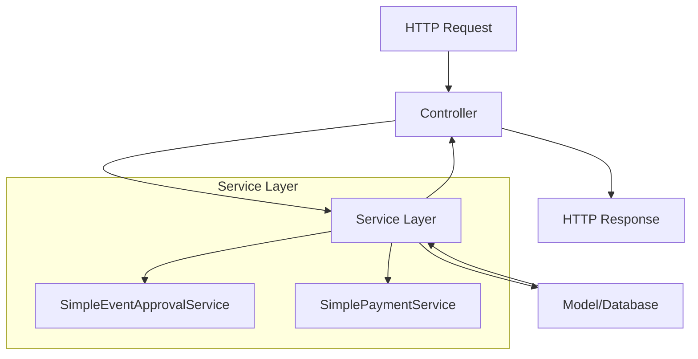
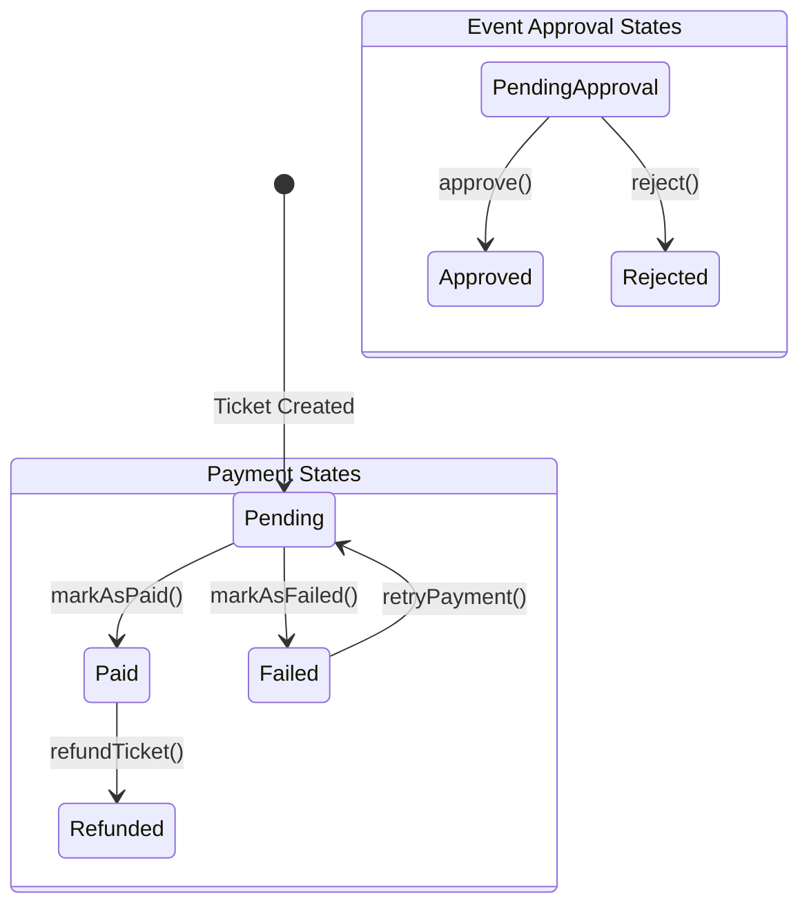
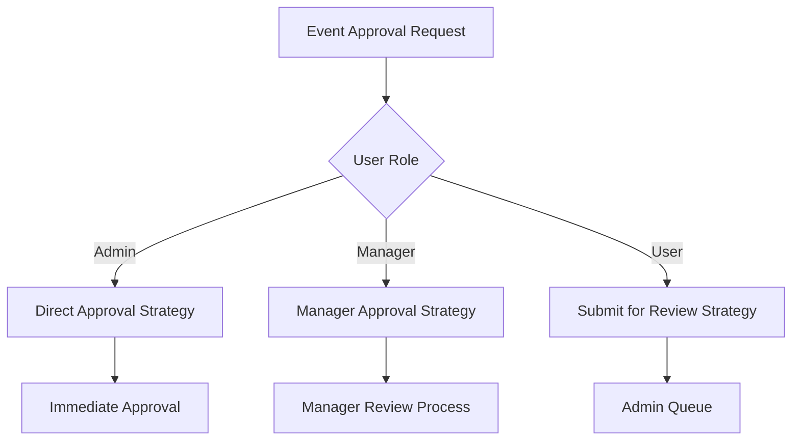
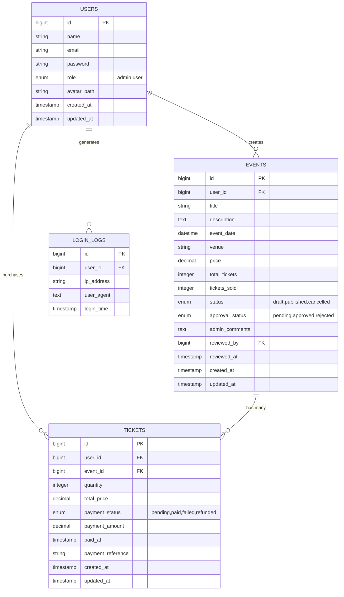
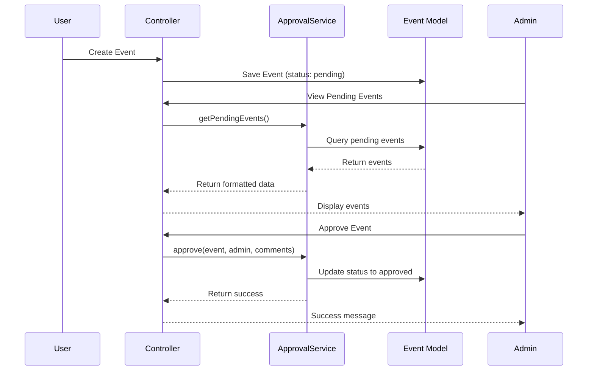
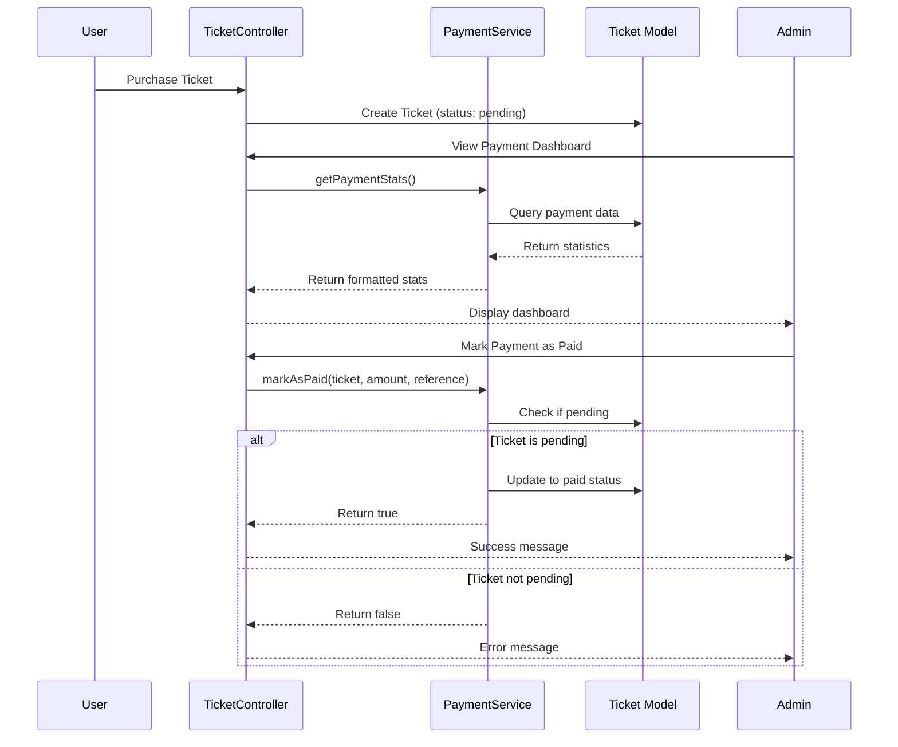

# Event Management System - Architecture Documentation

## 🏗️ System Architecture Overview

This Event Management and Ticketing System is built using **Laravel** with a focus on **clean architecture principles** and **beginner-friendly design patterns**. The system emphasizes simplicity, maintainability, and educational value.

## 📐 Architectural Patterns

### 1. Service Layer Pattern

The Service Layer Pattern separates business logic from HTTP handling, creating a clean separation of concerns.



#### Implementation:
- **Controllers**: Handle HTTP requests/responses only
- **Services**: Contain all business logic
- **Models**: Handle data relationships and simple queries

```php
// Controller (HTTP handling only)
class SimplePaymentController extends Controller 
{
    public function markPaid(Request $request, Ticket $ticket)
    {
        $this->checkAdminAccess();
        
        $success = $this->paymentService->markAsPaid(
            $ticket, 
            $request->payment_amount,
            $request->payment_reference
        );
        
        return redirect()->back()->with(
            $success ? 'success' : 'error', 
            $success ? 'Payment marked as paid!' : 'Cannot mark as paid.'
        );
    }
}

// Service (Business logic)
class SimplePaymentService
{
    public function markAsPaid(Ticket $ticket, $amount = null, $reference = null)
    {
        if (!$ticket->isPending()) {
            return false; // Business rule: only pending payments can be marked as paid
        }

        $ticket->update([
            'payment_status' => 'paid',
            'payment_amount' => $amount ?? $ticket->total_price,
            'paid_at' => now(),
            'payment_reference' => $reference,
        ]);

        return true;
    }
}
```

### 2. State Pattern

The State Pattern manages complex state transitions in a controlled way.



#### Benefits:
- **Controlled Transitions**: Invalid state changes are prevented
- **Clear Business Rules**: Each transition has explicit conditions
- **Easy Testing**: State changes are predictable and testable

```php
// State Pattern in Ticket Model
class Ticket extends Model
{
    // State checking methods
    public function isPaid() { return $this->payment_status === 'paid'; }
    public function isPending() { return $this->payment_status === 'pending'; }
    public function isFailed() { return $this->payment_status === 'failed'; }
    public function isRefunded() { return $this->payment_status === 'refunded'; }
}

// Service enforces valid state transitions
public function markAsPaid(Ticket $ticket, $amount = null, $reference = null)
{
    // Business rule: only pending payments can be marked as paid
    if (!$ticket->isPending()) {
        return false;
    }
    // ... proceed with state change
}
```

### 3. Strategy Pattern

The Strategy Pattern provides different algorithms for the same operation.



#### Implementation:
```php
class SimpleEventApprovalService
{
    public function approve(Event $event, User $admin, $comments = null)
    {
        // Strategy: Admin approval process
        if ($admin->role !== 'admin') {
            return false; // Access control strategy
        }

        $event->update([
            'approval_status' => 'approved',
            'admin_comments' => $comments,
            'reviewed_by' => $admin->id,
            'reviewed_at' => now(),
        ]);

        return true;
    }
}
```

## 📊 Database Architecture

### Entity Relationship Diagram



### Key Design Decisions:

1. **Enum Fields**: Using database enums for status fields ensures data integrity
2. **Audit Fields**: `reviewed_by`, `reviewed_at` provide audit trails
3. **Decimal for Money**: Using `decimal` type prevents floating-point precision issues
4. **Soft References**: Using foreign keys with proper indexing for performance

## 🚀 Application Flow

### 1. Event Approval Workflow



### 2. Payment Processing Workflow



## 🏛️ Directory Structure

```
app/
├── Http/Controllers/          # HTTP request handling
│   ├── SimpleEventApprovalController.php
│   ├── SimplePaymentController.php
│   └── ...
├── Services/                  # Business logic layer
│   ├── SimpleEventApprovalService.php
│   ├── SimplePaymentService.php
│   └── UserCreation/
├── Models/                    # Data models
│   ├── Event.php
│   ├── Ticket.php
│   ├── User.php
│   └── LoginLog.php
└── ...

database/
├── migrations/               # Database schema changes
│   ├── create_events_table.php
│   ├── add_approval_status_to_events_table.php
│   ├── add_payment_status_to_tickets_table.php
│   └── ...
└── seeders/                 # Test data
    ├── EventsSeeder.php
    └── TestUsersSeeder.php

resources/views/
├── admin/                   # Admin interfaces
│   ├── dashboard.blade.php
│   ├── approvals/
│   │   └── index.blade.php
│   └── payments/
│       └── index.blade.php
└── ...
```

## 🔧 Key Components

### Service Layer Components

#### 1. SimpleEventApprovalService
**Purpose**: Manages event approval workflow
**Responsibilities**:
- Approve/reject events
- Validate admin permissions
- Provide approval statistics
- Track approval history

```php
class SimpleEventApprovalService
{
    public function approve(Event $event, User $admin, $comments = null): bool
    public function reject(Event $event, User $admin, $comments = null): bool
    public function getPendingEvents(): Collection
    public function getApprovalStats(): array
}
```

#### 2. SimplePaymentService
**Purpose**: Manages payment state transitions
**Responsibilities**:
- Process payment status changes
- Validate state transitions
- Provide payment analytics
- Handle refunds

```php
class SimplePaymentService
{
    public function markAsPaid(Ticket $ticket, $amount = null, $reference = null): bool
    public function markAsFailed(Ticket $ticket, $reason = null): bool
    public function refundTicket(Ticket $ticket, $reference = null): bool
    public function retryPayment(Ticket $ticket): bool
    public function getPaymentStats(): array
}
```

### Model Components

#### Enhanced with Helper Methods
```php
class Ticket extends Model
{
    // State checking methods (State Pattern)
    public function isPaid(): bool
    public function isPending(): bool
    public function isFailed(): bool
    public function isRefunded(): bool
}

class Event extends Model
{
    // Approval state methods
    public function isPending(): bool
    public function isApproved(): bool
    public function isRejected(): bool
    
    // Relationships
    public function approvedBy(): BelongsTo
    public function tickets(): HasMany
}
```

## 🎯 Design Benefits

### For Beginners
1. **Clear Naming**: `SimplePaymentService`, `markAsPaid()`, `isPending()`
2. **Single Responsibility**: Each class has one clear purpose
3. **Explicit Methods**: Method names clearly indicate their function
4. **Predictable Structure**: Consistent patterns across the codebase

### For Maintainability
1. **Loose Coupling**: Services are independent and easily testable
2. **High Cohesion**: Related functionality is grouped together
3. **Open/Closed Principle**: Easy to extend without modifying existing code
4. **DRY Principle**: Business logic is centralized in services

### For Scalability
1. **Service Layer**: New business logic can be added without touching controllers
2. **State Management**: Complex workflows are managed systematically
3. **Role-based Access**: Security is built into the architecture
4. **Database Design**: Normalized structure supports growth

## 🧪 Testing Strategy

### Unit Testing Services
```php
class SimplePaymentServiceTest extends TestCase
{
    public function test_can_mark_pending_ticket_as_paid()
    {
        $ticket = Ticket::factory()->pending()->create();
        $service = new SimplePaymentService();
        
        $result = $service->markAsPaid($ticket, 50.00, 'TEST-REF');
        
        $this->assertTrue($result);
        $this->assertTrue($ticket->fresh()->isPaid());
    }
    
    public function test_cannot_mark_paid_ticket_as_paid_again()
    {
        $ticket = Ticket::factory()->paid()->create();
        $service = new SimplePaymentService();
        
        $result = $service->markAsPaid($ticket);
        
        $this->assertFalse($result);
    }
}
```

## 📈 Performance Considerations

### Database Optimization
- **Indexes**: Added on frequently queried fields (`payment_status`, `approval_status`)
- **Eager Loading**: Using `with()` to prevent N+1 queries
- **Query Optimization**: Service methods use efficient queries

### Caching Strategy
- **Statistics Caching**: Payment and approval stats can be cached
- **Query Caching**: Frequently accessed data can be cached
- **View Caching**: Admin dashboards can use view caching

## 🔐 Security Architecture

### Access Control
1. **Role-based Access**: Admin-only controllers and methods
2. **Method-level Security**: Each sensitive method checks permissions
3. **CSRF Protection**: All forms include CSRF tokens
4. **Input Validation**: Comprehensive request validation

### Data Integrity
1. **State Validation**: Services prevent invalid state transitions
2. **Business Rules**: Core business logic is enforced in services
3. **Audit Trails**: All changes are logged with timestamps and user info

---

This architecture provides a solid foundation for learning and extending the event management system while maintaining clean, understandable code structure.
