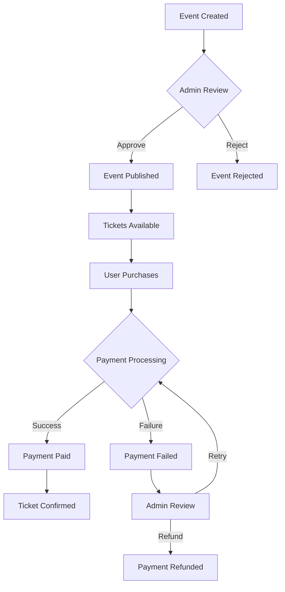

# Event Management & Ticketing System

A comprehensive Laravel-based event management and ticketing platform designed with clean architecture and beginner-friendly design patterns.

## 🌟 Features

### Core Event Management
- **Event Creation & Management**: Complete CRUD operations for events
- **Event Approval System**: Three-state approval workflow (pending → approved/rejected)
- **Ticket Sales & Management**: Real-time ticket availability and sales tracking
- **User Management**: Role-based access control (admin/user)

### Payment System
- **Payment Status Tracking**: Four-state payment workflow (pending → paid/failed/refunded)
- **Admin Payment Management**: Manual payment status control for admins
- **Payment Statistics**: Real-time revenue and payment analytics
- **Refund Management**: Complete refund workflow with tracking

### Admin Features
- **Dashboard Overview**: Real-time statistics and quick actions
- **Event Approval Interface**: Review and approve/reject events
- **Payment Management Dashboard**: Monitor and manage payment statuses
- **User Role Management**: Assign and modify user permissions

## 🏗️ Architecture & Design Patterns

This system implements clean, beginner-friendly design patterns:

### Service Layer Pattern
- **SimpleEventApprovalService**: Handles all event approval business logic
- **SimplePaymentService**: Manages payment status transitions and statistics
- **Clean separation**: Controllers handle HTTP, Services handle business logic

### State Pattern
- **Event Approval States**: `pending` → `approved` | `rejected`
- **Payment States**: `pending` → `paid` | `failed` → `refunded`
- **Clear transitions**: Each state has specific allowed transitions

### Strategy Pattern
- **Approval Strategies**: Different approval logic based on user roles
- **Payment Strategies**: Various payment processing approaches

## 📊 System Workflow



## 🚀 Quick Start

### Prerequisites
- PHP 8.1+
- Composer
- SQLite (included)
- Node.js & NPM

### Installation
```bash
# Clone the repository
git clone <repository-url>
cd Event-Management-Ticketing-System/laravel

# Install dependencies
composer install
npm install

# Setup environment
cp .env.example .env
php artisan key:generate

# Setup database
php artisan migrate
php artisan db:seed

# Build assets
npm run build

# Start development server
php artisan serve
```

## 📱 Usage

### For Regular Users
1. **Register/Login**: Create account or login
2. **Browse Events**: View available events
3. **Purchase Tickets**: Buy tickets (status starts as 'pending')
4. **View Bookings**: Check your ticket purchases

### For Administrators
1. **Admin Dashboard**: Access at `/dashboard`
2. **Event Approval**: Review pending events at `/admin/approvals`
3. **Payment Management**: Monitor payments at `/admin/payments`
4. **User Management**: Manage user roles at `/users`

## 💳 Payment Management

### Payment States
- **Pending**: Initial state when ticket is purchased
- **Paid**: Payment successfully processed
- **Failed**: Payment processing failed
- **Refunded**: Payment was refunded to customer

### Admin Payment Actions
- **Mark as Paid**: Manually confirm payment
- **Mark as Failed**: Mark payment as failed with reason
- **Process Refund**: Refund successful payments
- **Retry Payment**: Reset failed payments to pending

## 🔧 Technical Implementation

### Database Schema
```sql
-- Events Table
events (
    id, title, description, event_date, venue, price,
    total_tickets, tickets_sold, status,
    approval_status, admin_comments, reviewed_by, reviewed_at
)

-- Tickets Table  
tickets (
    id, user_id, event_id, quantity, total_price,
    payment_status, payment_amount, paid_at, payment_reference
)
```

### API Endpoints
```php
// Event Approval
GET    /admin/approvals           # List pending events
POST   /admin/approvals/{id}/approve  # Approve event
POST   /admin/approvals/{id}/reject   # Reject event

// Payment Management
GET    /admin/payments            # Payment dashboard
POST   /admin/payments/{id}/mark-paid    # Mark as paid
POST   /admin/payments/{id}/mark-failed  # Mark as failed
POST   /admin/payments/{id}/refund       # Process refund
POST   /admin/payments/{id}/retry        # Retry payment
```

## 🎯 Key Design Benefits

### Beginner-Friendly
- **Clear naming**: `SimplePaymentService`, `SimpleEventApprovalService`
- **Explicit methods**: `isPaid()`, `isPending()`, `markAsPaid()`
- **Simple workflows**: Easy to understand state transitions

### Maintainable
- **Single Responsibility**: Each service handles one concern
- **Loose Coupling**: Services are independent and testable
- **Clear Interfaces**: Predictable method signatures

### Scalable
- **Service Layer**: Easy to extend with new business logic
- **State Management**: Clear state transitions prevent data inconsistency
- **Role-based Access**: Secure admin-only operations

## 📈 Monitoring & Analytics

### Payment Statistics
- Total revenue tracking
- Payment success/failure rates
- Pending payment monitoring
- Refund tracking

### Event Analytics
- Event approval rates
- Ticket sales performance
- Revenue per event
- User engagement metrics

## 🔒 Security Features

- **Role-based Access Control**: Admin-only payment management
- **CSRF Protection**: All forms protected
- **Input Validation**: Comprehensive request validation
- **Authentication Required**: All sensitive operations require login

## 🛠️ Development

### Adding New Payment Methods
1. Extend `SimplePaymentService` with new methods
2. Add corresponding routes in `web.php`
3. Update controller with new actions
4. Create appropriate views

### Testing
```bash
# Run payment system test
php test_payment_system.php

# Check routes
php artisan route:list --name=admin.payments
```

## 📞 Support

For questions about implementation or extending the system:
1. Check the Service Layer classes for business logic
2. Review Controller classes for HTTP handling
3. Examine migration files for database structure
4. Test with the included test script

---

Built with ❤️ using Laravel and clean design patterns for educational purposes.

## Code of Conduct

In order to ensure that the Laravel community is welcoming to all, please review and abide by the [Code of Conduct](https://laravel.com/docs/contributions#code-of-conduct).

## Security Vulnerabilities

If you discover a security vulnerability within Laravel, please send an e-mail to Taylor Otwell via [taylor@laravel.com](mailto:taylor@laravel.com). All security vulnerabilities will be promptly addressed.

## License

The Laravel framework is open-sourced software licensed under the [MIT license](https://opensource.org/licenses/MIT).
